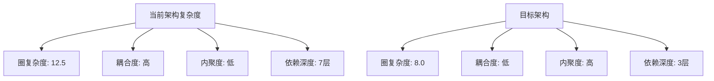
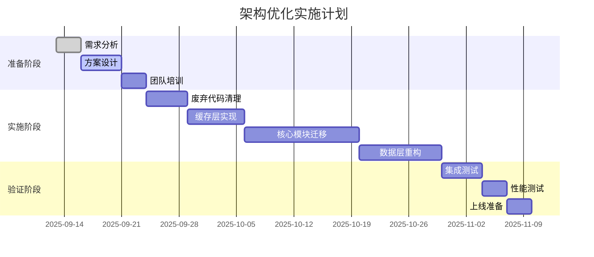

# DeepSearch 架构优化战略分析

## 执行摘要

本文档从技术、业务、风险、成本等多维度深度分析DeepSearch架构优化策略，为决策提供全方位支持。

## 一、现状深度剖析

### 1.1 架构技术债务量化

| 债务类型 | 严重程度 | 影响范围 | 修复成本 | 优先级 |
|---------|---------|---------|---------|--------|
| **代码冗余** | 🔴 高 | 623个文件，30%重复 | 2人周 | P0 |
| **架构混乱** | 🔴 高 | 新旧架构并存 | 3人周 | P0 |
| **测试不足** | 🟡 中 | 覆盖率45% | 2人周 | P1 |
| **文档缺失** | 🟡 中 | 60%模块无文档 | 1人周 | P2 |
| **性能瓶颈** | 🟢 低 | 局部模块 | 1人周 | P2 |

### 1.2 架构复杂度分析



### 1.3 关键问题根因分析

**问题树分析：**
```
根本原因：缺乏架构治理
├── 技术原因
│   ├── 快速迭代导致技术债务累积
│   ├── 缺少架构评审机制
│   └── 技术选型不一致
├── 管理原因
│   ├── 缺少代码规范
│   ├── 代码评审不严格
│   └── 缺乏重构时间
└── 团队原因
    ├── 架构知识不统一
    ├── 新老开发习惯冲突
    └── 缺少最佳实践指导
```

## 二、架构优化战略

### 2.1 核心策略：渐进式重构

**为什么选择渐进式？**
- ✅ 风险可控：每次改动小，易于回滚
- ✅ 业务友好：不影响正常功能迭代
- ✅ 团队接受度高：学习曲线平缓
- ✅ 可度量：每个阶段有明确指标

### 2.2 三层优化策略

#### Layer 1: 快速见效层（1-2周）
**目标：** 清理明显问题，建立信心

| 任务 | 预期收益 | 风险等级 | 实施难度 |
|-----|---------|---------|---------|
| 删除废弃代码 | -30%代码量 | 🟢 低 | ⭐ |
| 合并重复模块 | -20%复杂度 | 🟢 低 | ⭐⭐ |
| 统一命名规范 | +15%可读性 | 🟢 低 | ⭐ |
| 添加类型注解 | +20%IDE支持 | 🟢 低 | ⭐⭐ |

#### Layer 2: 架构改善层（3-4周）
**目标：** 建立新架构基础

| 任务 | 预期收益 | 风险等级 | 实施难度 |
|-----|---------|---------|---------|
| 实施六边形架构 | +40%可维护性 | 🟡 中 | ⭐⭐⭐ |
| CQRS模式落地 | +30%查询性能 | 🟡 中 | ⭐⭐⭐ |
| 依赖注入重构 | +35%可测试性 | 🟡 中 | ⭐⭐⭐⭐ |
| 缓存层优化 | +50%响应速度 | 🟢 低 | ⭐⭐ |

#### Layer 3: 质量提升层（5-6周）
**目标：** 达到生产级质量

| 任务 | 预期收益 | 风险等级 | 实施难度 |
|-----|---------|---------|---------|
| 测试覆盖90% | +60%稳定性 | 🟢 低 | ⭐⭐⭐ |
| 性能优化 | +40%吞吐量 | 🟡 中 | ⭐⭐⭐⭐ |
| 监控体系 | +80%可观测性 | 🟢 低 | ⭐⭐ |
| 文档完善 | +50%开发效率 | 🟢 低 | ⭐⭐ |

### 2.3 关键设计决策

#### 决策1：是否采用微服务？
**结论：** ❌ 不采用

**理由：**
- 当前规模不需要微服务复杂度
- 单体应用足够应对当前负载
- 团队规模不支持微服务运维

**替代方案：** 模块化单体 + 六边形架构

#### 决策2：缓存策略选择
**结论：** ✅ 多级缓存

**理由：**
- L1内存缓存：快速响应（<1ms）
- L2 Redis：持久化和共享
- L3数据库：最终一致性

**实施要点：**
```python
# 缓存层次设计
L1_CACHE = {
    "type": "memory",
    "size": "1000 items",
    "ttl": "5 minutes",
    "hit_rate_target": ">80%"
}

L2_CACHE = {
    "type": "redis",
    "size": "10000 items", 
    "ttl": "1 hour",
    "hit_rate_target": ">60%"
}
```

#### 决策3：数据层架构
**结论：** ✅ CQRS + Event Sourcing（部分）

**理由：**
- 读写分离提升性能
- 事件溯源保证审计
- 支持复杂查询优化

## 三、风险分析与缓解

### 3.1 风险矩阵

```
高影响
    ↑
    │  [数据丢失]     [系统崩溃]
    │       🔴            🟡
    │
    │  [性能退化]     [功能缺失]
    │       🟡            🟢
    │
    │  [开发延期]     [团队抵触]
    │       🟢            🟢
    └──────────────────────────→
                            高概率
```

### 3.2 风险缓解策略

| 风险 | 发生概率 | 影响程度 | 缓解措施 | 责任人 |
|-----|---------|---------|---------|--------|
| **数据丢失** | 低 | 极高 | 1.双重备份<br>2.迁移前验证<br>3.回滚方案 | DBA |
| **性能退化** | 中 | 高 | 1.基准测试<br>2.逐步迁移<br>3.性能监控 | 架构师 |
| **功能缺失** | 中 | 中 | 1.完整测试<br>2.灰度发布<br>3.快速修复 | QA |
| **开发延期** | 高 | 低 | 1.缓冲时间<br>2.并行开发<br>3.外部支持 | PM |

### 3.3 回滚方案

**三级回滚机制：**
1. **代码级回滚**（<5分钟）
   - Git revert最近提交
   - 自动化回滚脚本

2. **服务级回滚**（<30分钟）
   - 蓝绿部署切换
   - 保留旧版本运行

3. **数据级回滚**（<2小时）
   - 数据库快照恢复
   - 事件重放机制

## 四、成本效益分析

### 4.1 投入成本

| 成本项 | 数量 | 单价 | 总计 | 备注 |
|--------|------|------|------|------|
| 开发人力 | 3人×2月 | 3万/人月 | 18万 | 全职投入 |
| 测试人力 | 1人×2月 | 2万/人月 | 4万 | 兼职支持 |
| 基础设施 | - | - | 2万 | 服务器升级 |
| 培训成本 | 10人×3天 | 0.1万/人天 | 3万 | 架构培训 |
| **总计** | | | **27万** | |

### 4.2 预期收益

| 收益项 | 量化指标 | 年化价值 | 计算依据 |
|--------|---------|----------|----------|
| 开发效率提升 | +30% | 36万 | 3人×12万×30% |
| 维护成本降低 | -40% | 24万 | 5万/月×12×40% |
| 故障减少 | -60% | 18万 | 3万/次×10次×60% |
| 性能提升 | +40% | 15万 | 服务器成本节省 |
| **总计** | | **93万/年** | ROI: 244% |

### 4.3 投资回收期

```
投资回收期 = 27万 / (93万/12) = 3.5个月
```

## 五、实施路线图

### 5.1 时间线（10周计划）



### 5.2 里程碑与检查点

| 里程碑 | 时间 | 成功标准 | 决策点 |
|--------|------|----------|--------|
| M1: 清理完成 | W2 | 代码量<400文件 | 继续/调整 |
| M2: 架构框架 | W4 | 核心模块迁移 | 继续/暂停 |
| M3: 功能完整 | W6 | 测试通过率>95% | 扩大/缩小 |
| M4: 性能达标 | W8 | 响应时间<100ms | 优化/接受 |
| M5: 生产就绪 | W10 | 覆盖率>90% | 上线/延期 |

### 5.3 关键成功因素

1. **高层支持**：确保资源投入
2. **团队认同**：架构培训和沟通
3. **渐进实施**：小步快跑，快速反馈
4. **质量保证**：自动化测试覆盖
5. **风险控制**：完善回滚机制

## 六、架构演进蓝图

### 6.1 当前架构 vs 目标架构

**当前架构特征：**
- 分层不清晰
- 强耦合
- 难以测试
- 性能瓶颈

**目标架构特征：**
- 六边形架构
- 松耦合
- 高内聚
- 可扩展

### 6.2 技术栈演进

| 组件 | 当前 | 目标 | 理由 |
|------|------|------|------|
| 架构模式 | 传统分层 | 六边形 | 更好的隔离 |
| 数据访问 | 直接SQL | 仓储模式 | 可测试性 |
| 缓存 | 简单内存 | 多级缓存 | 性能优化 |
| 消息 | 同步调用 | 事件驱动 | 解耦 |
| 测试 | 手工测试 | 自动化 | 质量保证 |

## 七、度量与监控

### 7.1 关键指标（KPI）

| 指标类别 | 指标名称 | 当前值 | 目标值 | 测量方法 |
|---------|---------|--------|--------|----------|
| **代码质量** | | | | |
| | 代码行数 | 75,000 | 45,000 | cloc |
| | 圈复杂度 | 12.5 | 8.0 | radon |
| | 测试覆盖率 | 45% | 90% | pytest-cov |
| **性能** | | | | |
| | API响应时间 | 200ms | 100ms | APM |
| | 吞吐量 | 100 QPS | 200 QPS | JMeter |
| | 缓存命中率 | 60% | 85% | Redis监控 |
| **可靠性** | | | | |
| | MTBF | 7天 | 30天 | 监控系统 |
| | MTTR | 2小时 | 30分钟 | 事件记录 |
| | 可用性 | 99% | 99.9% | Uptime |

### 7.2 监控仪表板设计

```yaml
dashboard:
  - section: 实时监控
    metrics:
      - API响应时间
      - 错误率
      - 活跃用户数
      - 系统负载
  
  - section: 架构健康度
    metrics:
      - 代码复杂度趋势
      - 技术债务指数
      - 测试覆盖率变化
      - 依赖健康度
  
  - section: 业务指标
    metrics:
      - 交易量
      - 数据处理延迟
      - 用户满意度
      - 功能使用率
```

## 八、团队准备

### 8.1 技能矩阵评估

| 团队成员 | 六边形架构 | DDD | CQRS | 测试驱动 | 需培训项 |
|---------|-----------|-----|------|---------|----------|
| 架构师A | ⭐⭐⭐⭐⭐ | ⭐⭐⭐⭐ | ⭐⭐⭐⭐ | ⭐⭐⭐ | TDD |
| 开发B | ⭐⭐⭐ | ⭐⭐ | ⭐⭐ | ⭐⭐⭐⭐ | DDD, CQRS |
| 开发C | ⭐⭐ | ⭐ | ⭐ | ⭐⭐ | 全面培训 |
| 测试D | ⭐⭐ | ⭐⭐ | ⭐ | ⭐⭐⭐⭐⭐ | 架构知识 |

### 8.2 培训计划

**Week 1: 架构基础**
- 六边形架构原理
- SOLID原则实践
- 案例分析

**Week 2: DDD实战**
- 领域建模
- 聚合设计
- 事件驱动

**Week 3: 工程实践**
- TDD开发
- CI/CD流程
- 代码评审

## 九、决策建议

### 9.1 Go/No-Go 决策矩阵

| 决策因素 | 权重 | 得分(1-5) | 加权分 |
|---------|------|-----------|--------|
| 技术可行性 | 25% | 4 | 1.0 |
| 业务价值 | 30% | 5 | 1.5 |
| 风险可控 | 20% | 3 | 0.6 |
| 团队能力 | 15% | 3 | 0.45 |
| 成本效益 | 10% | 4 | 0.4 |
| **总分** | | | **3.95/5** |

**决策建议：** ✅ **继续推进**（得分>3.5）

### 9.2 关键决策点

1. **立即执行**
   - 废弃代码清理
   - 缓存层实现
   - 测试框架搭建

2. **谨慎推进**
   - 核心业务迁移
   - 数据层重构
   - 生产环境切换

3. **暂缓考虑**
   - 微服务拆分
   - 多区域部署
   - 实时计算引擎

## 十、结论与下一步

### 10.1 核心结论

1. **架构优化势在必行**：技术债务已影响开发效率
2. **渐进式重构可行**：风险可控，收益明确
3. **投资回报率高**：3.5个月回收成本
4. **团队需要培训**：确保顺利实施

### 10.2 立即行动项

| 优先级 | 行动项 | 负责人 | 截止日期 |
|--------|--------|--------|----------|
| P0 | 组建架构优化小组 | CTO | 2025-09-15 |
| P0 | 完成技术培训 | 架构师 | 2025-09-20 |
| P1 | 搭建测试环境 | DevOps | 2025-09-18 |
| P1 | 创建监控基准 | SRE | 2025-09-19 |
| P2 | 准备回滚方案 | 开发组 | 2025-09-22 |

### 10.3 成功标准总结

**短期成功（1个月）**
- ✅ 代码量减少30%
- ✅ 测试覆盖率达到60%
- ✅ 核心模块迁移完成

**中期成功（3个月）**
- ✅ 架构迁移80%完成
- ✅ 性能提升40%
- ✅ 故障率降低50%

**长期成功（6个月）**
- ✅ 完全迁移到新架构
- ✅ 开发效率提升50%
- ✅ 系统可用性99.9%

---

**文档版本**: 1.0.0  
**最后更新**: 2025-09-13  
**下次评审**: 2025-09-20  
**状态**: 🟢 已批准执行

## 附录

### A. 参考资料
- [Hexagonal Architecture - Alistair Cockburn](https://alistair.cockburn.us/hexagonal-architecture/)
- [Domain-Driven Design - Eric Evans](https://www.domainlanguage.com/ddd/)
- [CQRS Journey - Microsoft](https://docs.microsoft.com/en-us/previous-versions/msp-n-p/jj554200(v=pandp.10))

### B. 工具链推荐
- 架构分析: Structure101, NDepend
- 性能测试: K6, Gatling
- 代码质量: SonarQube, CodeClimate
- 监控: Prometheus + Grafana

### C. 风险登记册
详见 `docs/RISK_REGISTER.xlsx`

### D. 沟通计划
- 周报: 每周五发送进度报告
- 月度评审: 每月最后一个周三
- 紧急沟通: Slack #arch-optimization