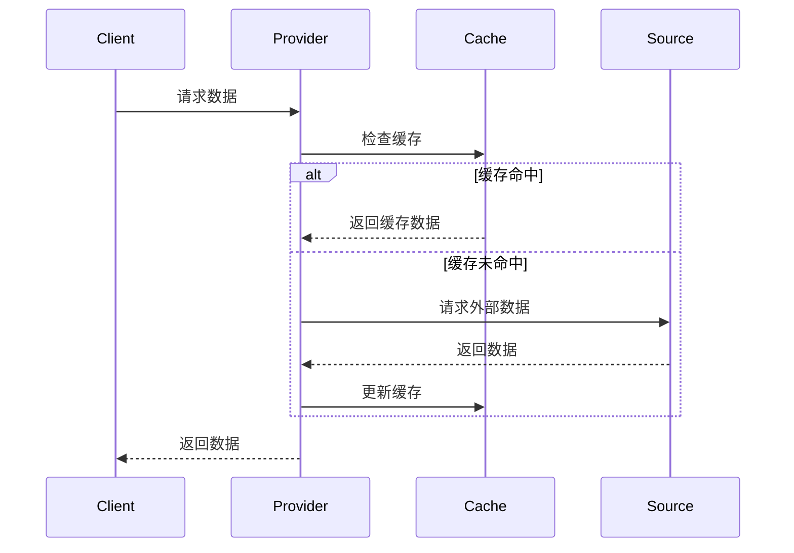

# 数据提供者架构设计

## 概述

DeepSearch 的数据提供者（Data Provider）架构设计用于统一管理和访问各种金融数据源，提供灵活、可扩展的数据访问层。

## 架构设计

### 核心组件

```
┌─────────────────────────────────────────────┐
│              数据消费者                       │
│  (ChartService, MarketService, etc.)        │
└─────────────────────────────────────────────┘
                      │
                      ▼
┌─────────────────────────────────────────────┐
│           DataSourceManager                  │
│         (统一数据源管理器)                    │
│  • 优先级选择                                │
│  • 断路器保护                                │
│  • 自动故障转移                              │
└─────────────────────────────────────────────┘
                      │
        ┌─────────────┼─────────────┬─────────────┐
        ▼             ▼             ▼             ▼
┌──────────────┬──────────────┬──────────────┬──────────────┐
│ AmazingData  │  Cloudflare  │     QMT      │   AkShare    │
│  Provider    │    Proxy     │   Provider   │   Direct     │
│ (Priority:1) │ (Priority:3) │ (Priority:5) │(Priority:10) │
└──────────────┴──────────────┴──────────────┴──────────────┘
        │             │             │             │
        ▼             ▼             ▼             ▼
┌─────────────────────────────────────────────┐
│            外部数据源                         │
│  • 银河证券AmazingData API                   │
│  • CloudFlare Workers Edge Network          │
│  • QMT Real-time Data Feed                  │
│  • 东方财富、新浪财经、雅虎财经等              │
└─────────────────────────────────────────────┘
```

## 数据提供者类型

### 1. DataSourceManager（统一管理器）

**文件**：`deepsearch/services/data_source_manager.py`

**职责**：
- 统一管理所有数据源
- 基于优先级自动选择
- 实现断路器模式
- 提供透明故障转移

**核心功能**：
```python
class DataSourceManager:
    # 获取股票信息，自动选择最优数据源
    async def get_stock_info(self, symbol: str) -> Dict
    
    # 获取K线数据，支持多级缓存
    async def get_kline_data(self, symbol: str, period: str) -> pd.DataFrame
    
    # 获取实时行情，优先使用高频数据源
    async def get_realtime_quote(self, symbol: str) -> Dict
    
    # 获取盘口数据
    async def get_orderbook(self, symbol: str) -> Dict
```

### 2. AmazingDataProvider（最高优先级）

**文件**：`deepsearch/data_providers/amazingdata.py`

**特点**：
- 银河证券专业数据API
- 最高数据质量和完整性
- 支持实时订阅推送
- 内置心跳和重连机制

**配置**：
```yaml
amazingdata:
  enabled: true
  priority: 1
  connection:
    username: "your_username"
    password: "your_password"
    host: "120.86.124.106"
    port: 8600
```

### 3. CloudflareProxyProvider

**文件**：`deepsearch/data_providers/cloudflare_proxy.py`

**特点**：
- 通过 Cloudflare Workers 代理访问
- 全球 CDN 加速
- 自动缓存管理
- 避免IP限制

**配置**：
```yaml
cloudflare_proxy:
  enabled: true
  priority: 3
  url: "https://akshare-proxy.workers.dev"
  api_key: "optional-api-key"
```

### 4. QMTProvider

**文件**：`deepsearch/data_providers/qmt_provider.py`

**特点**：
- 迅投量化实时数据
- 高频tick数据支持
- Level2行情数据
- WebSocket实时推送

### 5. AkShareDirectProvider

**文件**：`deepsearch/data_providers/akshare_direct.py`

**特点**：
- 直接调用AkShare库
- 作为备用数据源
- 支持完整的A股数据


## 数据流程

### 1. 请求流程



### 2. 故障转移流程

```python
async def _fetch_with_fallback(self, endpoint: str, params: Dict):
    """带故障转移的数据获取"""
    # 尝试主数据源
    try:
        return await self._fetch_from_primary(endpoint, params)
    except Exception as e:
        logger.warning(f"Primary source failed: {e}")
        
    # 尝试备用数据源
    for backup in self.backup_sources:
        try:
            return await self._fetch_from_backup(backup, endpoint, params)
        except Exception:
            continue
    
    # 所有源都失败，返回错误
    raise DataSourceError("All data sources failed")
```

## 多级缓存架构

### 缓存层级

```
┌─────────────────────────────────────────────┐
│              请求入口                         │
└─────────────────────────────────────────────┘
                      │
                      ▼
┌─────────────────────────────────────────────┐
│         L1: 内存缓存 (LRU)                   │
│  • 容量: 10000 条                            │
│  • TTL: 60 秒                                │
│  • 命中率: ~80%                              │
└─────────────────────────────────────────────┘
                      │ Miss
                      ▼
┌─────────────────────────────────────────────┐
│         L2: Redis 缓存                       │
│  • 容量: 无限制                              │
│  • TTL: 300 秒                               │
│  • 命中率: ~15%                              │
└─────────────────────────────────────────────┘
                      │ Miss
                      ▼
┌─────────────────────────────────────────────┐
│         L3: DuckDB/PostgreSQL                │
│  • 持久化存储                                │
│  • 历史数据完整保存                          │
│  • 命中率: ~4%                               │
└─────────────────────────────────────────────┘
                      │ Miss
                      ▼
┌─────────────────────────────────────────────┐
│         数据源（按优先级）                    │
│  1. AmazingData                              │
│  2. CloudFlare Proxy                         │
│  3. QMT                                      │
│  4. AkShare Direct                           │
└─────────────────────────────────────────────┘
```

### 缓存策略

**文件**: `deepsearch/services/kline_cache.py`

```python
class MultiLevelCache:
    def __init__(self):
        # L1: 内存缓存
        self.memory_cache = LRUCache(max_size=10000)
        
        # L2: Redis缓存
        self.redis_client = redis.Redis()
        
        # L3: DuckDB/PostgreSQL
        self.db_manager = DatabaseManager()
    
    async def get(self, key: str) -> Optional[Any]:
        # 逐级查找
        for cache_level in [self.memory_cache, self.redis_client, self.db_manager]:
            if data := await cache_level.get(key):
                # 回填上层缓存
                await self._backfill(key, data, cache_level)
                return data
        return None
```

## 缓存策略

### 1. 多级缓存

**L1 缓存**（内存）：
- 容量：100MB
- TTL：60秒
- 适用：高频访问数据

**L2 缓存**（Redis）：
- 容量：1GB
- TTL：5分钟
- 适用：共享数据

**L3 缓存**（CDN）：
- 容量：无限制
- TTL：1小时
- 适用：静态数据

### 2. 缓存键设计

```python
def _generate_cache_key(self, endpoint: str, params: Dict) -> str:
    """生成缓存键"""
    # 格式：provider:endpoint:params_hash
    params_str = json.dumps(params, sort_keys=True)
    params_hash = hashlib.md5(params_str.encode()).hexdigest()
    return f"{self.name}:{endpoint}:{params_hash}"
```

## 数据格式规范

### 1. K线数据格式

```python
{
    "symbol": "300476",
    "data": [
        {
            "ts": "2024-08-01 09:30:00",
            "open": 10.50,
            "high": 10.80,
            "low": 10.45,
            "close": 10.75,
            "volume": 1234567,
            "amount": 13245678.90
        }
    ],
    "metadata": {
        "period": "1m",
        "adjust": "qfq",
        "count": 240
    }
}
```

### 2. 实时数据格式

```python
{
    "symbol": "300476",
    "name": "胜宏科技",
    "price": 10.75,
    "change": 0.25,
    "change_pct": 2.38,
    "volume": 12345678,
    "amount": 132456789.00,
    "timestamp": "2024-08-01 14:30:00",
    "bid": [[10.74, 100], [10.73, 200]],
    "ask": [[10.75, 150], [10.76, 300]]
}
```

## 错误处理

### 1. 错误类型

```python
class DataProviderError(Exception):
    """数据提供者基础异常"""

class DataSourceError(DataProviderError):
    """数据源错误"""

class DataFormatError(DataProviderError):
    """数据格式错误"""

class RateLimitError(DataProviderError):
    """请求限速错误"""
```

### 2. 重试策略

```python
@retry(
    stop=stop_after_attempt(3),
    wait=wait_exponential(multiplier=1, min=4, max=10),
    retry=retry_if_exception_type(RequestException)
)
async def _fetch_with_retry(self, url: str, **kwargs):
    """带重试的请求"""
    return await self.session.get(url, **kwargs)
```

## 性能优化

### 1. 连接池管理

```python
# 共享连接池
connector = aiohttp.TCPConnector(
    limit=100,  # 总连接数限制
    limit_per_host=30,  # 每个主机连接数限制
    ttl_dns_cache=300  # DNS缓存时间
)
```

### 2. 批量请求

```python
async def get_batch_stock_hist(self, symbols: List[str], **kwargs):
    """批量获取多只股票数据"""
    tasks = [
        self.get_stock_hist(symbol, **kwargs)
        for symbol in symbols
    ]
    return await asyncio.gather(*tasks, return_exceptions=True)
```

### 3. 数据压缩

- 使用 gzip 压缩传输数据
- 支持 Protocol Buffers 二进制格式
- 增量更新机制

## 监控指标

### 1. 性能指标

- 请求延迟（P50, P95, P99）
- 缓存命中率
- 数据源可用性
- 错误率

### 2. 业务指标

- 日请求量
- 数据更新频率
- 活跃股票数量
- 数据完整性

## 扩展性设计

### 1. 插件机制

```python
class DataProviderPlugin:
    """数据提供者插件接口"""
    
    def pre_request(self, endpoint: str, params: Dict):
        """请求前处理"""
        pass
    
    def post_response(self, response: Dict):
        """响应后处理"""
        pass
```

### 2. 自定义提供者

```python
class CustomProvider(BaseDataProvider):
    """自定义数据提供者示例"""
    
    async def get_stock_hist(self, symbol: str, **kwargs):
        # 自定义实现
        pass
```

## 配置示例

### 完整配置

```yaml
data_provider:
  # 提供者类型
  type: composite
  
  # 主提供者
  primary:
    type: cloudflare
    config:
      worker_url: "https://api.workers.dev"
      cache_ttl: 300
  
  # 备用提供者
  fallback:
    - type: akshare_proxy
      config:
        base_url: "http://backup1.com:8080"
    - type: direct
      config:
        api_url: "https://api.eastmoney.com"
  
  # 缓存配置
  cache:
    redis:
      enabled: true
      ttl: 600
    memory:
      enabled: true
      max_size: 100  # MB
  
  # 限速配置
  rate_limit:
    requests_per_second: 10
    burst: 20
```

## 最佳实践

### 1. 选择合适的提供者

- **开发环境**：使用 AkShareProxyProvider，便于调试
- **生产环境**：使用 CloudflareProxyProvider，高可用性
- **低延迟场景**：使用 ProxyDataProvider，直连数据源

### 2. 缓存策略

- 实时数据：不缓存或极短缓存（1-5秒）
- 分钟数据：短期缓存（1-5分钟）
- 日线数据：长期缓存（1-24小时）
- 历史数据：永久缓存

### 3. 错误处理

- 使用断路器模式防止雪崩
- 实现优雅降级
- 记录详细错误日志

### 4. 监控告警

- 设置数据延迟告警
- 监控数据源健康状态
- 跟踪异常请求模式

## 未来规划

1. **WebSocket 支持**：实现推送式数据更新
2. **GraphQL API**：提供更灵活的数据查询
3. **数据验证**：自动数据质量检查
4. **智能路由**：基于延迟和成功率的动态路由
5. **数据订阅**：支持数据变更通知