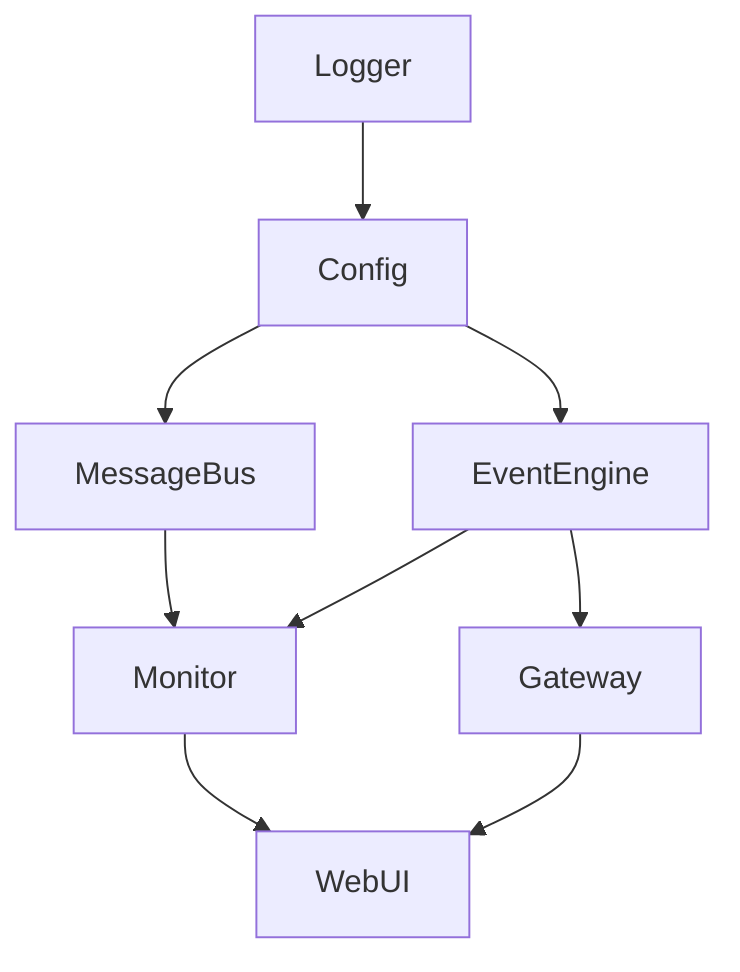

# DeepSearch 系统架构详解

## 目录

1. [系统概述](#1-系统概述)
2. [系统架构](#2-系统架构)
3. [核心组件详解](#3-核心组件详解)
4. [系统启动流程](#4-系统启动流程)
5. [事件驱动架构](#5-事件驱动架构)
6. [消息总线机制](#6-消息总线机制)
7. [WebUI架构](#7-webui架构)
8. [数据流图](#8-数据流图)
9. [部署架构](#9-部署架构)
10. [技术栈](#10-技术栈)

---

## 1. 系统概述

DeepSearch 是一个高性能的量化交易事件驱动系统，专为实时金融数据处理和交易策略执行而设计。系统采用模块化架构，支持分布式部署，具有以下核心特性：

- **事件驱动架构**：基于高性能事件引擎，支持批处理和优先级调度
- **分布式通信**：支持多种消息总线后端（ZeroMQ、Redis TimeSeries）
- **组件化设计**：所有功能模块化，支持热插拔和独立部署
- **实时监控**：内置监控系统和 WebUI 管理界面
- **高可用性**：支持故障隔离、自动重连和优雅降级

## 2. 系统架构

### 2.1 分层架构图

```
┌────────────────────────────────────────────────────────────────────┐
│                           用户接口层                                │
│  ┌─────────────┐  ┌─────────────┐  ┌─────────────┐               │
│  │     CLI     │  │   WebUI     │  │     API     │               │
│  │ (cli.py)    │  │  (Vue.js)   │  │  (FastAPI)  │               │
│  └─────────────┘  └─────────────┘  └─────────────┘               │
└────────────────────────────────────────────────────────────────────┘
                                 │
                                 ▼
┌────────────────────────────────────────────────────────────────────┐
│                           应用服务层                                │
│  ┌─────────────┐  ┌─────────────┐  ┌─────────────┐               │
│  │   WebUI     │  │   Monitor   │  │   Gateway   │               │
│  │   Server    │  │     API     │  │  Manager    │               │
│  └─────────────┘  └─────────────┘  └─────────────┘               │
└────────────────────────────────────────────────────────────────────┘
                                 │
                                 ▼
┌────────────────────────────────────────────────────────────────────┐
│                           核心引擎层                                │
│  ┌─────────────────────────────────────────────────────────────┐  │
│  │                      MainEngine                              │  │
│  │  ┌─────────────┐  ┌──────────────┐  ┌─────────────────┐   │  │
│  │  │ Component   │  │Initialization│  │    Process      │   │  │
│  │  │  Manager    │  │   Manager    │  │    Manager      │   │  │
│  │  └─────────────┘  └──────────────┘  └─────────────────┘   │  │
│  └─────────────────────────────────────────────────────────────┘  │
└────────────────────────────────────────────────────────────────────┘
                                 │
                                 ▼
┌────────────────────────────────────────────────────────────────────┐
│                           业务组件层                                │
│  ┌─────────────┐  ┌─────────────┐  ┌─────────────┐               │
│  │   Gateway   │  │  Strategy   │  │   Trader    │               │
│  │ Component  │  │  Component  │  │  Component  │               │
│  └─────────────┘  └─────────────┘  └─────────────┘               │
└────────────────────────────────────────────────────────────────────┘
                                 │
                                 ▼
┌────────────────────────────────────────────────────────────────────┐
│                          基础设施层                                 │
│  ┌─────────────┐  ┌─────────────┐  ┌─────────────┐               │
│  │EventEngine  │  │ MessageBus  │  │  Monitor    │               │
│  └─────────────┘  └─────────────┘  └─────────────┘               │
└────────────────────────────────────────────────────────────────────┘
                                 │
                                 ▼
┌────────────────────────────────────────────────────────────────────┐
│                            数据层                                   │
│  ┌─────────────┐  ┌─────────────┐  ┌─────────────┐               │
│  │  Database   │  │Redis Cache  │  │  Analytics  │               │
│  │(PostgreSQL) │  │  (L2 Cache) │  │  (DuckDB)   │               │
│  └─────────────┘  └─────────────┘  └─────────────┘               │
│                                                                    │
│  ┌─────────────────────────────────────────────────────────────┐  │
│  │                   数据提供者 (优先级排序)                      │  │
│  │  1. AmazingData (银河证券)                                   │  │
│  │  2. CloudFlare Workers Proxy                                │  │
│  │  3. QMT Real-time                                           │  │
│  │  4. AkShare Direct (备用)                                    │  │
│  └─────────────────────────────────────────────────────────────┘  │
└────────────────────────────────────────────────────────────────────┘
```

### 2.2 物理架构图

```
┌─────────────────────────────────────────────────────────────────────┐
│                         客户端                                       │
│  ┌──────────────┐    ┌──────────────┐    ┌──────────────┐         │
│  │   浏览器     │    │   CLI 工具   │    │  API 客户端  │         │
│  └──────┬───────┘    └──────┬───────┘    └──────┬───────┘         │
└─────────┼───────────────────┼───────────────────┼──────────────────┘
          │                   │                   │
          │ HTTP/WebSocket    │ Local             │ REST/WebSocket
          │ Port 3000/8000    │                   │ Port 8000
          │                   │                   │
┌─────────▼───────────────────▼───────────────────▼──────────────────┐
│                         DeepSearch 主机                             │
│ ┌─────────────────────────────────────────────────────────────────┐│
│ │                     进程管理器 (ProcessManager)                  ││
│ │ ┌─────────────┐ ┌─────────────┐ ┌─────────────┐ ┌────────────┐││
│ │ │  MainEngine │ │WebUI Backend│ │WebUI Frontend│ │  Gateway   │││
│ │ │   Process   │ │   Process   │ │   Process    │ │  Process   │││
│ │ └─────────────┘ └─────────────┘ └─────────────┘ └────────────┘││
│ └─────────────────────────────────────────────────────────────────┘│
│                                                                     │
│ ┌─────────────────────────────────────────────────────────────────┐│
│ │                     内部通信层                                   ││
│ │ ┌─────────────────────┐      ┌─────────────────────┐           ││
│ │ │    ZeroMQ Bus       │      │   Redis Bus         │           ││
│ │ │  Pub: 5556          │      │  Port: 6379         │           ││
│ │ │  Sub: 5557          │      │                     │           ││
│ │ └─────────────────────┘      └─────────────────────┘           ││
│ └─────────────────────────────────────────────────────────────────┘│
│                                                                     │
│ ┌─────────────────────────────────────────────────────────────────┐│
│ │                     数据存储层                                   ││
│ │ ┌─────────────┐    ┌─────────────┐    ┌─────────────┐         ││
│ │ │ PostgreSQL  │    │    Redis    │    │   DuckDB    │         ││
│ │ │  Port 5432  │    │  Port 6379  │    │   (Local)   │         ││
│ │ └─────────────┘    └─────────────┘    └─────────────┘         ││
│ └─────────────────────────────────────────────────────────────────┘│
└─────────────────────────────────────────────────────────────────────┘
                                │
                                ▼
┌─────────────────────────────────────────────────────────────────────┐
│                         外部系统                                     │
│  ┌──────────────┐    ┌──────────────┐    ┌──────────────┐         │
│  │   交易所     │    │  数据源      │    │  监控系统    │         │
│  │   APIs       │    │  Feeds       │    │  (Grafana)   │         │
│  └──────────────┘    └──────────────┘    └──────────────┘         │
└─────────────────────────────────────────────────────────────────────┘
```

## 3. 核心组件详解

### 3.1 MainEngine（主引擎）

**位置**: `deepsearch/core/engine.py`

**职责**:

- 系统的中央管理器和协调器
- 管理所有组件的生命周期
- 处理系统级事件和信号
- 提供统一的启动、停止接口

**关键方法**:

```python
class MainEngine:
    def initialize(self) -> None:
        """初始化所有系统组件"""
        
    def start_phased(self, include_business=True, include_webui=True) -> None:
        """分阶段启动系统"""
        
    def stop(self) -> None:
        """停止所有组件"""
        
    def is_running(self) -> bool:
        """检查引擎是否运行中"""
```

### 3.2 ComponentManager（组件管理器）

**位置**: `deepsearch/core/component_manager.py`

**职责**:

- 注册和管理所有系统组件
- 处理组件间的依赖关系
- 按拓扑排序启动组件
- 提供健康检查功能

**组件类型**:

- `INFRASTRUCTURE`: 基础设施组件（EventEngine, MessageBus, Monitor）
- `BUSINESS`: 业务组件（Gateway, Strategy, Trader）
- `EXTERNAL`: 外部组件（Database, Cache）

**依赖管理流程**:

```
1. 注册组件时声明依赖
2. 构建依赖图
3. 拓扑排序确定启动顺序
4. 按顺序启动组件
5. 失败时自动回滚
```

### 3.3 DataSourceManager（数据源管理器）

**位置**: `deepsearch/infrastructure/providers/managers/data_source_manager.py`

**职责**:

- 统一管理所有数据提供者
- 基于优先级自动选择最优数据源
- 实现断路器模式的故障隔离
- 提供透明的故障转移

**架构设计**:

```
┌─────────────────────────────────────────────────────────┐
│                 DataSourceManager                        │
│                                                          │
│  ┌──────────────────────────────────────────────────┐  │
│  │            Priority Queue                         │  │
│  │  1. AmazingData (Priority: 1)                    │  │
│  │  2. CloudFlare Proxy (Priority: 3)               │  │
│  │  3. AkShare Direct (Priority: 5)                 │  │
│  └────────────┬─────────────────────────────────────┘  │
│               │                                          │
│               ▼                                          │
│  ┌──────────────────────────────────────────────────┐  │
│  │          Circuit Breaker                          │  │
│  │  • Failure Threshold: 5                          │  │
│  │  • Recovery Time: 60s                            │  │
│  │  • Half-Open State Testing                       │  │
│  └────────────┬─────────────────────────────────────┘  │
│               │                                          │
│               ▼                                          │
│  ┌──────────────────────────────────────────────────┐  │
│  │          Multi-tier Cache                         │  │
│  │  L1: Memory (LRU, TTL: 60s)                      │  │
│  │  L2: Redis (TTL: 300s)                           │  │
│  │  L3: DuckDB (Persistent)                         │  │
│  └──────────────────────────────────────────────────┘  │
└─────────────────────────────────────────────────────────┘
```

**关键方法**:

```python
class DataSourceManager:
    async def get_stock_info(self, symbol: str) -> Dict:
        """获取股票信息，自动选择最优数据源"""
        
    async def get_kline_data(self, symbol: str, period: str) -> pd.DataFrame:
        """获取K线数据，支持多级缓存"""
        
    async def get_realtime_quote(self, symbol: str) -> Dict:
        """获取实时行情，优先使用高频数据源"""
```

### 3.4 EventEngine（事件引擎）

**位置**: `deepsearch/event/engine.py`

**架构设计**:

```
┌─────────────────────────────────────────────────────────┐
│                    EventEngine                          │
│                                                         │
│  ┌─────────────┐     ┌─────────────┐                  │
│  │  Producer   │     │  Consumer   │                  │
│  │  Threads    │     │  Threads    │                  │
│  └──────┬──────┘     └──────▲──────┘                  │
│         │                    │                          │
│         ▼                    │                          │
│  ┌─────────────────────────────────┐                  │
│  │      Priority Queue              │                  │
│  │  ┌─────┐ ┌─────┐ ┌─────┐       │                  │
│  │  │High │ │Med  │ │Low  │       │                  │
│  │  └─────┘ └─────┘ └─────┘       │                  │
│  └─────────────┬───────────────────┘                  │
│                │                                        │
│                ▼                                        │
│  ┌─────────────────────────────────┐                  │
│  │      Dispatcher Thread          │                  │
│  │  ┌─────────────┬──────────────┐ │                  │
│  │  │   Router    │   Executor   │ │                  │
│  │  └─────────────┴──────────────┘ │                  │
│  └─────────────────────────────────┘                  │
│                                                         │
│  ┌─────────────────────────────────┐                  │
│  │      Batch Processor            │                  │
│  │  Size: 100  Timeout: 0.1s       │                  │
│  └─────────────────────────────────┘                  │
└─────────────────────────────────────────────────────────┘
```

**特性**:

- 支持优先级队列（高、中、低）
- 批处理模式提升高频事件处理性能
- 异步/同步处理器支持
- 内置性能监控

### 3.4 MessageBus（消息总线）

**位置**: `deepsearch/messaging/bus.py`

**架构**:

```
┌────────────────────────────────────────────────────────┐
│                CompositeMessageBus                     │
│                                                        │
│  ┌──────────────────────────────────────────────────┐ │
│  │                Route Manager                      │ │
│  │  ┌─────────────┐  ┌─────────────┐               │ │
│  │  │TICK.* → zmq │  │ORDER.* → all│               │ │
│  │  └─────────────┘  └─────────────┘               │ │
│  └──────────────────────────────────────────────────┘ │
│                                                        │
│  ┌──────────────┐  ┌──────────────┐  ┌────────────┐  │
│  │   ZeroMQ     │  │    Redis     │  │  InMemory  │  │
│  │    Bus       │  │  TimeSeries  │  │    Bus     │  │
│  │              │  │     Bus      │  │            │  │
│  └──────────────┘  └──────────────┘  └────────────┘  │
└────────────────────────────────────────────────────────┘
```

**路由规则**:

- 支持通配符匹配 (`TICK.*`, `ORDER.*`)
- 可配置不同消息类型使用不同总线
- 自动故障转移

### 3.5 Gateway（网关组件）

**位置**: `deepsearch/gateway/gateway.py`

**状态机**:

```
┌─────────────┐
│DISCONNECTED │
└──────┬──────┘
       │ connect()
       ▼
┌─────────────┐
│ CONNECTING  │
└──────┬──────┘
       │ success
       ▼
┌─────────────┐     connection lost    ┌─────────────┐
│  CONNECTED  │ ─────────────────────▶ │RECONNECTING │
└──────┬──────┘                        └──────┬──────┘
       │ disconnect()                         │ reconnect
       ▼                                      │ success
┌─────────────┐                               │
│   CLOSED    │ ◀─────────────────────────────┘
└─────────────┘         max retries
```

**功能**:

- 异步连接管理
- 自动心跳检测
- 断线重连机制
- 事件发布

## 4. 系统启动流程

### 4.1 CLI 启动入口

```python
# 命令行启动
$ deepsearch run --mode full --no-frontend
```

### 4.2 详细启动流程

```
1. CLI 解析参数
   └── cli.run()
       └── EngineContext(mode='full').__enter__()
           ├── 创建 MainEngine 实例
           ├── 注册到 ProcessManager
           ├── 设置信号处理器
           └── engine.initialize()
               ├── logger_manager.start()
               ├── config_manager.validate()
               └── InitializationManager.initialize_all()
                   ├── 创建组件实例
                   ├── 注册到 ComponentManager
                   ├── 设置组件依赖
                   └── 返回初始化的组件

2. engine.start_phased()
   ├── 阶段1: start_infrastructure()
   │   ├── 启动 MessageBus
   │   ├── 启动 EventEngine
   │   └── 启动 Monitor
   │
   ├── 阶段2: start_business_components()
   │   ├── 启动 Gateway
   │   ├── 启动 Strategy
   │   └── 启动 Trader
   │
   └── 阶段3: start_webui()
       ├── 创建 WebUIComponent
       ├── 启动 FastAPI 后端
       └── 启动 Vue.js 前端（可选）

3. 主循环
   while engine.is_running():
       time.sleep(1)
```

### 4.3 组件初始化顺序



## 5. 事件驱动架构

### 5.1 事件流程图

```
┌─────────────┐    Event    ┌─────────────┐
│   Gateway   │ ──────────▶ │EventEngine  │
└─────────────┘             └──────┬──────┘
                                   │
                    ┌──────────────┴──────────────┐
                    ▼              ▼              ▼
            ┌─────────────┐ ┌─────────────┐ ┌─────────────┐
            │  Handler 1  │ │  Handler 2  │ │  Handler 3  │
            └─────────────┘ └─────────────┘ └─────────────┘
                    │              │              │
                    └──────────────┴──────────────┘
                                   │
                                   ▼
                            ┌─────────────┐
                            │ MessageBus  │
                            └─────────────┘
                                   │
                    ┌──────────────┴──────────────┐
                    ▼                             ▼
            ┌─────────────┐               ┌─────────────┐
            │External Sub │               │  Monitor    │
            └─────────────┘               └─────────────┘
```

### 5.2 事件类型

```python
# 系统事件
EVENT_SYSTEM_READY = "EVENT_SYSTEM_READY"
EVENT_SYSTEM_EXIT = "EVENT_SYSTEM_EXIT"
EVENT_COMPONENT_STATUS = "EVENT_COMPONENT_STATUS"

# 交易事件
EVENT_TICK = "EVENT_TICK"
EVENT_ORDER = "EVENT_ORDER"
EVENT_TRADE = "EVENT_TRADE"
EVENT_POSITION = "EVENT_POSITION"

# 监控事件
EVENT_MONITOR_UPDATE = "EVENT_MONITOR_UPDATE"
EVENT_HEALTH_CHECK = "EVENT_HEALTH_CHECK"
```

### 5.3 事件处理器注册

```python
# 注册事件处理器
engine.register_handler(
    event_type="EVENT_TICK",
    handler=on_tick,
    priority=1,  # 优先级
    async_flag=False  # 同步/异步
)

# 批处理器
@batch_handler(event_type="EVENT_TICK", batch_size=100)
def on_tick_batch(events: List[Event]):
    # 批量处理行情数据
    pass
```

## 6. 消息总线机制

### 6.1 消息路由配置

```yaml
message_bus:
  routes:
    - match: "TICK.*"
      buses: ["zmq", "redis"]
      
    - match: "ORDER.*"
      buses: ["zmq"]
      
    - match: "MONITOR.*"
      buses: ["redis"]
      
  buses:
    zmq:
      type: "zeromq"
      config:
        host: "127.0.0.1"
        pub_port: 5556
        sub_port: 5557
        
    redis:
      type: "redis"
      config:
        host: "localhost"
        port: 6379
        db: 0
```

### 6.2 消息发布订阅

```python
# 发布消息
message_bus.publish(
    topic="TICK.BTCUSDT",
    data={"price": 50000, "volume": 100}
)

# 订阅消息
def on_message(topic: str, data: Any):
    print(f"Received {topic}: {data}")

message_bus.subscribe("TICK.*", on_message)
```

## 7. WebUI架构

### 7.1 前后端架构

```
┌─────────────────────────────────────────────────────┐
│                  前端 (Vue.js)                      │
│  ┌─────────────┐  ┌─────────────┐  ┌────────────┐ │
│  │  Dashboard  │  │   Config    │  │  Monitor   │ │
│  │    View     │  │    View     │  │   View     │ │
│  └──────┬──────┘  └──────┬──────┘  └─────┬──────┘ │
│         │                 │                │        │
│         └─────────────────┴────────────────┘       │
│                           │                         │
│                    ┌──────▼──────┐                 │
│                    │   Vuex      │                 │
│                    │   Store     │                 │
│                    └──────┬──────┘                 │
│                           │                         │
│         ┌─────────────────┴────────────────┐       │
│         ▼                                  ▼       │
│  ┌─────────────┐                  ┌─────────────┐ │
│  │  Axios API  │                  │  WebSocket  │ │
│  │   Client    │                  │   Client    │ │
│  └──────┬──────┘                  └──────┬──────┘ │
└─────────┼─────────────────────────────────┼────────┘
          │ HTTP                            │ WS
          ▼                                 ▼
┌─────────────────────────────────────────────────────┐
│                 后端 (FastAPI)                      │
│  ┌─────────────────────────────────────────────────┐│
│  │              Middleware Layer                    ││
│  │  • RateLimitMiddleware (10 req/s)               ││
│  │  • DeduplicationMiddleware (5s TTL)             ││
│  │  • CORS Middleware                              ││
│  └─────────────────┬───────────────────────────────┘│
│                    ▼                                 │
│  ┌─────────────┐  ┌─────────────┐  ┌────────────┐ │
│  │   REST API  │  │  WebSocket  │  │   Static   │ │
│  │  Endpoints  │  │   Handler   │  │   Files    │ │
│  └──────┬──────┘  └──────┬──────┘  └────────────┘ │
│         │                 │                         │
│         └─────────────────┴────────────────┐       │
│                                            ▼       │
│                                   ┌─────────────┐  │
│                                   │Data Source  │  │
│                                   │  Manager    │  │
│                                   └─────────────┘  │
└─────────────────────────────────────────────────────┘
```

### 7.2 API 端点

```
/api/system/status      - 系统状态
/api/system/components  - 组件状态
/api/config             - 配置管理
/api/monitor/dashboard  - 监控面板数据
/api/database/status    - 数据库状态
/api/cache/status       - 缓存状态
/ws/monitor             - 实时监控 WebSocket
```

### 7.3 实时数据推送

```python
class MonitorWebSocket:
    async def connect(self, websocket: WebSocket):
        await self.manager.connect(websocket)
        
        # 启动监控数据推送
        while True:
            data = await self.get_monitor_data()
            await websocket.send_json(data)
            await asyncio.sleep(2.0)  # 2秒更新一次
```

## 8. 数据流图

### 8.1 行情数据流

```
外部数据源 ──▶ Gateway ──▶ EventEngine ──▶ Strategy
                  │                          │
                  ▼                          ▼
              MessageBus                  Orders
                  │                          │
                  ▼                          ▼
              Monitor/Storage            Gateway
                                            │
                                            ▼
                                        Exchange
```

### 8.2 订单执行流

```
Strategy ──▶ Order Event ──▶ EventEngine ──▶ Risk Manager
                                              │
                                              ▼
                                         Order Router
                                              │
                                              ▼
                                          Gateway
                                              │
                                              ▼
                                         Exchange
                                              │
                                              ▼
                                    Trade Confirmation
                                              │
                                              ▼
                                    Position Update
```

## 9. 部署架构

### 9.1 单机部署

```yaml
# docker-compose.yml
version: '3.8'

services:
  deepsearch:
    image: deepsearch:latest
    ports:
      - "8000:8000"  # WebUI Backend
      - "3000:3000"  # WebUI Frontend
      - "5556:5556"  # ZeroMQ Pub
      - "5557:5557"  # ZeroMQ Sub
    environment:
      - APP_ENV=prod
      - LOG_LEVEL=INFO
    volumes:
      - ./config:/app/config
      - ./data:/app/data
      
  redis:
    image: redis:7-alpine
    ports:
      - "6379:6379"
      
  postgres:
    image: postgres:15
    environment:
      - POSTGRES_DB=deepsearch
      - POSTGRES_USER=deepsearch
      - POSTGRES_PASSWORD=secret
    ports:
      - "5432:5432"
```

### 9.2 分布式部署

```
┌─────────────────┐     ┌─────────────────┐     ┌─────────────────┐
│   Gateway       │     │   Strategy      │     │    Trader       │
│   Node 1        │     │   Node 2        │     │    Node 3       │
└────────┬────────┘     └────────┬────────┘     └────────┬────────┘
         │                       │                        │
         └───────────────────────┴────────────────────────┘
                                 │
                         ┌───────▼────────┐
                         │  Message Bus   │
                         │   (ZeroMQ)     │
                         └───────┬────────┘
                                 │
         ┌───────────────────────┴────────────────────────┐
         │                       │                        │
┌────────▼────────┐     ┌────────▼────────┐     ┌────────▼────────┐
│   Monitor       │     │   Database      │     │    Cache        │
│   Node          │     │   Cluster       │     │    Cluster      │
└─────────────────┘     └─────────────────┘     └─────────────────┘
```

## 10. 技术栈

### 10.1 核心技术

- **语言**: Python 3.10+
- **异步框架**: asyncio
- **Web框架**: FastAPI
- **前端框架**: Vue.js 3 + Element Plus
- **消息队列**: ZeroMQ, Redis
- **数据库**: PostgreSQL, DuckDB
- **缓存**: Redis TimeSeries
- **日志**: Loguru
- **配置**: Pydantic + YAML

### 10.2 主要依赖

```toml
[dependencies]
fastapi = "^0.104.0"
uvicorn = "^0.24.0"
pydantic = "^2.4.0"
sqlalchemy = "^2.0.0"
redis = "^5.0.0"
pyzmq = "^25.1.0"
loguru = "^0.7.0"
click = "^8.1.0"
psutil = "^5.9.0"
duckdb = "^0.9.0"
```

### 10.3 开发工具

- **代码格式化**: Black, isort
- **类型检查**: mypy
- **测试框架**: pytest
- **文档生成**: mkdocs
- **CI/CD**: GitHub Actions

---

## 总结

DeepSearch 采用了现代化的分布式系统架构，通过事件驱动、组件化设计和消息总线等技术，实现了高性能、高可用的量化交易系统。系统具有良好的扩展性和维护性，适合构建复杂的交易策略和大规模的数据处理应用。

主要优势：

- **模块化设计**：组件独立，易于开发和维护
- **高性能**：批处理、异步处理、连接池等优化
- **高可用**：故障隔离、自动重连、优雅降级
- **易扩展**：插件化架构，支持水平扩展
- **实时监控**：内置监控系统，便于运维管理
