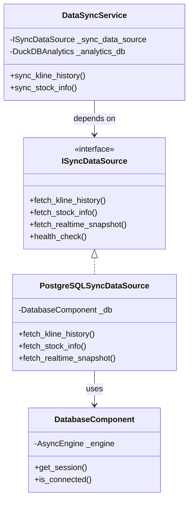

# DataSyncService 架构重构方案

> 创建日期：2025-12-09
> 状态：提案阶段
> 相关模块：`DataSyncService`、`DatabaseComponent`、`AnalyticsComponent`

---

## 🎯 第一性原理简化方案（推荐）

> "Simplicity is the ultimate sophistication." — Leonardo da Vinci

### 本质问题

回到最根本的问题：**我们到底要做什么？**

```
多个数据源 ──→ 统一存储 ──→ 供分析使用
```

就是这么简单。一切复杂性都是围绕这个核心展开的。

### 第一性原理分析

| 表面需求 | 本质需求 | 最简解决方案 |
|----------|----------|--------------|
| 多数据库适配器 | 能从多个地方读数据 | **统一的拉取函数** |
| 字段映射器 | 字段名不一样 | **一个字典** |
| 数据规范化 | 格式要统一 | **一个转换函数** |
| 增量同步 | 不想重复拉 | **记住上次拉到哪** |
| 多源合并 | 字段互补 | **SQL COALESCE** |
| 数据血缘 | 知道数据从哪来 | **一个 source 字段** |

### 极简架构

**整个系统只需要 3 个核心概念**：

```
┌─────────────────────────────────────────────────────────────┐
│                    DataSyncPipeline                          │
│                                                              │
│  ┌─────────────┐    ┌─────────────┐    ┌─────────────────┐  │
│  │   Fetcher   │───▶│ Normalizer  │───▶│     Writer      │  │
│  │   (拉取)    │    │   (规范化)   │    │    (写入)       │  │
│  └─────────────┘    └─────────────┘    └─────────────────┘  │
│                                                              │
│  配置驱动: source_configs.yaml                               │
└─────────────────────────────────────────────────────────────┘
```

### 核心代码实现（不到 200 行）

```python
"""
极简数据同步管道
核心理念：配置驱动，约定优于配置
"""

from dataclasses import dataclass, field
from datetime import datetime
from typing import Any, Callable, Dict, List, Optional
import pandas as pd


# ============ 配置 ============

@dataclass
class SourceConfig:
    """数据源配置 - 一个数据源只需要这些信息"""
    name: str                           # 数据源名称
    fetcher: Callable                   # 拉取函数
    field_map: Dict[str, str]           # 字段映射 {原始名: 标准名}
    priority: int = 0                   # 优先级（高优先级的值优先）


@dataclass
class SyncState:
    """同步状态 - 就这么简单"""
    source: str
    table: str
    last_timestamp: Optional[datetime] = None


# ============ 核心管道 ============

class DataSyncPipeline:
    """
    极简数据同步管道

    使用方式:
        pipeline = DataSyncPipeline(db)
        pipeline.register("amazingdata", fetcher=fetch_amazingdata, field_map={...})
        pipeline.register("akshare", fetcher=fetch_akshare, field_map={...})
        await pipeline.sync("kline_history")
    """

    def __init__(self, target_db):
        self._db = target_db
        self._sources: Dict[str, SourceConfig] = {}
        self._states: Dict[str, SyncState] = {}

    def register(
        self,
        name: str,
        fetcher: Callable,
        field_map: Dict[str, str],
        priority: int = 0,
    ) -> "DataSyncPipeline":
        """注册数据源 - 链式调用"""
        self._sources[name] = SourceConfig(
            name=name,
            fetcher=fetcher,
            field_map=field_map,
            priority=priority,
        )
        return self

    async def sync(
        self,
        table: str,
        sources: Optional[List[str]] = None,
        **fetch_kwargs,
    ) -> int:
        """
        同步数据

        核心逻辑只有 3 步:
        1. Fetch: 从各数据源增量拉取
        2. Normalize: 规范化字段名
        3. Write: UPSERT 到目标库（自动合并）
        """
        sources = sources or list(self._sources.keys())
        total_rows = 0

        # 按优先级排序（高优先级先同步，作为基础数据）
        sorted_sources = sorted(
            [self._sources[s] for s in sources],
            key=lambda x: -x.priority  # 降序
        )

        for source in sorted_sources:
            # 1. Fetch（增量）
            state = self._get_state(source.name, table)

            df = await self._fetch(source, table, state, **fetch_kwargs)
            if df.empty:
                continue

            # 2. Normalize
            df = self._normalize(df, source)

            # 3. Write（UPSERT + 字段补充）
            rows = await self._write(df, table, source.name)
            total_rows += rows

            # 更新状态
            self._update_state(source.name, table, df)

        return total_rows

    async def _fetch(
        self,
        source: SourceConfig,
        table: str,
        state: SyncState,
        **kwargs,
    ) -> pd.DataFrame:
        """拉取数据（自动增量）"""
        # 如果有上次同步记录，添加时间过滤
        if state.last_timestamp:
            kwargs["since"] = state.last_timestamp

        # 调用用户提供的拉取函数
        result = source.fetcher(table, **kwargs)
        if hasattr(result, "__await__"):
            result = await result

        return result if isinstance(result, pd.DataFrame) else pd.DataFrame()

    def _normalize(self, df: pd.DataFrame, source: SourceConfig) -> pd.DataFrame:
        """规范化字段名 - 就是重命名"""
        # 只重命名存在的列
        rename_map = {
            old: new
            for old, new in source.field_map.items()
            if old in df.columns
        }
        df = df.rename(columns=rename_map)

        # 添加来源标记
        df["_source"] = source.name
        df["_synced_at"] = datetime.utcnow()

        return df

    async def _write(
        self,
        df: pd.DataFrame,
        table: str,
        source_name: str,
    ) -> int:
        """
        写入数据 - 核心是 UPSERT + 字段补充

        SQL 本身就支持这个功能，不需要复杂的合并引擎！
        """
        if df.empty:
            return 0

        # 生成 UPSERT SQL（DuckDB 语法）
        columns = list(df.columns)
        key_cols = ["symbol", "timestamp"]  # 主键
        value_cols = [c for c in columns if c not in key_cols]

        # 核心技巧：使用 COALESCE 实现"空值补充"
        # INSERT ... ON CONFLICT ... UPDATE SET col = COALESCE(excluded.col, col)
        # 含义：如果新值非空则用新值，否则保留旧值

        update_clause = ", ".join([
            f"{col} = COALESCE(excluded.{col}, {table}.{col})"
            for col in value_cols
            if not col.startswith("_")  # 跳过元数据字段
        ])

        # 元数据字段总是更新
        update_clause += f", _source = excluded._source, _synced_at = excluded._synced_at"

        sql = f"""
            INSERT INTO {table} ({', '.join(columns)})
            VALUES ({', '.join(['?' for _ in columns])})
            ON CONFLICT ({', '.join(key_cols)}) DO UPDATE SET
            {update_clause}
        """

        # 批量执行
        rows = 0
        for _, row in df.iterrows():
            await self._db.execute(sql, tuple(row[c] for c in columns))
            rows += 1

        return rows

    def _get_state(self, source: str, table: str) -> SyncState:
        """获取同步状态"""
        key = f"{source}:{table}"
        if key not in self._states:
            self._states[key] = SyncState(source=source, table=table)
        return self._states[key]

    def _update_state(self, source: str, table: str, df: pd.DataFrame) -> None:
        """更新同步状态"""
        key = f"{source}:{table}"
        if "timestamp" in df.columns and not df.empty:
            self._states[key].last_timestamp = df["timestamp"].max()
```

### 使用示例

```python
# 初始化
pipeline = DataSyncPipeline(duckdb)

# 注册数据源（只需提供拉取函数和字段映射）
pipeline.register(
    name="amazingdata",
    priority=10,  # 高优先级
    fetcher=amazingdata_client.query_kline,
    field_map={
        "SECURITY_CODE": "symbol",
        "TRADE_DATE": "timestamp",
        "OPEN_PRICE": "open",
        "HIGH_PRICE": "high",
        "LOW_PRICE": "low",
        "CLOSE_PRICE": "close",
        "TRADE_VOLUME": "volume",
        "TURNOVER_RATE": "turnover_rate",  # AmazingData 独有
    }
)

pipeline.register(
    name="akshare",
    priority=5,  # 次优先级，用于补充
    fetcher=akshare_fetch_kline,
    field_map={
        "日期": "timestamp",
        "股票代码": "symbol",
        "开盘": "open",
        "最高": "high",
        "最低": "low",
        "收盘": "close",
        "成交量": "volume",
        "成交额": "amount",       # AkShare 独有
        "涨跌幅": "change_pct",   # AkShare 独有
    }
)

# 同步数据 - 自动增量 + 自动合并
await pipeline.sync("kline_history")
```

### 为什么这个设计足够？

| 复杂设计中的概念 | 简化方案中的实现 | 说明 |
|------------------|------------------|------|
| `ISyncDataSource` + 多个实现类 | **一个 `fetcher` 函数** | 函数是最简单的抽象 |
| `IFieldMapper` + 映射器类 | **一个字典 `field_map`** | 字典足矣 |
| `CanonicalKline` 规范模型 | **DataFrame 的列名** | 归一后就是标准列名 |
| `DataMergeEngine` 合并引擎 | **SQL `COALESCE`** | 数据库原生支持 |
| `IncrementalUpsertWriter` | **SQL `ON CONFLICT`** | 数据库原生支持 |
| `SyncCheckpointManager` | **内存中的 `dict`** | 简单场景足够；复杂场景序列化到文件 |
| `DataLineageTracker` | **`_source` 字段** | 一个字段解决 |
| `SyncCapability` 能力声明 | **注册时的 `field_map`** | 有什么字段一目了然 |

### 复杂度对比

```
复杂方案:
├── ISyncDataSource (接口)
├── PostgreSQLSyncDataSource
├── MySQLSyncDataSource
├── TimescaleDBSyncDataSource
├── SQLiteSyncDataSource
├── CompositeSyncDataSource
├── SyncDataSourceFactory
├── IFieldMapper (接口)
├── AmazingDataFieldMapper
├── AkShareFieldMapper
├── PostgreSQLFieldMapper
├── CanonicalKline
├── CanonicalStockInfo
├── CanonicalRealtimeQuote
├── DataMergeEngine
├── MergeStrategy (枚举)
├── DataSourcePriority
├── IncrementalUpsertWriter
├── SyncCheckpointManager
├── SyncCheckpoint
├── DataLineageTracker
├── MultiSourceSyncCoordinator
├── SyncResult
└── ... (20+ 类/接口)

简化方案:
├── DataSyncPipeline (1 个类)
├── SourceConfig (1 个配置类)
└── SyncState (1 个状态类)
    共 3 个类，约 200 行代码
```

### 扩展性保留

**Q: 如果需要更复杂的转换逻辑怎么办？**

```python
# A: 在 fetcher 函数中处理
async def fetch_amazingdata_with_transform(table, **kwargs):
    df = await amazingdata.query(...)
    # 任何复杂转换逻辑
    df["symbol"] = df["SECURITY_CODE"].apply(normalize_symbol)
    df["timestamp"] = pd.to_datetime(df["TRADE_DATE"], format="%Y%m%d")
    return df
```

**Q: 如果需要持久化同步状态怎么办？**

```python
# A: 加一个简单的持久化层
class PersistentSyncState:
    def __init__(self, file_path: str):
        self._path = file_path
        self._states = self._load()

    def _load(self) -> dict:
        if os.path.exists(self._path):
            return json.load(open(self._path))
        return {}

    def save(self):
        json.dump(self._states, open(self._path, "w"))
```

**Q: 如果需要并行同步怎么办？**

```python
# A: 使用 asyncio.gather
async def sync_parallel(self, table: str):
    tasks = [self._sync_source(s, table) for s in self._sources.values()]
    results = await asyncio.gather(*tasks)
    return sum(results)
```

### 结论

> **最好的代码是不需要写的代码。**

通过回归本质，我们发现：

1. **数据库本身就是合并引擎**（`COALESCE` + `ON CONFLICT`）
2. **函数就是最好的接口**（不需要抽象类）
3. **字典就是最好的配置**（不需要专门的配置类）
4. **DataFrame 就是规范模型**（列名统一即可）

**推荐**：先用这个极简方案实现。如果真的遇到它无法解决的问题，再逐步增加复杂度。

---

## 目录（详细设计参考）

以下章节保留了更详细的设计，**仅作参考**。如果极简方案满足需求，可跳过。

---

## 问题背景

### 现象描述

系统启动时，`DataSyncService` 输出以下警告：

```
WARNING - 数据库组件未实现 fetch_kline_history，跳过 K 线同步
WARNING - 数据库组件未实现股票信息拉取接口，跳过同步
```

### 根本原因

`DataSyncService` 的设计意图是将业务数据从 PostgreSQL 同步到 DuckDB 用于离线分析。它期望注入的 `database_component` 具有以下方法：

- `fetch_kline_history(start_date, end_date, symbols)` — 获取 K 线历史
- `fetch_stock_info()` / `get_stock_info()` — 获取股票基础信息

但实际注入的 `DatabaseComponent`（位于 `data_components.py`）是一个**底层基础设施组件**，仅负责：

- 管理 PostgreSQL 异步连接池 (`AsyncEngine`)
- 提供会话工厂 (`AsyncSession`)

这是典型的**依赖注入错配**和**职责边界不清**问题。

---

## 现状分析

### 当前架构

```
┌─────────────────────────────────────────────────────────────────┐
│                        MainEngine                               │
│  ┌─────────────────────────────────────────────────────────┐   │
│  │              AnalyticsComponent                          │   │
│  │  ┌─────────────────┐    ┌─────────────────────────────┐ │   │
│  │  │ DuckDBAnalytics │◄───│     DataSyncService         │ │   │
│  │  └─────────────────┘    │  ┌─────────────────────────┐│ │   │
│  │                         │  │ _database_component     ││ │   │
│  │                         │  │ (expects business API)  ││ │   │
│  │                         │  └───────────┬─────────────┘│ │   │
│  └─────────────────────────└──────────────┼──────────────┘ │   │
│                                           │                     │
│  ┌─────────────────────────────────────────┼───────────────┐   │
│  │              DatabaseComponent          │               │   │
│  │  ┌─────────────────────────────────────▼─────────────┐ │   │
│  │  │ AsyncEngine (PostgreSQL connection management)     │ │   │
│  │  │ - connect_async() / disconnect_async()            │ │   │
│  │  │ - get_session() -> AsyncSession                   │ │   │
│  │  │ ✗ 无 fetch_kline_history                          │ │   │
│  │  │ ✗ 无 fetch_stock_info                             │ │   │
│  │  └───────────────────────────────────────────────────┘ │   │
│  └─────────────────────────────────────────────────────────┘   │
└─────────────────────────────────────────────────────────────────┘
```

### 现有 Repository 模式

系统已有 Repository 模式的实现，但未与 `DataSyncService` 整合：

| 文件 | 职责 |
|------|------|
| `domain/interfaces/repository.py` | 定义 `IStockRepository` 协议 |
| `infrastructure/repositories/stock_repository.py` | `PostgreSQLStockRepository` 实现 |
| `infrastructure/repositories/stock_repository_impl.py` | 扩展实现 |

### 问题清单

| 编号 | 问题 | 影响 | 严重程度 |
|------|------|------|----------|
| P1 | `DataSyncService` 参数命名为 `database_component`，但期望的是业务层 API | 代码可读性差，新开发者难以理解 | 中 |
| P2 | 缺少专门的数据查询层（Repository for sync） | 同步功能完全无法工作 | 高 |
| P3 | `DatabaseComponent` 职责过于模糊 | 被错误地用于业务数据查询 | 中 |
| P4 | 现有 `PostgreSQLStockRepository` 未被同步服务使用 | 代码重复，标准化程度低 | 低 |

---

## 设计目标

1. **清晰的职责分离**：底层连接管理与业务数据查询分离
2. **接口优先**：定义明确的数据同步源接口
3. **渐进式重构**：不破坏现有功能，逐步迁移
4. **可测试性**：便于单元测试和 mock
5. **可扩展性**：支持未来接入其他数据源

---

## 解决方案

### 方案概述

引入 `ISyncDataSource` 接口和 `PostgreSQLSyncDataSource` 实现，作为 `DataSyncService` 的数据来源。

### 目标架构（多数据库适配）

核心设计理念：**抽象统一，实现分离**

```
┌──────────────────────────────────────────────────────────────────────────┐
│                            MainEngine                                     │
│  ┌────────────────────────────────────────────────────────────────────┐  │
│  │                     AnalyticsComponent                              │  │
│  │  ┌─────────────────┐    ┌────────────────────────────────────────┐ │  │
│  │  │ DuckDBAnalytics │◄───│         DataSyncService                │ │  │
│  │  └─────────────────┘    │  ┌──────────────────────────────────┐  │ │  │
│  │                         │  │ _sync_data_source                 │  │ │  │
│  │                         │  │ (ISyncDataSource)                 │  │ │  │
│  │                         │  └────────────────┬─────────────────┘  │ │  │
│  └─────────────────────────└───────────────────┼────────────────────┘ │  │
│                                                │                       │  │
│  ┌─────────────────────────────────────────────┼─────────────────────┐│  │
│  │              SyncDataSourceFactory          │                     ││  │
│  │  ┌──────────────────────────────────────────▼───────────────────┐ ││  │
│  │  │ + create(db_type, connection) -> ISyncDataSource            │ ││  │
│  │  │ + create_composite([sources]) -> CompositeSyncDataSource    │ ││  │
│  │  └──────────────────────────────────────────────────────────────┘ ││  │
│  └───────────────────────────────────────────────────────────────────┘│  │
│                                                                        │  │
│  ┌────────────────────────────────────────────────────────────────────┐│  │
│  │                    ISyncDataSource (统一接口)                        ││  │
│  │  ┌──────────────────────────────────────────────────────────────┐  ││  │
│  │  │ + fetch_kline_history(start, end, symbols) -> DataFrame     │  ││  │
│  │  │ + fetch_stock_info() -> DataFrame                           │  ││  │
│  │  │ + fetch_realtime_snapshot(symbols) -> DataFrame             │  ││  │
│  │  │ + get_capabilities() -> Set[Capability]                     │  ││  │
│  │  │ + health_check() -> bool                                    │  ││  │
│  │  └──────────────────────────────────────────────────────────────┘  ││  │
│  └────────────────────────────────────────────────────────────────────┘│  │
│                                    ▲                                    │  │
│         ┌──────────────────────────┼──────────────────────────┐        │  │
│         │                          │                          │        │  │
│  ┌──────┴──────┐  ┌────────────────┴────────────┐  ┌─────────┴──────┐ │  │
│  │ PostgreSQL  │  │         MySQL               │  │   TimescaleDB  │ │  │
│  │ Adapter     │  │        Adapter              │  │    Adapter     │ │  │
│  └─────────────┘  └─────────────────────────────┘  └────────────────┘ │  │
│         │                          │                          │        │  │
│         ▼                          ▼                          ▼        │  │
│  ┌─────────────┐  ┌─────────────────────────────┐  ┌────────────────┐ │  │
│  │ PostgreSQL  │  │         MySQL               │  │  TimescaleDB   │ │  │
│  │  Database   │  │        Database             │  │   Database     │ │  │
│  └─────────────┘  └─────────────────────────────┘  └────────────────┘ │  │
└──────────────────────────────────────────────────────────────────────────┘
```

### 多数据库适配设计

#### 4.1 为什么需要多数据库适配？

| 场景 | 需求 |
|------|------|
| **开发环境** | 使用 SQLite 快速启动，无需安装数据库 |
| **生产环境** | 使用 PostgreSQL/TimescaleDB 获得高性能 |
| **历史数据** | 从 MySQL 遗留系统迁移数据 |
| **混合部署** | 不同数据存储在不同数据库中 |
| **容灾切换** | 主库故障时切换到备库 |

#### 4.2 能力声明模式 (Capability Pattern)

不同数据库支持的能力不同，通过声明式能力检测实现优雅降级：

```python
from enum import Flag, auto

class SyncCapability(Flag):
    """数据同步能力枚举"""
    NONE = 0
    KLINE_HISTORY = auto()      # 支持 K 线历史查询
    STOCK_INFO = auto()         # 支持股票信息查询
    REALTIME_SNAPSHOT = auto()  # 支持实时快照
    BATCH_QUERY = auto()        # 支持批量查询
    STREAMING = auto()          # 支持流式读取
    TIMESERIES = auto()         # 支持时序优化

    # 常用组合
    BASIC = KLINE_HISTORY | STOCK_INFO
    FULL = BASIC | REALTIME_SNAPSHOT | BATCH_QUERY
```

#### 4.3 统一抽象层设计

```python
from abc import ABC, abstractmethod
from typing import List, Optional, Set, AsyncIterator
import pandas as pd


class ISyncDataSource(ABC):
    """统一的数据同步源接口

    所有数据库适配器必须实现此接口，同时通过 get_capabilities()
    声明自身支持的能力，让 DataSyncService 可以做出智能决策。
    """

    @property
    @abstractmethod
    def name(self) -> str:
        """数据源名称，用于日志和监控"""
        pass

    @property
    @abstractmethod
    def database_type(self) -> str:
        """数据库类型标识：postgresql, mysql, sqlite, timescaledb"""
        pass

    @abstractmethod
    def get_capabilities(self) -> Set[SyncCapability]:
        """声明该数据源支持的能力

        Returns:
            支持的能力集合
        """
        pass

    def supports(self, capability: SyncCapability) -> bool:
        """检查是否支持某项能力"""
        return capability in self.get_capabilities()

    @abstractmethod
    async def fetch_kline_history(
        self,
        start_date: Optional[str] = None,
        end_date: Optional[str] = None,
        symbols: Optional[List[str]] = None,
    ) -> pd.DataFrame:
        """获取 K 线历史数据"""
        pass

    @abstractmethod
    async def fetch_stock_info(self) -> pd.DataFrame:
        """获取股票基础信息"""
        pass

    @abstractmethod
    async def fetch_realtime_snapshot(
        self,
        symbols: Optional[List[str]] = None,
    ) -> pd.DataFrame:
        """获取实时数据快照"""
        pass

    async def fetch_kline_history_streaming(
        self,
        start_date: Optional[str] = None,
        end_date: Optional[str] = None,
        symbols: Optional[List[str]] = None,
        batch_size: int = 10000,
    ) -> AsyncIterator[pd.DataFrame]:
        """流式获取 K 线历史（用于大数据量）

        默认实现：回退到普通的 fetch_kline_history
        支持 STREAMING 能力的适配器应覆盖此方法
        """
        df = await self.fetch_kline_history(start_date, end_date, symbols)
        yield df

    @abstractmethod
    async def health_check(self) -> bool:
        """健康检查"""
        pass

    async def close(self) -> None:
        """关闭连接（可选实现）"""
        pass
```

#### 4.4 数据库特定适配器

**PostgreSQL 适配器**（完整功能）：

```python
class PostgreSQLSyncDataSource(ISyncDataSource):
    """PostgreSQL 数据同步源"""

    def __init__(self, database_component: DatabaseComponent):
        self._db = database_component
        self._dialect = PostgreSQLDialect()

    @property
    def name(self) -> str:
        return "PostgreSQL"

    @property
    def database_type(self) -> str:
        return "postgresql"

    def get_capabilities(self) -> Set[SyncCapability]:
        return {
            SyncCapability.KLINE_HISTORY,
            SyncCapability.STOCK_INFO,
            SyncCapability.REALTIME_SNAPSHOT,
            SyncCapability.BATCH_QUERY,
            SyncCapability.STREAMING,
        }

    async def fetch_kline_history(self, ...) -> pd.DataFrame:
        query = self._dialect.build_kline_query(start_date, end_date, symbols)
        return await self._execute_query(query)
```

**MySQL 适配器**（语法差异处理）：

```python
class MySQLSyncDataSource(ISyncDataSource):
    """MySQL 数据同步源"""

    def __init__(self, connection_url: str):
        self._engine = create_async_engine(connection_url)
        self._dialect = MySQLDialect()

    @property
    def database_type(self) -> str:
        return "mysql"

    def get_capabilities(self) -> Set[SyncCapability]:
        return {
            SyncCapability.KLINE_HISTORY,
            SyncCapability.STOCK_INFO,
            SyncCapability.BATCH_QUERY,
            # MySQL 不支持原生的实时快照
        }

    async def fetch_realtime_snapshot(self, ...) -> pd.DataFrame:
        # 降级处理：返回空或抛出 NotSupported
        logger.warning("MySQL 不支持实时快照，返回空数据")
        return pd.DataFrame()
```

**TimescaleDB 适配器**（时序优化）：

```python
class TimescaleDBSyncDataSource(PostgreSQLSyncDataSource):
    """TimescaleDB 数据同步源（继承自 PostgreSQL）"""

    @property
    def database_type(self) -> str:
        return "timescaledb"

    def get_capabilities(self) -> Set[SyncCapability]:
        caps = super().get_capabilities()
        caps.add(SyncCapability.TIMESERIES)  # 时序优化能力
        return caps

    async def fetch_kline_history(self, ...) -> pd.DataFrame:
        # 使用 TimescaleDB 特有的时序函数优化查询
        query = """
            SELECT time_bucket('1 minute', time) AS bucket,
                   symbol,
                   first(open, time) AS open,
                   max(high) AS high,
                   min(low) AS low,
                   last(close, time) AS close,
                   sum(volume) AS volume
            FROM kline_history
            WHERE time BETWEEN :start_date AND :end_date
            GROUP BY bucket, symbol
            ORDER BY bucket
        """
        return await self._execute_query(query)
```

**SQLite 适配器**（开发/测试用）：

```python
class SQLiteSyncDataSource(ISyncDataSource):
    """SQLite 数据同步源（轻量级，用于开发测试）"""

    @property
    def database_type(self) -> str:
        return "sqlite"

    def get_capabilities(self) -> Set[SyncCapability]:
        return {
            SyncCapability.KLINE_HISTORY,
            SyncCapability.STOCK_INFO,
            # SQLite 不支持流式和批量优化
        }
```

#### 4.5 复合数据源模式 (Composite Pattern)

支持从多个数据源聚合数据：

```python
class CompositeSyncDataSource(ISyncDataSource):
    """复合数据同步源

    聚合多个数据源，支持：
    - 按能力路由：不同查询发送到最合适的数据源
    - 故障转移：主数据源失败时切换到备用
    - 数据合并：从多个源获取不同维度的数据
    """

    def __init__(
        self,
        sources: List[ISyncDataSource],
        strategy: str = "capability",  # capability | failover | merge
    ):
        self._sources = sources
        self._strategy = strategy

    @property
    def name(self) -> str:
        names = [s.name for s in self._sources]
        return f"Composite({', '.join(names)})"

    def get_capabilities(self) -> Set[SyncCapability]:
        # 返回所有数据源能力的并集
        all_caps = set()
        for source in self._sources:
            all_caps |= source.get_capabilities()
        return all_caps

    async def fetch_kline_history(self, ...) -> pd.DataFrame:
        if self._strategy == "capability":
            # 选择支持该能力的最佳数据源
            for source in self._sources:
                if source.supports(SyncCapability.KLINE_HISTORY):
                    try:
                        return await source.fetch_kline_history(...)
                    except Exception as e:
                        logger.warning(f"{source.name} 查询失败: {e}")
                        continue

        elif self._strategy == "failover":
            # 故障转移模式
            for source in self._sources:
                try:
                    return await source.fetch_kline_history(...)
                except Exception:
                    continue

        elif self._strategy == "merge":
            # 合并多个数据源的结果
            dfs = []
            for source in self._sources:
                try:
                    df = await source.fetch_kline_history(...)
                    dfs.append(df)
                except Exception:
                    continue
            return pd.concat(dfs, ignore_index=True).drop_duplicates()

        return pd.DataFrame()
```

#### 4.6 工厂模式创建适配器

```python
class SyncDataSourceFactory:
    """数据同步源工厂

    根据配置动态创建合适的数据源适配器
    """

    _registry: Dict[str, Type[ISyncDataSource]] = {
        "postgresql": PostgreSQLSyncDataSource,
        "mysql": MySQLSyncDataSource,
        "sqlite": SQLiteSyncDataSource,
        "timescaledb": TimescaleDBSyncDataSource,
    }

    @classmethod
    def register(cls, db_type: str, adapter_class: Type[ISyncDataSource]) -> None:
        """注册新的数据库适配器"""
        cls._registry[db_type] = adapter_class

    @classmethod
    def create(
        cls,
        db_type: str,
        **kwargs,
    ) -> ISyncDataSource:
        """创建数据源实例

        Args:
            db_type: 数据库类型
            **kwargs: 传递给适配器构造函数的参数

        Returns:
            ISyncDataSource 实例

        Raises:
            ValueError: 不支持的数据库类型
        """
        if db_type not in cls._registry:
            raise ValueError(
                f"不支持的数据库类型: {db_type}. "
                f"支持: {list(cls._registry.keys())}"
            )

        adapter_class = cls._registry[db_type]
        return adapter_class(**kwargs)

    @classmethod
    def create_from_config(cls, config: DatabaseConfig) -> ISyncDataSource:
        """从配置创建数据源"""
        db_type = config.type.lower()

        # 自动检测 TimescaleDB
        if db_type == "postgresql" and config.timescale_enabled:
            db_type = "timescaledb"

        return cls.create(
            db_type=db_type,
            connection_url=config.get_url(),
            **config.extra_options,
        )

    @classmethod
    def create_composite(
        cls,
        configs: List[DatabaseConfig],
        strategy: str = "failover",
    ) -> CompositeSyncDataSource:
        """创建复合数据源"""
        sources = [cls.create_from_config(cfg) for cfg in configs]
        return CompositeSyncDataSource(sources, strategy=strategy)
```

#### 4.7 配置驱动示例

```yaml
# settings.dev.yaml
database:
  sync_sources:
    primary:
      type: postgresql
      host: localhost
      port: 5432
      database: deepsearch
      timescale_enabled: true

    fallback:
      type: sqlite
      path: ./data/fallback.db

  sync_strategy: failover  # capability | failover | merge
```

```python
# 使用配置创建数据源
config = get_config()
sync_source = SyncDataSourceFactory.create_composite(
    configs=[config.database.sync_sources.primary,
             config.database.sync_sources.fallback],
    strategy=config.database.sync_strategy,
)
```

---

## 数据规范化与表结构设计

### 5.1 问题分析：数据源异构性

不同数据源返回的数据存在显著差异：

| 差异维度 | 示例 |
|----------|------|
| **字段名称** | AmazingData: `SECURITY_CODE`, AkShare: `code`, PostgreSQL: `symbol` |
| **字段类型** | 价格可能是 `float`, `Decimal`, `str`, 甚至 `int`（分为单位） |
| **时间格式** | `2024-01-15`, `20240115`, `1705276800` (timestamp) |
| **代码格式** | `600000`, `600000.SH`, `SH600000`, `CNE000001` |
| **可用字段** | 有的源有 PE/PB，有的没有；有的有实时数据，有的只有日线 |
| **数据精度** | 高频源保留 4 位小数，日频源可能只有 2 位 |
| **空值表示** | `None`, `NaN`, `0`, `-1`, `''`, `'--'` |

### 5.2 解决方案：规范化数据模型 (Canonical Data Model)

采用**规范化中间层**设计：

```
┌─────────────┐   ┌─────────────┐   ┌─────────────┐
│ AmazingData │   │   AkShare   │   │  PostgreSQL │
│   (Raw)     │   │   (Raw)     │   │   (Raw)     │
└──────┬──────┘   └──────┬──────┘   └──────┬──────┘
       │                 │                 │
       ▼                 ▼                 ▼
┌──────────────────────────────────────────────────┐
│              Field Mapper / Normalizer            │
│  ┌────────────────────────────────────────────┐  │
│  │ - 字段名映射                               │  │
│  │ - 类型转换                                 │  │
│  │ - 代码标准化                               │  │
│  │ - 时间格式统一                             │  │
│  │ - 空值处理                                 │  │
│  │ - 数据校验                                 │  │
│  └────────────────────────────────────────────┘  │
└──────────────────────┬───────────────────────────┘
                       │
                       ▼
┌──────────────────────────────────────────────────┐
│           Canonical Data Model (规范模型)         │
│  ┌────────────────────────────────────────────┐  │
│  │ KlineRecord, StockInfo, RealtimeQuote      │  │
│  │ - 统一的字段名和类型                        │  │
│  │ - 明确的 nullable 语义                      │  │
│  │ - 数据来源标记                              │  │
│  └────────────────────────────────────────────┘  │
└──────────────────────┬───────────────────────────┘
                       │
                       ▼
┌──────────────────────────────────────────────────┐
│               Target Database (DuckDB)            │
│  ┌────────────────────────────────────────────┐  │
│  │ kline_history, stock_info, realtime_quote  │  │
│  └────────────────────────────────────────────┘  │
└──────────────────────────────────────────────────┘
```

### 5.3 规范化数据模型定义

#### 5.3.1 K 线数据规范模型

```python
from dataclasses import dataclass, field
from datetime import datetime
from decimal import Decimal
from typing import Optional
from enum import Enum


class DataSource(Enum):
    """数据来源标识"""
    POSTGRESQL = "postgresql"
    AMAZINGDATA = "amazingdata"
    AKSHARE = "akshare"
    TUSHARE = "tushare"
    YAHOO = "yahoo"
    UNKNOWN = "unknown"


@dataclass(slots=True)
class CanonicalKline:
    """规范化 K 线数据模型

    所有数据源的 K 线数据都会转换为此格式后再写入目标数据库。
    """
    # 必填字段
    symbol: str                      # 标准化代码，如 "600000.SH"
    timestamp: datetime              # 精确时间，统一 UTC
    open: Decimal                    # 开盘价
    high: Decimal                    # 最高价
    low: Decimal                     # 最低价
    close: Decimal                   # 收盘价
    volume: int                      # 成交量（股）

    # 可选字段（不是所有数据源都提供）
    amount: Optional[Decimal] = None          # 成交额
    turnover_rate: Optional[Decimal] = None   # 换手率
    amplitude: Optional[Decimal] = None       # 振幅
    change_pct: Optional[Decimal] = None      # 涨跌幅
    pre_close: Optional[Decimal] = None       # 昨收价

    # 元数据
    period: str = "1d"                        # 周期: 1m, 5m, 15m, 30m, 1h, 1d, 1w, 1M
    source: DataSource = DataSource.UNKNOWN   # 数据来源
    fetched_at: datetime = field(default_factory=datetime.utcnow)  # 获取时间

    def to_dict(self) -> dict:
        """转换为字典，用于 DataFrame 构建"""
        return {
            "symbol": self.symbol,
            "timestamp": self.timestamp,
            "open": float(self.open),
            "high": float(self.high),
            "low": float(self.low),
            "close": float(self.close),
            "volume": self.volume,
            "amount": float(self.amount) if self.amount else None,
            "turnover_rate": float(self.turnover_rate) if self.turnover_rate else None,
            "amplitude": float(self.amplitude) if self.amplitude else None,
            "change_pct": float(self.change_pct) if self.change_pct else None,
            "pre_close": float(self.pre_close) if self.pre_close else None,
            "period": self.period,
            "source": self.source.value,
            "fetched_at": self.fetched_at,
        }
```

#### 5.3.2 股票信息规范模型

```python
@dataclass(slots=True)
class CanonicalStockInfo:
    """规范化股票信息模型"""
    # 必填字段
    symbol: str                       # 标准化代码
    name: str                         # 股票名称

    # 可选字段
    exchange: Optional[str] = None    # 交易所: SSE, SZSE, BSE
    market: Optional[str] = None      # 市场: 主板, 创业板, 科创板, 北交所
    industry: Optional[str] = None    # 行业（一级）
    sector: Optional[str] = None      # 板块（细分）
    list_date: Optional[datetime] = None       # 上市日期
    delist_date: Optional[datetime] = None     # 退市日期
    status: Optional[str] = None      # 状态: normal, suspended, delisted

    # 财务指标（可能不是所有源都有）
    total_shares: Optional[int] = None         # 总股本
    float_shares: Optional[int] = None         # 流通股本
    market_cap: Optional[Decimal] = None       # 总市值
    pe_ratio: Optional[Decimal] = None         # 市盈率
    pb_ratio: Optional[Decimal] = None         # 市净率

    # 元数据
    source: DataSource = DataSource.UNKNOWN
    updated_at: datetime = field(default_factory=datetime.utcnow)
```

#### 5.3.3 实时行情规范模型

```python
@dataclass(slots=True)
class CanonicalRealtimeQuote:
    """规范化实时行情模型"""
    symbol: str
    timestamp: datetime

    # 价格
    last_price: Decimal
    open: Decimal
    high: Decimal
    low: Decimal
    pre_close: Decimal

    # 成交
    volume: int
    amount: Optional[Decimal] = None

    # 盘口（可选）
    bid_price_1: Optional[Decimal] = None
    bid_volume_1: Optional[int] = None
    ask_price_1: Optional[Decimal] = None
    ask_volume_1: Optional[int] = None
    # ... bid/ask 2-5

    # 衍生指标
    change: Optional[Decimal] = None
    change_pct: Optional[Decimal] = None
    turnover_rate: Optional[Decimal] = None

    # 元数据
    source: DataSource = DataSource.UNKNOWN
```

### 5.4 字段映射器设计

每个数据源适配器需要实现字段映射逻辑：

```python
from abc import ABC, abstractmethod
from typing import Dict, Any, List
import pandas as pd


class IFieldMapper(ABC):
    """字段映射器接口"""

    @property
    @abstractmethod
    def source_name(self) -> str:
        """数据源名称"""
        pass

    @abstractmethod
    def map_kline(self, raw_data: pd.DataFrame) -> List[CanonicalKline]:
        """将原始 K 线数据映射为规范模型"""
        pass

    @abstractmethod
    def map_stock_info(self, raw_data: pd.DataFrame) -> List[CanonicalStockInfo]:
        """将原始股票信息映射为规范模型"""
        pass

    def normalize_symbol(self, raw_symbol: str) -> str:
        """标准化股票代码

        统一格式: 600000.SH, 000001.SZ, 430047.BJ
        """
        # 子类可覆盖
        return raw_symbol


class AmazingDataFieldMapper(IFieldMapper):
    """AmazingData 字段映射器"""

    # 字段映射表
    KLINE_FIELD_MAP = {
        "SECURITY_CODE": "symbol",
        "TRADE_DATE": "timestamp",
        "OPEN_PRICE": "open",
        "HIGH_PRICE": "high",
        "LOW_PRICE": "low",
        "CLOSE_PRICE": "close",
        "TRADE_VOLUME": "volume",
        "TRADE_AMOUNT": "amount",
        "TURNOVER_RATE": "turnover_rate",
        "CHANGE_RATE": "change_pct",
        "PRE_CLOSE_PRICE": "pre_close",
    }

    @property
    def source_name(self) -> str:
        return "amazingdata"

    def map_kline(self, raw_data: pd.DataFrame) -> List[CanonicalKline]:
        results = []
        for _, row in raw_data.iterrows():
            try:
                kline = CanonicalKline(
                    symbol=self.normalize_symbol(str(row.get("SECURITY_CODE", ""))),
                    timestamp=self._parse_timestamp(row.get("TRADE_DATE")),
                    open=self._to_decimal(row.get("OPEN_PRICE")),
                    high=self._to_decimal(row.get("HIGH_PRICE")),
                    low=self._to_decimal(row.get("LOW_PRICE")),
                    close=self._to_decimal(row.get("CLOSE_PRICE")),
                    volume=int(row.get("TRADE_VOLUME", 0)),
                    amount=self._to_decimal(row.get("TRADE_AMOUNT")),
                    turnover_rate=self._to_decimal(row.get("TURNOVER_RATE")),
                    change_pct=self._to_decimal(row.get("CHANGE_RATE")),
                    pre_close=self._to_decimal(row.get("PRE_CLOSE_PRICE")),
                    source=DataSource.AMAZINGDATA,
                )
                results.append(kline)
            except Exception as e:
                logger.warning(f"映射 K 线数据失败: {e}, row={row}")
                continue
        return results

    def normalize_symbol(self, raw_symbol: str) -> str:
        """AmazingData 代码格式: 600000.SH 或 SH600000"""
        if not raw_symbol:
            return ""
        raw_symbol = raw_symbol.strip().upper()

        # 已经是标准格式
        if "." in raw_symbol:
            return raw_symbol

        # SH600000 -> 600000.SH
        if raw_symbol.startswith(("SH", "SZ", "BJ")):
            exchange = raw_symbol[:2]
            code = raw_symbol[2:]
            return f"{code}.{exchange}"

        # 600000 -> 600000.SH (根据代码规则推断)
        if raw_symbol.startswith("6"):
            return f"{raw_symbol}.SH"
        elif raw_symbol.startswith(("0", "3")):
            return f"{raw_symbol}.SZ"
        elif raw_symbol.startswith(("4", "8")):
            return f"{raw_symbol}.BJ"

        return raw_symbol

    def _parse_timestamp(self, value: Any) -> datetime:
        """解析时间戳"""
        if isinstance(value, datetime):
            return value
        if isinstance(value, str):
            # 尝试多种格式
            for fmt in ("%Y-%m-%d", "%Y%m%d", "%Y-%m-%d %H:%M:%S"):
                try:
                    return datetime.strptime(value, fmt)
                except ValueError:
                    continue
        if isinstance(value, (int, float)):
            # Unix timestamp
            return datetime.fromtimestamp(value)
        raise ValueError(f"无法解析时间: {value}")

    def _to_decimal(self, value: Any) -> Optional[Decimal]:
        """转换为 Decimal"""
        if value is None or value == "" or pd.isna(value):
            return None
        if isinstance(value, Decimal):
            return value
        try:
            return Decimal(str(value))
        except Exception:
            return None


class AkShareFieldMapper(IFieldMapper):
    """AkShare 字段映射器"""

    KLINE_FIELD_MAP = {
        "日期": "timestamp",
        "代码": "symbol",
        "开盘": "open",
        "最高": "high",
        "最低": "low",
        "收盘": "close",
        "成交量": "volume",
        "成交额": "amount",
        "换手率": "turnover_rate",
        "涨跌幅": "change_pct",
    }

    @property
    def source_name(self) -> str:
        return "akshare"

    # ... 类似实现
```

### 5.5 目标数据库表结构设计

#### 5.5.1 DuckDB 表结构

采用**宽松模式**：核心字段严格，扩展字段灵活

```sql
-- K 线历史表（核心表）
CREATE TABLE IF NOT EXISTS kline_history (
    -- 主键
    symbol VARCHAR NOT NULL,
    timestamp TIMESTAMP NOT NULL,
    period VARCHAR DEFAULT '1d',

    -- 核心字段（必填）
    open DOUBLE NOT NULL,
    high DOUBLE NOT NULL,
    low DOUBLE NOT NULL,
    close DOUBLE NOT NULL,
    volume BIGINT NOT NULL,

    -- 扩展字段（可空）
    amount DOUBLE,
    turnover_rate DOUBLE,
    amplitude DOUBLE,
    change_pct DOUBLE,
    pre_close DOUBLE,

    -- 元数据
    source VARCHAR DEFAULT 'unknown',
    fetched_at TIMESTAMP DEFAULT CURRENT_TIMESTAMP,

    -- 复合主键
    PRIMARY KEY (symbol, timestamp, period)
);

-- 股票信息表
CREATE TABLE IF NOT EXISTS stock_info (
    symbol VARCHAR PRIMARY KEY,
    name VARCHAR NOT NULL,

    -- 可选字段
    exchange VARCHAR,
    market VARCHAR,
    industry VARCHAR,
    sector VARCHAR,
    list_date DATE,
    delist_date DATE,
    status VARCHAR DEFAULT 'normal',

    -- 财务指标
    total_shares BIGINT,
    float_shares BIGINT,
    market_cap DOUBLE,
    pe_ratio DOUBLE,
    pb_ratio DOUBLE,

    -- 元数据
    source VARCHAR DEFAULT 'unknown',
    updated_at TIMESTAMP DEFAULT CURRENT_TIMESTAMP
);

-- 实时快照表（滚动更新）
CREATE TABLE IF NOT EXISTS realtime_snapshot (
    symbol VARCHAR PRIMARY KEY,
    timestamp TIMESTAMP NOT NULL,

    last_price DOUBLE NOT NULL,
    open DOUBLE,
    high DOUBLE,
    low DOUBLE,
    pre_close DOUBLE,

    volume BIGINT,
    amount DOUBLE,

    change DOUBLE,
    change_pct DOUBLE,

    -- 盘口数据（JSON 存储，灵活性高）
    order_book JSON,

    source VARCHAR DEFAULT 'unknown',
    fetched_at TIMESTAMP DEFAULT CURRENT_TIMESTAMP
);
```

#### 5.5.2 表结构版本管理

```python
class SchemaVersion:
    """表结构版本管理"""

    CURRENT_VERSION = 2

    MIGRATIONS = {
        1: [
            "ALTER TABLE kline_history ADD COLUMN IF NOT EXISTS amplitude DOUBLE",
            "ALTER TABLE kline_history ADD COLUMN IF NOT EXISTS pre_close DOUBLE",
        ],
        2: [
            "ALTER TABLE stock_info ADD COLUMN IF NOT EXISTS sector VARCHAR",
            "ALTER TABLE realtime_snapshot ADD COLUMN IF NOT EXISTS order_book JSON",
        ],
    }

    @classmethod
    async def migrate(cls, db: DuckDBAnalytics, from_version: int) -> None:
        """执行迁移"""
        for version in range(from_version + 1, cls.CURRENT_VERSION + 1):
            if version in cls.MIGRATIONS:
                for sql in cls.MIGRATIONS[version]:
                    try:
                        await db.execute(sql)
                    except Exception as e:
                        logger.warning(f"Migration {version} failed: {e}")

        # 更新版本号
        await db.execute(
            "INSERT OR REPLACE INTO schema_version VALUES (?)",
            (cls.CURRENT_VERSION,)
        )
```

### 5.6 数据质量处理

#### 5.6.1 数据校验规则

```python
from dataclasses import dataclass
from typing import List, Callable


@dataclass
class ValidationRule:
    """数据校验规则"""
    name: str
    validator: Callable[[Any], bool]
    severity: str  # error | warning | info
    message: str


class KlineValidator:
    """K 线数据校验器"""

    RULES = [
        ValidationRule(
            name="price_positive",
            validator=lambda k: k.open > 0 and k.high > 0 and k.low > 0 and k.close > 0,
            severity="error",
            message="价格必须为正数"
        ),
        ValidationRule(
            name="high_is_highest",
            validator=lambda k: k.high >= k.open and k.high >= k.close and k.high >= k.low,
            severity="error",
            message="最高价必须大于等于开、收、低价"
        ),
        ValidationRule(
            name="low_is_lowest",
            validator=lambda k: k.low <= k.open and k.low <= k.close and k.low <= k.high,
            severity="error",
            message="最低价必须小于等于开、收、高价"
        ),
        ValidationRule(
            name="volume_non_negative",
            validator=lambda k: k.volume >= 0,
            severity="error",
            message="成交量不能为负"
        ),
        ValidationRule(
            name="change_pct_reasonable",
            validator=lambda k: k.change_pct is None or -20 <= float(k.change_pct) <= 20,
            severity="warning",
            message="涨跌幅超出正常范围（-20% ~ 20%）"
        ),
    ]

    @classmethod
    def validate(cls, kline: CanonicalKline) -> List[str]:
        """校验 K 线数据，返回错误列表"""
        errors = []
        for rule in cls.RULES:
            try:
                if not rule.validator(kline):
                    if rule.severity == "error":
                        errors.append(f"[{rule.name}] {rule.message}")
                    else:
                        logger.warning(f"Validation warning: {rule.message}, symbol={kline.symbol}")
            except Exception as e:
                logger.debug(f"Validation rule {rule.name} failed: {e}")
        return errors
```

#### 5.6.2 数据清洗流水线

```python
class DataCleaningPipeline:
    """数据清洗流水线"""

    def __init__(self, validators: List = None, sanitizers: List = None):
        self.validators = validators or [KlineValidator()]
        self.sanitizers = sanitizers or []

    def process(self, records: List[CanonicalKline]) -> Tuple[List[CanonicalKline], List[dict]]:
        """处理数据，返回 (有效数据, 错误报告)"""
        valid_records = []
        error_reports = []

        for record in records:
            # 清洗
            for sanitizer in self.sanitizers:
                record = sanitizer.sanitize(record)

            # 校验
            errors = []
            for validator in self.validators:
                errors.extend(validator.validate(record))

            if errors:
                error_reports.append({
                    "symbol": record.symbol,
                    "timestamp": record.timestamp,
                    "errors": errors,
                })
            else:
                valid_records.append(record)

        # 统计
        logger.info(
            f"数据清洗完成: 总数={len(records)}, "
            f"有效={len(valid_records)}, 错误={len(error_reports)}"
        )

        return valid_records, error_reports
```

### 5.7 处理字段缺失问题

#### 5.7.1 缺失字段填充策略

```python
class FieldFillingStrategy(Enum):
    """字段缺失填充策略"""
    NULL = "null"           # 保持 NULL
    DEFAULT = "default"     # 使用默认值
    FORWARD_FILL = "ffill"  # 向前填充（时序数据）
    BACKWARD_FILL = "bfill" # 向后填充
    INTERPOLATE = "interpolate"  # 插值
    DROP = "drop"           # 丢弃整行


@dataclass
class FieldPolicy:
    """字段策略配置"""
    field_name: str
    filling_strategy: FieldFillingStrategy
    default_value: Any = None


class FieldPolicyManager:
    """字段策略管理器"""

    DEFAULT_POLICIES = {
        "amount": FieldPolicy("amount", FieldFillingStrategy.NULL),
        "turnover_rate": FieldPolicy("turnover_rate", FieldFillingStrategy.NULL),
        "pe_ratio": FieldPolicy("pe_ratio", FieldFillingStrategy.NULL),
        "pb_ratio": FieldPolicy("pb_ratio", FieldFillingStrategy.NULL),
        "change_pct": FieldPolicy("change_pct", FieldFillingStrategy.DEFAULT, Decimal("0")),
    }

    @classmethod
    def apply(cls, df: pd.DataFrame) -> pd.DataFrame:
        """应用字段填充策略"""
        for field_name, policy in cls.DEFAULT_POLICIES.items():
            if field_name not in df.columns:
                df[field_name] = policy.default_value
            elif policy.filling_strategy == FieldFillingStrategy.FORWARD_FILL:
                df[field_name] = df[field_name].ffill()
            elif policy.filling_strategy == FieldFillingStrategy.DEFAULT:
                df[field_name] = df[field_name].fillna(policy.default_value)
        return df
```

#### 5.7.2 适配器输出标准化

```python
class ISyncDataSource(ABC):
    """更新后的接口：增加规范化输出"""

    @abstractmethod
    async def fetch_kline_history_raw(self, ...) -> pd.DataFrame:
        """获取原始数据（供调试用）"""
        pass

    async def fetch_kline_history(self, ...) -> pd.DataFrame:
        """获取规范化后的 K 线数据

        子类只需实现 fetch_kline_history_raw 和字段映射器，
        基类负责调用映射器并验证数据。
        """
        raw_df = await self.fetch_kline_history_raw(...)
        if raw_df.empty:
            return pd.DataFrame()

        # 使用字段映射器转换
        canonical_records = self.field_mapper.map_kline(raw_df)

        # 数据清洗
        valid_records, errors = self.cleaning_pipeline.process(canonical_records)

        # 转换为 DataFrame
        return pd.DataFrame([r.to_dict() for r in valid_records])
```

### 5.8 完整数据流示例

```
AmazingData API 返回:
┌────────────────┬────────────┬────────────┬───────────┬───────────┬───────────┬──────────────┐
│ SECURITY_CODE  │ TRADE_DATE │ OPEN_PRICE │ HIGH_PRICE│ LOW_PRICE │CLOSE_PRICE│ TRADE_VOLUME │
├────────────────┼────────────┼────────────┼───────────┼───────────┼───────────┼──────────────┤
│ SH600000       │ 20240115   │ 10.52      │ 10.88     │ 10.45     │ 10.76     │ 12345678     │
└────────────────┴────────────┴────────────┴───────────┴───────────┴───────────┴──────────────┘
                                              │
                                              ▼ AmazingDataFieldMapper.map_kline()

CanonicalKline:
┌─────────────┬─────────────────────┬───────┬───────┬───────┬───────┬──────────┬────────────┐
│ symbol      │ timestamp           │ open  │ high  │ low   │ close │ volume   │ source     │
├─────────────┼─────────────────────┼───────┼───────┼───────┼───────┼──────────┼────────────┤
│ 600000.SH   │ 2024-01-15 00:00:00 │ 10.52 │ 10.88 │ 10.45 │ 10.76 │ 12345678 │ amazingdata│
└─────────────┴─────────────────────┴───────┴───────┴───────┴───────┴──────────┴────────────┘
                                              │
                                              ▼ KlineValidator.validate() + FieldPolicyManager.apply()

DuckDB kline_history:
┌─────────────┬─────────────────────┬────────┬───────┬───────┬───────┬───────┬──────────┬─────────┬────────────┐
│ symbol      │ timestamp           │ period │ open  │ high  │ low   │ close │ volume   │ amount  │ source     │
├─────────────┼─────────────────────┼────────┼───────┼───────┼───────┼───────┼──────────┼─────────┼────────────┤
│ 600000.SH   │ 2024-01-15 00:00:00 │ 1d     │ 10.52 │ 10.88 │ 10.45 │ 10.76 │ 12345678 │ NULL    │ amazingdata│
└─────────────┴─────────────────────┴────────┴───────┴───────┴───────┴───────┴──────────┴─────────┴────────────┘
```

---

## 增量同步与多源数据融合

### 6.1 增量同步策略

#### 6.1.1 增量同步的必要性

| 全量同步 | 增量同步 |
|----------|----------|
| 每次拉取全部数据 | 只拉取新增/变更数据 |
| 数据库压力大 | 数据库压力小 |
| 网络传输量大 | 传输量小 |
| 简单但低效 | 复杂但高效 |
| 适合小数据集 | 适合大数据集 |

#### 6.1.2 增量检测机制

```python
from dataclasses import dataclass
from datetime import datetime
from typing import Optional
from enum import Enum


class IncrementalMode(Enum):
    """增量模式"""
    FULL = "full"                    # 全量（首次同步或重建）
    TIMESTAMP = "timestamp"          # 基于时间戳
    WATERMARK = "watermark"          # 基于高水位标记
    CHANGE_DATA_CAPTURE = "cdc"      # 变更数据捕获
    CHECKSUM = "checksum"            # 基于校验和


@dataclass
class SyncCheckpoint:
    """同步检查点"""
    table_name: str
    source_name: str
    last_sync_at: datetime
    last_timestamp: Optional[datetime]  # 数据的最后时间戳
    last_rowcount: int
    watermark: Optional[str]            # 高水位标记
    checksum: Optional[str]             # 数据校验和

    def to_dict(self) -> dict:
        return {
            "table_name": self.table_name,
            "source_name": self.source_name,
            "last_sync_at": self.last_sync_at.isoformat(),
            "last_timestamp": self.last_timestamp.isoformat() if self.last_timestamp else None,
            "last_rowcount": self.last_rowcount,
            "watermark": self.watermark,
            "checksum": self.checksum,
        }


class SyncCheckpointManager:
    """同步检查点管理器

    维护每个表、每个数据源的同步进度
    """

    # 检查点存储表
    CHECKPOINT_TABLE = """
    CREATE TABLE IF NOT EXISTS _sync_checkpoints (
        table_name VARCHAR NOT NULL,
        source_name VARCHAR NOT NULL,
        last_sync_at TIMESTAMP NOT NULL,
        last_timestamp TIMESTAMP,
        last_rowcount INTEGER DEFAULT 0,
        watermark VARCHAR,
        checksum VARCHAR,
        PRIMARY KEY (table_name, source_name)
    )
    """

    def __init__(self, db: "DuckDBAnalytics"):
        self._db = db

    async def get_checkpoint(
        self, table_name: str, source_name: str
    ) -> Optional[SyncCheckpoint]:
        """获取检查点"""
        result = await self._db.query(
            """
            SELECT * FROM _sync_checkpoints
            WHERE table_name = ? AND source_name = ?
            """,
            (table_name, source_name)
        )
        if result.empty:
            return None
        row = result.iloc[0]
        return SyncCheckpoint(
            table_name=row["table_name"],
            source_name=row["source_name"],
            last_sync_at=row["last_sync_at"],
            last_timestamp=row["last_timestamp"],
            last_rowcount=row["last_rowcount"],
            watermark=row["watermark"],
            checksum=row["checksum"],
        )

    async def save_checkpoint(self, checkpoint: SyncCheckpoint) -> None:
        """保存检查点"""
        await self._db.execute(
            """
            INSERT OR REPLACE INTO _sync_checkpoints
            (table_name, source_name, last_sync_at, last_timestamp,
             last_rowcount, watermark, checksum)
            VALUES (?, ?, ?, ?, ?, ?, ?)
            """,
            (
                checkpoint.table_name,
                checkpoint.source_name,
                checkpoint.last_sync_at,
                checkpoint.last_timestamp,
                checkpoint.last_rowcount,
                checkpoint.watermark,
                checkpoint.checksum,
            )
        )

    async def get_incremental_range(
        self, table_name: str, source_name: str
    ) -> tuple[Optional[datetime], Optional[datetime]]:
        """获取增量同步的时间范围

        Returns:
            (start_time, end_time): 需要同步的时间范围
            start_time 为 None 表示需要全量同步
        """
        checkpoint = await self.get_checkpoint(table_name, source_name)
        if checkpoint is None:
            # 首次同步，全量
            return (None, None)

        return (checkpoint.last_timestamp, datetime.utcnow())
```

#### 6.1.3 增量拉取实现

```python
class ISyncDataSource(ABC):
    """扩展接口：支持增量拉取"""

    @abstractmethod
    async def fetch_kline_history(
        self,
        start_date: Optional[str] = None,
        end_date: Optional[str] = None,
        symbols: Optional[List[str]] = None,
        incremental: bool = True,           # 是否增量模式
        since_timestamp: Optional[datetime] = None,  # 增量起点
    ) -> pd.DataFrame:
        """获取 K 线历史数据

        Args:
            incremental: True 表示只获取 since_timestamp 之后的数据
            since_timestamp: 增量同步的起始时间点
        """
        pass

    def supports_incremental(self) -> bool:
        """是否支持增量同步"""
        return True


class IncrementalSyncService:
    """增量同步服务"""

    def __init__(
        self,
        data_source: ISyncDataSource,
        target_db: "DuckDBAnalytics",
        checkpoint_manager: SyncCheckpointManager,
    ):
        self._source = data_source
        self._db = target_db
        self._checkpoints = checkpoint_manager

    async def sync_kline_history(
        self,
        symbols: Optional[List[str]] = None,
        force_full: bool = False,
    ) -> SyncResult:
        """同步 K 线历史（自动增量）"""
        table_name = "kline_history"
        source_name = self._source.name

        # 获取增量范围
        if force_full or not self._source.supports_incremental():
            start_time, end_time = None, None
            mode = IncrementalMode.FULL
        else:
            start_time, end_time = await self._checkpoints.get_incremental_range(
                table_name, source_name
            )
            mode = IncrementalMode.TIMESTAMP if start_time else IncrementalMode.FULL

        logger.info(
            f"开始同步 {table_name} from {source_name}, "
            f"mode={mode.value}, range=[{start_time}, {end_time}]"
        )

        # 拉取数据
        df = await self._source.fetch_kline_history(
            start_date=start_time.strftime("%Y-%m-%d") if start_time else None,
            end_date=end_time.strftime("%Y-%m-%d") if end_time else None,
            symbols=symbols,
            incremental=(mode != IncrementalMode.FULL),
            since_timestamp=start_time,
        )

        if df.empty:
            logger.info(f"无新数据需要同步")
            return SyncResult(rows_synced=0, mode=mode)

        # 写入数据库（使用 UPSERT）
        rows_synced = await self._upsert_kline_data(df)

        # 更新检查点
        new_checkpoint = SyncCheckpoint(
            table_name=table_name,
            source_name=source_name,
            last_sync_at=datetime.utcnow(),
            last_timestamp=df["timestamp"].max(),
            last_rowcount=len(df),
            watermark=None,
            checksum=None,
        )
        await self._checkpoints.save_checkpoint(new_checkpoint)

        logger.info(f"同步完成: {rows_synced} 行")
        return SyncResult(rows_synced=rows_synced, mode=mode)
```

### 6.2 多源数据融合策略

#### 6.2.1 问题场景

```
AmazingData 返回:
┌───────────┬────────────┬───────┬───────┬───────┬───────┬──────────┬─────────────┬──────────────┐
│ symbol    │ timestamp  │ open  │ high  │ low   │ close │ volume   │ turnover_rate│ amplitude   │
│ 600000.SH │ 2024-01-15 │ 10.52 │ 10.88 │ 10.45 │ 10.76 │ 12345678 │ 2.35        │ 4.11        │
└───────────┴────────────┴───────┴───────┴───────┴───────┴──────────┴─────────────┴──────────────┘
                              ▲ 有换手率和振幅

AkShare 返回:
┌───────────┬────────────┬───────┬───────┬───────┬───────┬──────────┬─────────────┬──────────────┐
│ symbol    │ timestamp  │ open  │ high  │ low   │ close │ volume   │ amount      │ change_pct   │
│ 600000.SH │ 2024-01-15 │ 10.52 │ 10.88 │ 10.45 │ 10.76 │ 12345678 │ 133456789   │ 2.28        │
└───────────┴────────────┴───────┴───────┴───────┴───────┴──────────┴─────────────┴──────────────┘
                              ▲ 有成交额和涨跌幅

期望融合结果:
┌───────────┬────────────┬───────┬───────┬───────┬───────┬──────────┬─────────────┬──────────────┬─────────────┬──────────────┐
│ symbol    │ timestamp  │ open  │ high  │ low   │ close │ volume   │ amount      │ turnover_rate│ amplitude   │ change_pct   │
│ 600000.SH │ 2024-01-15 │ 10.52 │ 10.88 │ 10.45 │ 10.76 │ 12345678 │ 133456789   │ 2.35        │ 4.11        │ 2.28        │
└───────────┴────────────┴───────┴───────┴───────┴───────┴──────────┴─────────────┴─────────────┴─────────────┴──────────────┘
                              ▲ 融合了两个数据源的所有字段
```

#### 6.2.2 字段级合并策略

```python
from enum import Enum
from typing import Dict, Any, List, Optional
from dataclasses import dataclass


class MergeStrategy(Enum):
    """字段合并策略"""
    KEEP_FIRST = "keep_first"       # 保留第一个非空值
    KEEP_LAST = "keep_last"         # 保留最后一个值（覆盖）
    KEEP_HIGHEST_PRIORITY = "priority"  # 按数据源优先级
    KEEP_NEWEST = "newest"          # 保留最新的值
    KEEP_NON_NULL = "non_null"      # 填充空值，不覆盖已有值
    AVERAGE = "average"             # 取平均值（数值字段）
    MAX = "max"                     # 取最大值
    MIN = "min"                     # 取最小值
    CONCAT = "concat"               # 拼接（列表/字符串）


@dataclass
class FieldMergeConfig:
    """字段合并配置"""
    field_name: str
    strategy: MergeStrategy
    priority_order: List[str] = None  # 数据源优先级顺序


class DataSourcePriority:
    """数据源优先级配置

    定义每个字段应该优先使用哪个数据源的数据
    """

    # 默认字段优先级
    FIELD_PRIORITIES: Dict[str, List[str]] = {
        # 核心价格字段：优先使用 AmazingData（实时性更好）
        "open": ["amazingdata", "akshare", "tushare", "postgresql"],
        "high": ["amazingdata", "akshare", "tushare", "postgresql"],
        "low": ["amazingdata", "akshare", "tushare", "postgresql"],
        "close": ["amazingdata", "akshare", "tushare", "postgresql"],
        "volume": ["amazingdata", "akshare", "tushare", "postgresql"],

        # 成交额：AkShare 数据更完整
        "amount": ["akshare", "amazingdata", "tushare", "postgresql"],

        # 换手率/振幅：AmazingData 独有
        "turnover_rate": ["amazingdata", "tushare"],
        "amplitude": ["amazingdata", "tushare"],

        # 涨跌幅：各源都有，取 AkShare
        "change_pct": ["akshare", "amazingdata", "tushare"],

        # 财务指标：PostgreSQL（本地维护）优先
        "pe_ratio": ["postgresql", "amazingdata", "akshare"],
        "pb_ratio": ["postgresql", "amazingdata", "akshare"],
        "market_cap": ["postgresql", "amazingdata", "akshare"],
    }

    # 默认合并策略
    DEFAULT_MERGE_STRATEGIES: Dict[str, MergeStrategy] = {
        # 核心字段：按优先级
        "open": MergeStrategy.KEEP_HIGHEST_PRIORITY,
        "high": MergeStrategy.KEEP_HIGHEST_PRIORITY,
        "low": MergeStrategy.KEEP_HIGHEST_PRIORITY,
        "close": MergeStrategy.KEEP_HIGHEST_PRIORITY,
        "volume": MergeStrategy.KEEP_HIGHEST_PRIORITY,

        # 可补充字段：填充空值
        "amount": MergeStrategy.KEEP_NON_NULL,
        "turnover_rate": MergeStrategy.KEEP_NON_NULL,
        "amplitude": MergeStrategy.KEEP_NON_NULL,
        "change_pct": MergeStrategy.KEEP_NON_NULL,
        "pre_close": MergeStrategy.KEEP_NON_NULL,

        # 财务指标：保留最新
        "pe_ratio": MergeStrategy.KEEP_NEWEST,
        "pb_ratio": MergeStrategy.KEEP_NEWEST,
        "market_cap": MergeStrategy.KEEP_NEWEST,
    }
```

#### 6.2.3 数据融合引擎

```python
class DataMergeEngine:
    """数据融合引擎

    负责将多个数据源的数据合并为一条完整记录
    """

    def __init__(
        self,
        priority_config: DataSourcePriority = None,
        merge_configs: Dict[str, FieldMergeConfig] = None,
    ):
        self._priorities = priority_config or DataSourcePriority()
        self._merge_configs = merge_configs or {}

    def merge_records(
        self,
        records: List[Dict[str, Any]],
        key_fields: List[str] = ["symbol", "timestamp"],
    ) -> Dict[str, Any]:
        """合并多条记录为一条

        Args:
            records: 来自不同数据源的同一实体记录
            key_fields: 主键字段

        Returns:
            合并后的记录
        """
        if not records:
            return {}

        if len(records) == 1:
            return records[0]

        # 按数据源优先级排序
        sorted_records = self._sort_by_priority(records)

        # 初始化结果（使用最高优先级记录作为基础）
        merged = dict(sorted_records[0])

        # 逐字段合并
        all_fields = set()
        for record in records:
            all_fields.update(record.keys())

        for field in all_fields:
            if field in key_fields:
                continue  # 跳过主键

            merged[field] = self._merge_field(
                field,
                [r.get(field) for r in sorted_records],
                [r.get("source", "unknown") for r in sorted_records],
            )

        # 记录合并来源
        merged["_merged_from"] = [r.get("source") for r in records]

        return merged

    def _merge_field(
        self,
        field_name: str,
        values: List[Any],
        sources: List[str],
    ) -> Any:
        """合并单个字段的值"""
        strategy = self._get_strategy(field_name)
        priority_order = self._priorities.FIELD_PRIORITIES.get(field_name, [])

        if strategy == MergeStrategy.KEEP_FIRST:
            return self._first_non_null(values)

        elif strategy == MergeStrategy.KEEP_LAST:
            return self._last_non_null(values)

        elif strategy == MergeStrategy.KEEP_NON_NULL:
            # 返回第一个非空值，实现字段补充
            return self._first_non_null(values)

        elif strategy == MergeStrategy.KEEP_HIGHEST_PRIORITY:
            # 按优先级顺序选择
            for preferred_source in priority_order:
                for value, source in zip(values, sources):
                    if source == preferred_source and self._is_valid(value):
                        return value
            return self._first_non_null(values)

        elif strategy == MergeStrategy.AVERAGE:
            valid_values = [v for v in values if self._is_numeric(v)]
            if valid_values:
                return sum(valid_values) / len(valid_values)
            return None

        elif strategy == MergeStrategy.MAX:
            valid_values = [v for v in values if self._is_numeric(v)]
            return max(valid_values) if valid_values else None

        elif strategy == MergeStrategy.MIN:
            valid_values = [v for v in values if self._is_numeric(v)]
            return min(valid_values) if valid_values else None

        else:
            return self._first_non_null(values)

    def _first_non_null(self, values: List[Any]) -> Any:
        for v in values:
            if self._is_valid(v):
                return v
        return None

    def _last_non_null(self, values: List[Any]) -> Any:
        for v in reversed(values):
            if self._is_valid(v):
                return v
        return None

    def _is_valid(self, value: Any) -> bool:
        if value is None:
            return False
        if isinstance(value, float) and pd.isna(value):
            return False
        if isinstance(value, str) and value.strip() in ("", "--", "N/A"):
            return False
        return True

    def _is_numeric(self, value: Any) -> bool:
        if value is None:
            return False
        try:
            float(value)
            return True
        except (TypeError, ValueError):
            return False

    def _get_strategy(self, field_name: str) -> MergeStrategy:
        if field_name in self._merge_configs:
            return self._merge_configs[field_name].strategy
        return self._priorities.DEFAULT_MERGE_STRATEGIES.get(
            field_name, MergeStrategy.KEEP_NON_NULL
        )

    def _sort_by_priority(self, records: List[Dict]) -> List[Dict]:
        """按数据源整体优先级排序"""
        # 默认优先级顺序
        default_order = ["amazingdata", "akshare", "tushare", "postgresql", "unknown"]

        def priority_key(record):
            source = record.get("source", "unknown")
            try:
                return default_order.index(source)
            except ValueError:
                return len(default_order)

        return sorted(records, key=priority_key)
```

#### 6.2.4 UPSERT 与字段补充

```python
class IncrementalUpsertWriter:
    """增量 UPSERT 写入器

    支持：
    1. 新记录插入
    2. 已有记录更新
    3. 空字段补充（不覆盖已有非空值）
    """

    def __init__(self, db: "DuckDBAnalytics", merge_engine: DataMergeEngine):
        self._db = db
        self._merge_engine = merge_engine

    async def upsert_kline_history(
        self,
        new_data: pd.DataFrame,
        source_name: str,
        merge_mode: str = "supplement",  # supplement | replace | merge
    ) -> int:
        """UPSERT K 线数据

        Args:
            new_data: 新数据
            source_name: 数据源名称
            merge_mode:
                - supplement: 只填充空字段，不覆盖已有值
                - replace: 完全覆盖已有记录
                - merge: 按字段优先级合并

        Returns:
            影响的行数
        """
        if new_data.empty:
            return 0

        # 添加来源标记
        new_data["source"] = source_name
        new_data["fetched_at"] = datetime.utcnow()

        key_columns = ["symbol", "timestamp", "period"]

        if merge_mode == "replace":
            # 直接覆盖
            return await self._upsert_replace(new_data, key_columns)

        elif merge_mode == "supplement":
            # 只补充空字段
            return await self._upsert_supplement(new_data, key_columns, source_name)

        else:  # merge
            # 按优先级合并
            return await self._upsert_merge(new_data, key_columns, source_name)

    async def _upsert_supplement(
        self,
        new_data: pd.DataFrame,
        key_columns: List[str],
        source_name: str,
    ) -> int:
        """补充模式：只填充空字段"""

        # 获取已有数据的主键
        keys = new_data[key_columns].drop_duplicates()
        key_conditions = " AND ".join([f"{col} = ?" for col in key_columns])

        rows_affected = 0

        for _, row in new_data.iterrows():
            key_values = tuple(row[col] for col in key_columns)

            # 查询已有记录
            existing = await self._db.query(
                f"SELECT * FROM kline_history WHERE {key_conditions}",
                key_values
            )

            if existing.empty:
                # 新记录，直接插入
                await self._insert_row(row)
                rows_affected += 1
            else:
                # 已有记录，补充空字段
                existing_row = existing.iloc[0].to_dict()
                update_fields = {}

                for col in row.index:
                    if col in key_columns:
                        continue

                    new_value = row[col]
                    existing_value = existing_row.get(col)

                    # 只有当现有值为空且新值非空时才更新
                    if self._is_empty(existing_value) and not self._is_empty(new_value):
                        update_fields[col] = new_value

                if update_fields:
                    await self._update_fields(key_values, key_columns, update_fields)
                    rows_affected += 1

        return rows_affected

    async def _upsert_merge(
        self,
        new_data: pd.DataFrame,
        key_columns: List[str],
        source_name: str,
    ) -> int:
        """合并模式：按字段优先级合并"""
        key_conditions = " AND ".join([f"{col} = ?" for col in key_columns])
        rows_affected = 0

        for _, row in new_data.iterrows():
            key_values = tuple(row[col] for col in key_columns)
            new_record = row.to_dict()
            new_record["source"] = source_name

            # 查询已有记录
            existing = await self._db.query(
                f"SELECT * FROM kline_history WHERE {key_conditions}",
                key_values
            )

            if existing.empty:
                await self._insert_row(row)
                rows_affected += 1
            else:
                existing_record = existing.iloc[0].to_dict()

                # 合并两条记录
                merged = self._merge_engine.merge_records(
                    [existing_record, new_record],
                    key_fields=key_columns,
                )

                # 检查是否有变化
                if self._has_changes(existing_record, merged, key_columns):
                    await self._update_row(key_values, key_columns, merged)
                    rows_affected += 1

        return rows_affected

    def _is_empty(self, value: Any) -> bool:
        if value is None:
            return True
        if isinstance(value, float) and pd.isna(value):
            return True
        if isinstance(value, str) and value.strip() == "":
            return True
        return False
```

### 6.3 多源协调同步

#### 6.3.1 同步协调器

```python
class MultiSourceSyncCoordinator:
    """多数据源同步协调器

    协调多个数据源的同步，实现数据融合
    """

    def __init__(
        self,
        sources: List[ISyncDataSource],
        target_db: "DuckDBAnalytics",
        merge_engine: DataMergeEngine,
    ):
        self._sources = sources
        self._db = target_db
        self._merge_engine = merge_engine
        self._checkpoints = SyncCheckpointManager(target_db)
        self._writer = IncrementalUpsertWriter(target_db, merge_engine)

    async def sync_kline_history(
        self,
        symbols: Optional[List[str]] = None,
        parallel: bool = True,
    ) -> Dict[str, SyncResult]:
        """从所有数据源同步 K 线数据

        Args:
            symbols: 股票代码列表
            parallel: 是否并行拉取

        Returns:
            各数据源的同步结果
        """
        results = {}

        if parallel:
            # 并行从各数据源拉取
            tasks = [
                self._sync_from_source(source, symbols)
                for source in self._sources
            ]
            source_results = await asyncio.gather(*tasks, return_exceptions=True)

            for source, result in zip(self._sources, source_results):
                if isinstance(result, Exception):
                    logger.error(f"从 {source.name} 同步失败: {result}")
                    results[source.name] = SyncResult(rows_synced=0, error=str(result))
                else:
                    results[source.name] = result
        else:
            # 按优先级顺序同步
            for source in self._sorted_sources():
                try:
                    result = await self._sync_from_source(source, symbols)
                    results[source.name] = result
                except Exception as e:
                    logger.error(f"从 {source.name} 同步失败: {e}")
                    results[source.name] = SyncResult(rows_synced=0, error=str(e))

        # 统计
        total_rows = sum(r.rows_synced for r in results.values() if not r.error)
        logger.info(
            f"多源同步完成: {len(results)} 个数据源, "
            f"总计 {total_rows} 行"
        )

        return results

    async def _sync_from_source(
        self,
        source: ISyncDataSource,
        symbols: Optional[List[str]],
    ) -> SyncResult:
        """从单个数据源同步"""
        # 获取增量范围
        start_time, _ = await self._checkpoints.get_incremental_range(
            "kline_history", source.name
        )

        # 拉取数据
        df = await source.fetch_kline_history(
            start_date=start_time.strftime("%Y-%m-%d") if start_time else None,
            symbols=symbols,
            incremental=bool(start_time),
        )

        if df.empty:
            return SyncResult(rows_synced=0)

        # 使用 supplement 模式写入（补充空字段）
        rows = await self._writer.upsert_kline_history(
            df,
            source_name=source.name,
            merge_mode="supplement",
        )

        # 更新检查点
        await self._checkpoints.save_checkpoint(SyncCheckpoint(
            table_name="kline_history",
            source_name=source.name,
            last_sync_at=datetime.utcnow(),
            last_timestamp=df["timestamp"].max(),
            last_rowcount=len(df),
            watermark=None,
            checksum=None,
        ))

        return SyncResult(rows_synced=rows)

    def _sorted_sources(self) -> List[ISyncDataSource]:
        """按优先级排序数据源"""
        priority_order = ["amazingdata", "akshare", "tushare", "postgresql"]

        def key(source):
            try:
                return priority_order.index(source.name.lower())
            except ValueError:
                return len(priority_order)

        return sorted(self._sources, key=key)
```

### 6.4 数据血缘追踪

```python
class DataLineageTracker:
    """数据血缘追踪

    记录每个字段值的来源，便于数据质量分析和问题排查
    """

    LINEAGE_TABLE = """
    CREATE TABLE IF NOT EXISTS _data_lineage (
        record_key VARCHAR NOT NULL,     -- symbol + timestamp + period
        field_name VARCHAR NOT NULL,
        source_name VARCHAR NOT NULL,
        value_hash VARCHAR,              -- 值的 hash（用于变更检测）
        synced_at TIMESTAMP NOT NULL,
        PRIMARY KEY (record_key, field_name)
    )
    """

    def __init__(self, db: "DuckDBAnalytics"):
        self._db = db

    async def track(
        self,
        record_key: str,
        field_updates: Dict[str, Tuple[str, Any]],  # field -> (source, value)
    ) -> None:
        """记录字段来源"""
        for field_name, (source_name, value) in field_updates.items():
            value_hash = hashlib.md5(str(value).encode()).hexdigest()[:16]

            await self._db.execute(
                """
                INSERT OR REPLACE INTO _data_lineage
                (record_key, field_name, source_name, value_hash, synced_at)
                VALUES (?, ?, ?, ?, ?)
                """,
                (record_key, field_name, source_name, value_hash, datetime.utcnow())
            )

    async def get_field_source(
        self,
        record_key: str,
        field_name: str,
    ) -> Optional[str]:
        """获取字段值的来源"""
        result = await self._db.query(
            """
            SELECT source_name FROM _data_lineage
            WHERE record_key = ? AND field_name = ?
            """,
            (record_key, field_name)
        )
        if result.empty:
            return None
        return result.iloc[0]["source_name"]

    async def get_source_coverage(self) -> pd.DataFrame:
        """获取各数据源的字段覆盖率统计"""
        return await self._db.query(
            """
            SELECT
                source_name,
                field_name,
                COUNT(*) as record_count
            FROM _data_lineage
            GROUP BY source_name, field_name
            ORDER BY source_name, field_name
            """
        )
```

### 6.5 完整多源同步流程示例

```
┌─────────────┐     ┌─────────────┐     ┌─────────────┐
│ AmazingData │     │   AkShare   │     │  PostgreSQL │
└──────┬──────┘     └──────┬──────┘     └──────┬──────┘
       │ 增量拉取           │ 增量拉取           │ 增量拉取
       │ since: 2024-01-14 │ since: 2024-01-14 │ since: 2024-01-14
       ▼                   ▼                   ▼
┌──────────────────────────────────────────────────────┐
│                MultiSourceSyncCoordinator             │
│  1. 并行从各数据源拉取增量数据                         │
│  2. 规范化字段名和格式                                 │
│  3. 按主键分组                                        │
└──────────────────────────────────────────────────────┘
       │
       ▼
┌──────────────────────────────────────────────────────┐
│                   DataMergeEngine                     │
│  对于 symbol=600000.SH, timestamp=2024-01-15:        │
│                                                       │
│  AmazingData: {open:10.52, turnover_rate:2.35, ...}  │
│  AkShare:     {open:10.52, amount:133456789, ...}    │
│  PostgreSQL:  {pe_ratio:8.5, pb_ratio:0.9, ...}      │
│                                                       │
│  合并策略:                                            │
│  - open: KEEP_HIGHEST_PRIORITY → AmazingData=10.52   │
│  - turnover_rate: KEEP_NON_NULL → AmazingData=2.35   │
│  - amount: KEEP_NON_NULL → AkShare=133456789         │
│  - pe_ratio: KEEP_NON_NULL → PostgreSQL=8.5          │
└──────────────────────────────────────────────────────┘
       │
       ▼
┌──────────────────────────────────────────────────────┐
│                IncrementalUpsertWriter                │
│                                                       │
│  UPSERT into kline_history:                          │
│  - 新记录: INSERT                                    │
│  - 已有记录且有新字段: UPDATE SET col=? WHERE col IS NULL│
│  - 已有记录无变化: SKIP                               │
└──────────────────────────────────────────────────────┘
       │
       ▼
┌──────────────────────────────────────────────────────┐
│                   SyncCheckpointManager               │
│                                                       │
│  更新检查点:                                          │
│  - amazingdata: last_timestamp = 2024-01-15 15:00    │
│  - akshare: last_timestamp = 2024-01-15 15:00        │
│  - postgresql: last_timestamp = 2024-01-15 12:00     │
└──────────────────────────────────────────────────────┘
       │
       ▼
┌──────────────────────────────────────────────────────┐
│                   DataLineageTracker                  │
│                                                       │
│  记录字段来源:                                        │
│  - (600000.SH, 2024-01-15, open) → amazingdata       │
│  - (600000.SH, 2024-01-15, amount) → akshare         │
│  - (600000.SH, 2024-01-15, pe_ratio) → postgresql    │
└──────────────────────────────────────────────────────┘
```

---

## 详细设计

### 5.1 接口定义

**文件**: `deepsearch/infrastructure/providers/managers/sync_data_source.py`

```python
from abc import ABC, abstractmethod
from typing import List, Optional
import pandas as pd


class ISyncDataSource(ABC):
    """数据同步源接口

    定义 DataSyncService 所需的数据获取能力。
    实现类负责从具体数据源（PostgreSQL、外部 API 等）拉取数据。
    """

    @abstractmethod
    async def fetch_kline_history(
        self,
        start_date: Optional[str] = None,
        end_date: Optional[str] = None,
        symbols: Optional[List[str]] = None,
    ) -> pd.DataFrame:
        """获取 K 线历史数据

        Args:
            start_date: 开始日期 (YYYY-MM-DD)
            end_date: 结束日期 (YYYY-MM-DD)
            symbols: 股票代码列表，None 表示全部

        Returns:
            包含 symbol, time, open, high, low, close, volume 等字段的 DataFrame
        """
        pass

    @abstractmethod
    async def fetch_stock_info(self) -> pd.DataFrame:
        """获取股票基础信息

        Returns:
            包含 symbol, name, market, sector 等字段的 DataFrame
        """
        pass

    @abstractmethod
    async def fetch_realtime_snapshot(
        self,
        symbols: Optional[List[str]] = None,
    ) -> pd.DataFrame:
        """获取实时数据快照

        Args:
            symbols: 股票代码列表，None 表示全部

        Returns:
            最新行情快照 DataFrame
        """
        pass

    async def health_check(self) -> bool:
        """健康检查

        Returns:
            数据源是否可用
        """
        return True
```

### 5.2 PostgreSQL 实现

**文件**: `deepsearch/infrastructure/providers/managers/postgresql_sync_data_source.py`

```python
from typing import List, Optional
import pandas as pd
from sqlalchemy import text
from sqlalchemy.ext.asyncio import AsyncSession

from .sync_data_source import ISyncDataSource
from deepsearch.core.components.data_components import DatabaseComponent
from deepsearch.observability import get_logger

logger = get_logger(__name__)


class PostgreSQLSyncDataSource(ISyncDataSource):
    """PostgreSQL 数据同步源实现

    从 PostgreSQL 数据库读取业务数据，供 DataSyncService 同步到 DuckDB。
    """

    def __init__(self, database_component: DatabaseComponent):
        """初始化

        Args:
            database_component: 数据库连接组件
        """
        self._db = database_component

    async def fetch_kline_history(
        self,
        start_date: Optional[str] = None,
        end_date: Optional[str] = None,
        symbols: Optional[List[str]] = None,
    ) -> pd.DataFrame:
        """从 PostgreSQL 获取 K 线历史"""
        if not self._db.is_connected():
            logger.warning("数据库未连接，无法获取 K 线历史")
            return pd.DataFrame()

        try:
            async with self._db.get_session() as session:
                query = "SELECT * FROM kline_history WHERE 1=1"
                params = {}

                if start_date:
                    query += " AND time >= :start_date"
                    params["start_date"] = start_date
                if end_date:
                    query += " AND time <= :end_date"
                    params["end_date"] = end_date
                if symbols:
                    query += " AND symbol = ANY(:symbols)"
                    params["symbols"] = symbols

                result = await session.execute(text(query), params)
                rows = result.fetchall()
                columns = result.keys()

                return pd.DataFrame(rows, columns=columns)

        except Exception as e:
            logger.error(f"获取 K 线历史失败: {e}")
            return pd.DataFrame()

    async def fetch_stock_info(self) -> pd.DataFrame:
        """从 PostgreSQL 获取股票信息"""
        if not self._db.is_connected():
            logger.warning("数据库未连接，无法获取股票信息")
            return pd.DataFrame()

        try:
            async with self._db.get_session() as session:
                result = await session.execute(
                    text("SELECT symbol, name, market, sector FROM stocks")
                )
                rows = result.fetchall()
                columns = result.keys()

                return pd.DataFrame(rows, columns=columns)

        except Exception as e:
            logger.error(f"获取股票信息失败: {e}")
            return pd.DataFrame()

    async def fetch_realtime_snapshot(
        self,
        symbols: Optional[List[str]] = None,
    ) -> pd.DataFrame:
        """获取实时快照（暂不支持，返回空）"""
        logger.debug("PostgreSQL 不支持实时快照，跳过")
        return pd.DataFrame()

    async def health_check(self) -> bool:
        """检查数据库连接健康状态"""
        return self._db.is_connected()
```

### 5.3 DataSyncService 改造

**修改**: `deepsearch/infrastructure/providers/managers/data_sync_service.py`

```diff
- def __init__(self, database_component=None):
+ def __init__(self, sync_data_source: "ISyncDataSource | None" = None):
      """
      初始化数据同步服务

      Args:
-         database_component: 数据库组件实例，用于获取PostgreSQL连接
+         sync_data_source: 数据同步源，提供业务数据获取能力
      """
-     self._database_component = database_component
+     self._sync_data_source = sync_data_source
      self._analytics_db = None
      # ... 其他初始化代码
```

```diff
  async def sync_kline_history(self, ...):
-     if not self._database_component:
+     if not self._sync_data_source:
          logger.warning("未配置数据同步源，无法同步 K 线数据")
          return

-     fetcher = getattr(self._database_component, "fetch_kline_history", None)
-     if fetcher is None:
-         logger.warning("数据库组件未实现 fetch_kline_history，跳过 K 线同步")
-         return
-
-     result = fetcher(**fetch_kwargs)
-     if inspect.iscoroutine(result):
-         result = await result
+     result = await self._sync_data_source.fetch_kline_history(**fetch_kwargs)
```

### 5.4 AnalyticsComponent 适配

**修改**: `deepsearch/core/components/analytics_components.py`

```diff
  async def _do_initialize(self) -> None:
      # ... 其他初始化代码

      if analytics_config.auto_sync:
-         self._sync_service = get_sync_service(self._database_component)
+         # 创建数据同步源
+         sync_data_source = None
+         if self._database_component and self._database_component.is_connected():
+             from deepsearch.infrastructure.providers.managers.postgresql_sync_data_source import (
+                 PostgreSQLSyncDataSource,
+             )
+             sync_data_source = PostgreSQLSyncDataSource(self._database_component)
+
+         self._sync_service = get_sync_service(sync_data_source)
```

---

## 边界情况与容错

### 6.1 数据库未连接

| 场景 | 处理方式 |
|------|---------|
| `DatabaseComponent` 未启用 | `ISyncDataSource` 为 `None`，同步服务跳过所有同步任务 |
| 数据库连接中断 | `health_check()` 返回 `False`，同步时检测并记录警告 |
| 数据库重连成功 | 下一次同步周期自动恢复 |

### 6.2 表不存在

```python
async def fetch_kline_history(...) -> pd.DataFrame:
    try:
        # 执行查询
    except ProgrammingError as e:
        if "relation" in str(e) and "does not exist" in str(e):
            logger.info("kline_history 表不存在，跳过同步")
            return pd.DataFrame()
        raise
```

### 6.3 大数据量分批处理

```python
async def fetch_kline_history(
    self,
    start_date: Optional[str] = None,
    end_date: Optional[str] = None,
    symbols: Optional[List[str]] = None,
    batch_size: int = 10000,
) -> pd.DataFrame:
    """支持分批获取，避免内存溢出"""
    # 实现分页查询逻辑
```

### 6.4 多数据源支持

未来可扩展其他数据源实现：

```python
class AmazingDataSyncDataSource(ISyncDataSource):
    """从 AmazingData 同步数据"""
    pass

class AkShareSyncDataSource(ISyncDataSource):
    """从 AkShare 同步数据"""
    pass
```

---

## 迁移策略

### Phase 1: 创建新接口和实现（低风险）

1. 创建 `ISyncDataSource` 接口
2. 创建 `PostgreSQLSyncDataSource` 实现
3. 添加单元测试

**预计时间**: 1 天
**风险等级**: 低（新增代码，不影响现有功能）

### Phase 2: 改造 DataSyncService（中风险）

1. 修改 `DataSyncService` 构造函数签名
2. 更新内部调用逻辑
3. 保留向后兼容的 `set_database_component` 方法（deprecated）

**预计时间**: 1 天
**风险等级**: 中（修改核心服务，需回归测试）

### Phase 3: 更新依赖注入（中风险）

1. 修改 `AnalyticsComponent` 初始化逻辑
2. 修改 `get_sync_service()` 工厂函数
3. 更新相关文档

**预计时间**: 0.5 天
**风险等级**: 中（涉及组件生命周期）

### Phase 4: 清理与文档（低风险）

1. 移除废弃的 `set_database_component` 方法
2. 更新 README 和 Runbook
3. 添加集成测试

**预计时间**: 0.5 天
**风险等级**: 低

---

## 验证计划

### 单元测试

```python
# tests/unit/infrastructure/providers/managers/test_postgresql_sync_data_source.py

@pytest.fixture
def mock_database_component():
    component = MagicMock(spec=DatabaseComponent)
    component.is_connected.return_value = True
    return component

async def test_fetch_kline_history_returns_dataframe(mock_database_component):
    source = PostgreSQLSyncDataSource(mock_database_component)
    result = await source.fetch_kline_history()
    assert isinstance(result, pd.DataFrame)

async def test_fetch_stock_info_when_disconnected(mock_database_component):
    mock_database_component.is_connected.return_value = False
    source = PostgreSQLSyncDataSource(mock_database_component)
    result = await source.fetch_stock_info()
    assert result.empty
```

### 集成测试

```python
# tests/integration/test_data_sync_pipeline.py

async def test_sync_pipeline_end_to_end():
    """验证完整的同步链路：PostgreSQL -> DataSyncService -> DuckDB"""
    pass
```

### 手动验证

1. 启动系统，确认无 WARNING 日志
2. 调用 `/api/analytics/sync` 触发手动同步
3. 查询 DuckDB 验证数据已写入

---

## 风险评估

| 风险 | 可能性 | 影响 | 缓解措施 |
|------|--------|------|---------|
| 重构引入新 bug | 中 | 中 | 充分的单元测试 + 代码审查 |
| 性能下降 | 低 | 中 | 新增接口层开销极小，可忽略 |
| 向后兼容性破坏 | 低 | 高 | 保留 deprecated 方法过渡 |
| 文档不同步 | 中 | 低 | 重构完成后立即更新文档 |

---

## 附录

### A. 相关文件清单

| 文件 | 操作 |
|------|------|
| `infrastructure/providers/managers/sync_data_source.py` | 新建 |
| `infrastructure/providers/managers/postgresql_sync_data_source.py` | 新建 |
| `infrastructure/providers/managers/data_sync_service.py` | 修改 |
| `core/components/analytics_components.py` | 修改 |
| `infrastructure/providers/managers/__init__.py` | 修改（导出新接口） |

### B. 依赖关系图



---

## 审批与反馈

- [ ] 技术评审通过
- [ ] 代码审查完成
- [ ] QA 验证通过
- [ ] 文档更新完成
