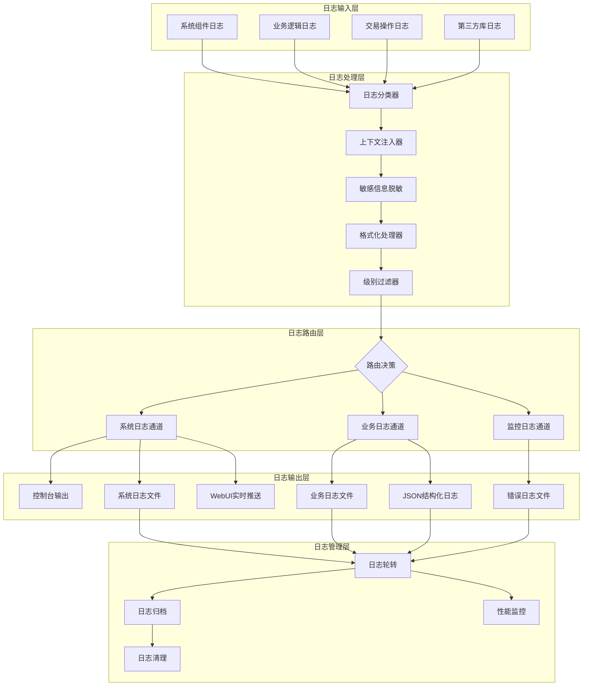

# DeepSearch 日志系统架构设计

## 一、现有系统分析

### 1.1 当前实现

- **主日志模块**: `observability/logger.py` - 基于 loguru 的核心日志系统
- **美化日志模块**: `observability/pretty_logger.py` - 提供美化的控制台输出
- **配置管理**: `observability/logger_config.py` - 动态日志级别控制（冗余，需要移除）
- **配置模型**: `config/models/log.py` - Pydantic 配置模型

### 1.2 现有功能

1. **多输出目标**: 控制台、文本文件、JSON文件、错误专用文件
2. **日志轮转**: 基于时间和大小的轮转策略
3. **日志保留**: 可配置的保留天数
4. **格式化**: Spring Boot 风格格式化
5. **标准库集成**: 拦截 Python 标准库日志
6. **进程安全**: 处理多进程环境
7. **动态配置**: 支持运行时调整日志级别

### 1.3 存在的问题

1. 存在两个日志配置模块（logger.py 和 logger_config.py），功能重复
2. 缺少系统日志和业务日志的明确分离
3. 没有结构化日志字段标准
4. 缺少日志上下文传递机制
5. 没有敏感信息脱敏功能

## 二、架构设计流程图



## 三、详细设计方案

### 3.1 日志分类策略

#### 系统日志 (System Logs)

- **内容**: 组件生命周期、配置加载、资源管理、性能指标
- **模块**: core, event, messaging, gateway, webui
- **级别**: DEBUG/INFO/WARNING/ERROR
- **文件**: `deepsearch_system_{date}.log`

#### 业务日志 (Business Logs)

- **内容**: 交易信号、订单执行、持仓变化、策略决策
- **模块**: trading, strategy, indicators
- **级别**: INFO/WARNING/ERROR
- **文件**: `deepsearch_trading_{date}.log`
- **特殊字段**: symbol, action, price, volume, strategy_id

#### 监控日志 (Monitoring Logs)

- **内容**: 性能指标、健康检查、异常告警
- **模块**: monitoring, observability
- **级别**: INFO/WARNING/ERROR/CRITICAL
- **文件**: `deepsearch_monitor_{date}.log`

### 3.2 结构化日志格式

```python
# 系统日志结构
{
    "timestamp": "2024-01-30T10:30:45.123Z",
    "level": "INFO",
    "logger": "deepsearch.core.engine",
    "component": "MainEngine",
    "action": "start",
    "duration_ms": 1234,
    "status": "success",
    "context": {
        "version": "1.0.0",
        "environment": "dev"
    },
    "message": "主引擎启动成功"
}

# 业务日志结构
{
    "timestamp": "2024-01-30T10:30:45.123Z",
    "level": "INFO",
    "logger": "deepsearch.trading",
    "event_type": "order_executed",
    "symbol": "000001.SZ",
    "action": "BUY",
    "price": 12.34,
    "volume": 1000,
    "strategy_id": "mean_reversion_01",
    "order_id": "ORD20240130001",
    "execution_time_ms": 23,
    "message": "订单执行成功"
}
```

### 3.3 实现步骤（基于现有 loguru）

#### 第一步：创建日志分类器

```python
class LogClassifier:
    """日志分类器，根据模块名和内容分类日志"""
    
    SYSTEM_MODULES = ["core", "event", "messaging", "gateway", "webui"]
    BUSINESS_MODULES = ["trading", "strategy", "indicators"]
    MONITOR_MODULES = ["monitoring", "observability"]
    
    @classmethod
    def classify(cls, record) -> str:
        module = record["name"]
        for mod in cls.BUSINESS_MODULES:
            if mod in module:
                return "business"
        for mod in cls.MONITOR_MODULES:
            if mod in module:
                return "monitor"
        return "system"
```

#### 第二步：增强上下文管理

```python
class LogContext:
    """日志上下文管理器"""
    
    def __init__(self):
        self._context = {}
    
    def bind(self, **kwargs):
        """绑定上下文信息"""
        self._context.update(kwargs)
        return logger.bind(**self._context)
    
    def clear(self):
        """清除上下文"""
        self._context.clear()
```

#### 第三步：实现敏感信息脱敏

```python
class SensitiveFilter:
    """敏感信息过滤器"""
    
    PATTERNS = {
        "password": r"password['\"]?\s*[:=]\s*['\"]?([^'\"}\s]+)",
        "token": r"token['\"]?\s*[:=]\s*['\"]?([^'\"}\s]+)",
        "key": r"api_key['\"]?\s*[:=]\s*['\"]?([^'\"}\s]+)"
    }
    
    @classmethod
    def filter(cls, message: str) -> str:
        for name, pattern in cls.PATTERNS.items():
            message = re.sub(pattern, f"{name}=******", message)
        return message
```

### 3.4 配置示例

```yaml
# settings.dev.yaml
log:
  active: true
  level: DEBUG
  rotation: "00:00"
  retention_days: 7
  json: true
  
  # 新增配置
  categories:
    system:
      level: INFO
      file: "deepsearch_system_{time}.log"
      retention_days: 7
    business:
      level: INFO
      file: "deepsearch_trading_{time}.log"
      retention_days: 30  # 业务日志保留更长时间
    monitor:
      level: WARNING
      file: "deepsearch_monitor_{time}.log"
      retention_days: 14
  
  # 模块级别控制
  modules:
    "deepsearch.core.engine": DEBUG
    "deepsearch.trading": INFO
    "deepsearch.webui": WARNING
```

## 四、重构计划

### 4.1 第一阶段：清理和整合

1. 删除 `logger_config.py`（冗余）
2. 整合 `logger.py` 和 `pretty_logger.py` 的功能
3. 统一日志配置管理

### 4.2 第二阶段：实现日志分类

1. 实现 LogClassifier
2. 创建不同类别的日志输出通道
3. 根据分类路由日志到不同文件

### 4.3 第三阶段：增强功能

1. 实现结构化日志字段
2. 添加上下文管理
3. 实现敏感信息脱敏
4. 支持日志实时推送到 WebUI

### 4.4 第四阶段：优化和测试

1. 性能优化（异步写入）
2. 单元测试覆盖
3. 集成测试
4. 文档更新

## 五、兼容性保证

1. **API 兼容**: 保持现有的 `logger` 对象接口不变
2. **配置兼容**: 新配置向后兼容，旧配置继续工作
3. **输出兼容**: 默认输出格式保持不变，新格式可选
4. **导入兼容**: 保持现有的导入路径不变

## 六、性能考虑

1. **异步写入**: 使用 loguru 的 `enqueue=True` 确保非阻塞
2. **批量写入**: 对于高频日志，实现批量写入机制
3. **内存控制**: 限制日志队列大小，防止内存溢出
4. **条件日志**: 使用 `logger.opt(lazy=True)` 延迟计算

## 七、监控指标

1. **日志吞吐量**: 每秒日志条数
2. **写入延迟**: 日志写入磁盘的延迟
3. **队列长度**: 待写入日志的队列长度
4. **错误率**: 日志写入失败的比例