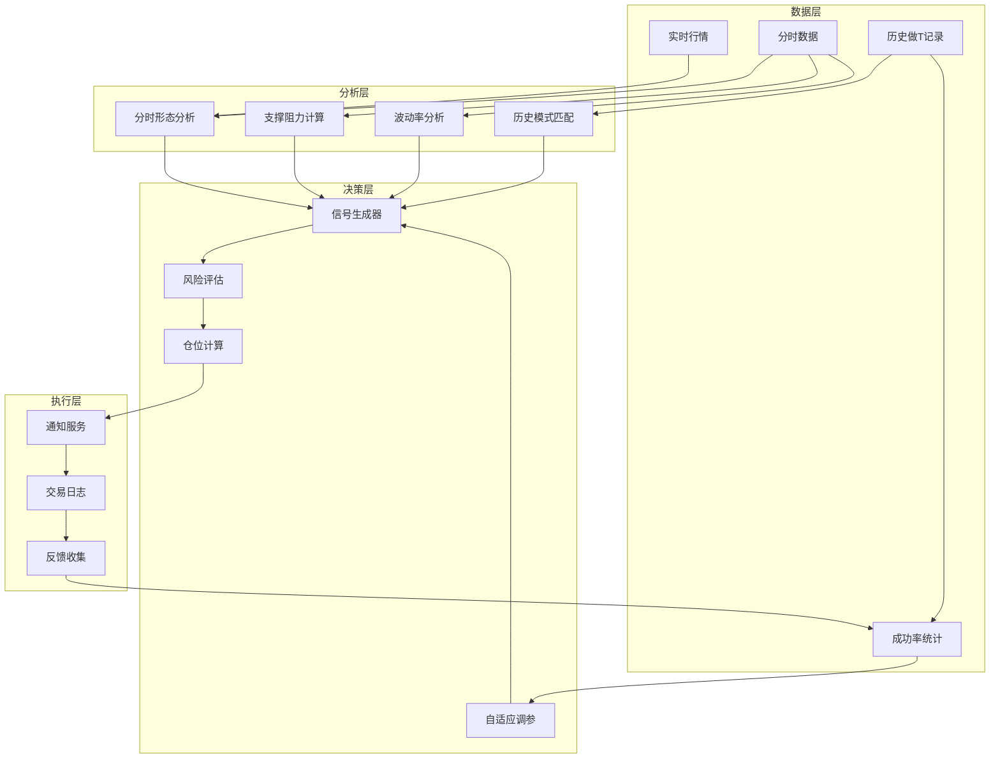
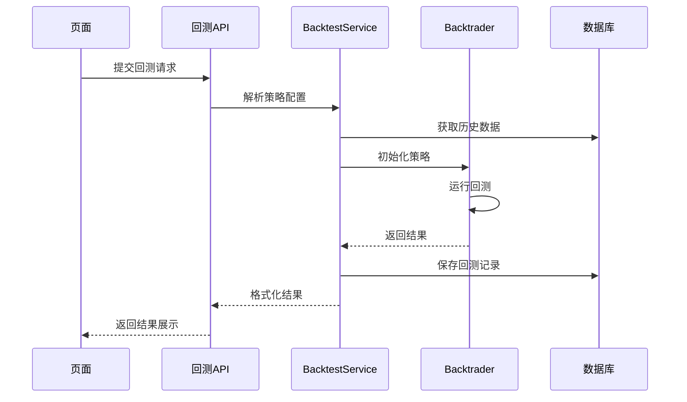

# 统一策略中心深度设计方案 V2

## 需求澄清汇总

根据用户反馈，对设计进行以下重大调整：

| 原设计 | 调整后 |
|--------|--------|
| 可视化条件编辑器 | **策略文件管理器**（管理Python脚本） |
| 简单的Redis存储 | **PostgreSQL + Redis**（做T历史分析需持久化） |
| 简单到价触发 | **复杂做T算法**（分时分析+成功率微调） |
| 固定策略类型 | **策略组合系统**（多策略加权组合+滑动条） |

---

## 核心设计理念

```
┌─────────────────────────────────────────────────────────────────┐
│                        策略中心 (Strategy Center)                │
├─────────────────────────────────────────────────────────────────┤
│                                                                 │
│  ┌────────────┐   ┌────────────┐   ┌────────────┐              │
│  │  策略文件  │   │  策略组合  │   │   做T引擎  │              │
│  │  管理器    │   │  编排器    │   │   (复杂)   │              │
│  └────────────┘   └────────────┘   └────────────┘              │
│        │                │                │                      │
│        └────────────────┼────────────────┘                      │
│                         ▼                                       │
│                  ┌─────────────┐                               │
│                  │  统一执行器  │                               │
│                  │  (Backtest/ │                               │
│                  │   Screen/   │                               │
│                  │   Monitor)  │                               │
│                  └─────────────┘                               │
│                                                                 │
└─────────────────────────────────────────────────────────────────┘
```

---

## 模块一：策略文件管理器

### 设计目标

- 策略逻辑以 **Python 脚本文件** 存在于项目目录
- 页面只负责 **识别、命名、分类、启用/禁用** 这些脚本
- 无需在页面编写代码

### 目录结构

```
deepsearch/strategies/
├── implementations/           # 策略实现目录（系统扫描此目录）
│   ├── moving_average.py     # 均线策略
│   ├── mean_reversion.py     # 均值回归
│   ├── momentum.py           # 动量策略
│   ├── turtle_trading.py     # 海龟交易
│   ├── custom/               # 用户自定义策略
│   │   ├── my_strategy_1.py
│   │   └── my_strategy_2.py
│   └── __init__.py
├── registry.yaml             # 策略注册与元数据配置
└── ...
```

### 策略注册文件 (registry.yaml)

```yaml
strategies:
  - id: ma_crossover
    file: implementations/moving_average.py
    class: MovingAverageStrategy
    name: 均线交叉策略
    description: 基于快慢均线交叉的趋势跟踪策略
    category: trend_following
    tags: [均线, 趋势, 经典]
    params:
      fast_period: { type: int, default: 5, min: 2, max: 60 }
      slow_period: { type: int, default: 20, min: 5, max: 250 }
    enabled: true
    version: "1.0.0"

  - id: mean_reversion_rsi
    file: implementations/mean_reversion.py
    class: MeanReversionStrategy
    name: RSI均值回归
    description: 基于RSI超买超卖的均值回归策略
    category: mean_reversion
    tags: [RSI, 震荡, 反转]
    params:
      rsi_period: { type: int, default: 14 }
      overbought: { type: float, default: 70 }
      oversold: { type: float, default: 30 }
    enabled: true
```

### 策略基类约束

```python
# deepsearch/strategies/interfaces/base.py
class BaseStrategy(ABC):
    """所有策略必须继承此基类"""

    # 必须实现的类属性
    STRATEGY_ID: str           # 唯一标识
    STRATEGY_NAME: str         # 显示名称
    STRATEGY_DESC: str         # 描述
    STRATEGY_PARAMS: dict      # 参数定义

    @abstractmethod
    def on_bar(self, bar: BarData) -> Optional[Signal]:
        """处理K线数据，返回信号"""
        pass

    @abstractmethod
    def get_signal_strength(self) -> float:
        """返回当前信号强度 [-1.0 ~ 1.0]"""
        pass
```

### 页面功能

| 功能 | 说明 |
|------|------|
| 策略列表 | 展示所有已识别的策略文件，显示状态 |
| 策略详情 | 查看策略参数、描述、标签 |
| 启用/禁用 | 控制策略是否参与计算 |
| 分类管理 | 按类别（趋势/震荡/量价）组织 |
| 参数调整 | 通过表单调整策略运行参数 |
| 重新扫描 | 刷新策略目录，识别新增/移除的策略 |

---

## 模块1.5：Backtrader 适配器架构

> [!IMPORTANT]
> 设计目标：策略代码一次编写，同时支持 **Backtrader 回测** 和 **MiniQMT 实盘**

### 架构概览

```
┌─────────────────────────────────────────────────────────────────┐
│              统一策略接口层 (DeepSearch UnifiedStrategy)         │
├─────────────────────────────────────────────────────────────────┤
│                                                                 │
│   ┌───────────────────────────────────────────────────────┐    │
│   │           StrategyContext (上下文抽象)                 │    │
│   │   - get_current_price() / get_position()              │    │
│   │   - submit_order() / cancel_order()                   │    │
│   └──────────────────────┬────────────────────────────────┘    │
│                          │                                      │
│          ┌───────────────┼───────────────┐                      │
│          ▼               ▼               ▼                      │
│   ┌─────────────┐ ┌─────────────┐ ┌─────────────┐              │
│   │ Backtrader  │ │  MiniQMT    │ │  Simulated  │              │
│   │  Adapter    │ │  Adapter    │ │   Adapter   │              │
│   │ (回测模式)   │ │ (实盘模式)   │ │ (模拟模式)   │              │
│   └─────────────┘ └─────────────┘ └─────────────┘              │
│                                                                 │
└─────────────────────────────────────────────────────────────────┘
```

### 核心接口

```python
class StrategyContext(ABC):
    """策略运行上下文 - 屏蔽底层实现差异"""

    @abstractmethod
    def get_current_price(self, symbol: str) -> float: ...

    @abstractmethod
    def get_position(self, symbol: str) -> int: ...

    @abstractmethod
    def get_cash(self) -> float: ...

    @abstractmethod
    def submit_order(self, symbol: str, side: str, qty: int, price: float = None) -> str: ...


class UnifiedStrategy(ABC):
    """统一策略基类 - 与执行引擎解耦"""

    def __init__(self, context: StrategyContext, params: dict = None):
        self.ctx = context
        self.params = params or {}

    @abstractmethod
    def on_bar(self, bar: dict):
        """K线回调 - bar格式统一"""
        pass

    # 便捷方法
    def buy(self, symbol: str, qty: int, price: float = None) -> str:
        return self.ctx.submit_order(symbol, "buy", qty, price)

    def sell(self, symbol: str, qty: int, price: float = None) -> str:
        return self.ctx.submit_order(symbol, "sell", qty, price)
```

### 适配器实现

| 适配器 | 用途 | 关键实现 |
|--------|------|----------|
| `BacktraderAdapter` | 回测 | 包装 `bt.Strategy`，转发 `next()` 到 `on_bar()` |
| `MiniQMTAdapter` | 实盘 | 使用 `xttrader` + `xtdata`，订阅行情推送 |
| `SimulatedAdapter` | 模拟 | 内存模拟撮合，用于训练和验证 |

### 使用示例

```python
# 策略只需写一次
class MyMAStrategy(UnifiedStrategy):
    def on_bar(self, bar):
        if self.fast_ma > self.slow_ma and self.ctx.get_position(bar['symbol']) == 0:
            self.buy(bar['symbol'], 100)

# 回测模式
results = run_backtest(MyMAStrategy, ['000001.SZ'], '2024-01-01', '2024-12-01')

# 实盘模式 (切换适配器即可)
runner = MiniQMTRunner(MyMAStrategy, account_id='xxx', symbols=['000001.SZ'])
runner.start()
```

### 配置切换

```yaml
# config/strategy_execution.yaml
execution:
  default_mode: backtest  # backtest / live / paper

  backtrader:
    initial_cash: 100000
    commission: 0.0002    # 万二
    min_commission: 0     # 不免五 (设置为0即表示没有最低5元限制)
    stamp_duty: 0.001     # 印花税 (仅卖出收取)
    transfer_fee: 0.00001 # 过户费

  miniqmt:
    account_id: "your_account"
    server: "localhost:20000"
```

---

## 模块二：策略组合编排器

### 设计目标

- 支持将 **多个简单策略** 组合成 **复合策略**
- 每个子策略有 **权重系数**（滑动条调整）
- 组合策略的信号 = 加权聚合各子策略信号

### 数据模型

```python
class StrategyWeight(BaseModel):
    """策略权重配置"""
    strategy_id: str                    # 子策略ID
    weight: float = Field(ge=0, le=1)   # 权重 0~1
    enabled: bool = True


class CompositeStrategy(BaseModel):
    """组合策略"""
    id: str
    name: str
    description: Optional[str]

    # 子策略配置
    components: List[StrategyWeight]

    # 聚合方式
    aggregation: Literal["weighted_avg", "vote", "unanimous"] = "weighted_avg"

    # 信号阈值（聚合信号超过此值才触发）
    signal_threshold: float = 0.5

    # 元数据
    created_at: datetime
    updated_at: datetime


class CompositeSignal(BaseModel):
    """组合策略输出信号"""
    composite_id: str
    timestamp: datetime

    # 各子策略信号
    component_signals: Dict[str, float]  # strategy_id -> signal_strength

    # 聚合后的信号
    aggregated_signal: float             # -1.0 ~ 1.0
    direction: Literal["buy", "sell", "hold"]
    confidence: float                    # 信心度
```

### 聚合算法

```python
def aggregate_signals(
    signals: Dict[str, float],      # 子策略信号 {id: strength}
    weights: Dict[str, float],       # 权重配置 {id: weight}
    method: str = "weighted_avg"
) -> float:
    """
    聚合多策略信号

    weighted_avg: 加权平均
    vote: 投票（信号方向计数）
    unanimous: 一致性（所有策略同向才触发）
    """
    if method == "weighted_avg":
        total_weight = sum(weights.values())
        if total_weight == 0:
            return 0.0
        return sum(
            signals.get(sid, 0) * w
            for sid, w in weights.items()
        ) / total_weight

    elif method == "vote":
        buy_weight = sum(w for sid, w in weights.items() if signals.get(sid, 0) > 0)
        sell_weight = sum(w for sid, w in weights.items() if signals.get(sid, 0) < 0)
        total = buy_weight + sell_weight
        return (buy_weight - sell_weight) / total if total > 0 else 0.0

    elif method == "unanimous":
        active = [signals.get(sid, 0) for sid in weights if weights[sid] > 0]
        if all(s > 0 for s in active):
            return sum(active) / len(active)
        elif all(s < 0 for s in active):
            return sum(active) / len(active)
        return 0.0
```

### UI 设计

```
┌─────────────────────────────────────────────────────────────────┐
│  组合策略编排器                                    [保存] [回测] │
├─────────────────────────────────────────────────────────────────┤
│                                                                 │
│  策略名称: [我的组合策略1                              ]        │
│                                                                 │
│  聚合方式: [加权平均 ▼]    信号阈值: [====●====] 0.5           │
│                                                                 │
│  ┌─────────────────────────────────────────────────────────┐   │
│  │  子策略配置                                              │   │
│  ├─────────────────────────────────────────────────────────┤   │
│  │  ☑ 均线交叉策略     [=========●=] 40%    [配置参数]     │   │
│  │  ☑ RSI均值回归      [======●====] 30%    [配置参数]     │   │
│  │  ☑ 动量策略         [====●======] 20%    [配置参数]     │   │
│  │  ☐ MACD策略         [=●=========] 10%    [配置参数]     │   │
│  │                                                          │   │
│  │  [+ 添加子策略]                                          │   │
│  └─────────────────────────────────────────────────────────┘   │
│                                                                 │
│  实时信号预览:                                                  │
│  ┌─────────────────────────────────────────────────────────┐   │
│  │  均线: +0.7  RSI: -0.3  动量: +0.5                      │   │
│  │  ══════════════════════════════════════                  │   │
│  │  聚合信号: +0.38  ────────●──────────  [观望]           │   │
│  └─────────────────────────────────────────────────────────┘   │
│                                                                 │
└─────────────────────────────────────────────────────────────────┘
```

---

## 模块三：做T引擎（核心难点）

> [!CAUTION]
> 这是整个系统最复杂的模块。不是简单的到价触发，需要：
>
> - 历史分时数据分析
> - 做T成功率统计
> - 基于成功率的参数微调
> - 实时价格监控与信号生成

### 行业参考：同花顺"分时顶底"

> [!TIP]
> 参考同花顺智能做T产品（分时顶底）的设计思路：
>
> - **核心算法**：AI深度学习模型，基于历史分时数据训练，预测日内高低点
> - **信号类型**："高"信号（卖出时机）、"低"信号（买入时机）
> - **成功率统计**：近30日信号成功率约 **68%**
> - **适用场景**：震荡市效果最佳，单边行情成功率下降
> - **市场统计**：实时展示全市场高/低信号个数，作为大盘情绪参考

**我们的做T引擎可借鉴的设计要点：**

1. 基于分时数据的 **分钟级预测模型**
2. 信号的 **历史成功率追踪** 和可视化
3. 根据 **市场状态自适应调整** 信号置信度
4. 全市场信号统计作为 **辅助决策依据**

### 做T算法框架



### 核心数据模型

```python
# ============================================
# 做T策略配置
# ============================================

class TTradingConfig(BaseModel):
    """做T策略配置"""
    id: str
    name: str
    symbol: str

    # 基础参数
    base_position_ratio: float = 50.0     # 底仓比例%
    trading_position_ratio: float = 50.0  # 交易仓比例%

    # 网格参数
    grid_enabled: bool = True
    grid_base_price: Optional[float]      # 网格基准价（None=自动）
    grid_step_ratio: float = 2.0          # 网格步长%
    grid_levels: int = 5                  # 网格层数

    # 技术指标参数
    ma_periods: List[int] = [5, 10, 20]   # 均线周期
    rsi_period: int = 14
    boll_period: int = 20
    boll_std: float = 2.0

    # 分时分析参数
    intraday_ma_period: int = 20          # 分时均线周期
    volume_ratio_threshold: float = 1.5   # 量比阈值

    # 风控参数
    max_daily_trades: int = 10            # 每日最大交易次数
    stop_loss_ratio: float = 3.0          # 止损比例%
    take_profit_ratio: float = 2.0        # 止盈比例%

    # 自适应参数
    adaptive_enabled: bool = True         # 启用自适应调参
    lookback_days: int = 20               # 回看天数
    min_success_rate: float = 0.6         # 最低成功率阈值


# ============================================
# 分时数据分析
# ============================================

class IntradayAnalysis(BaseModel):
    """分时分析结果"""
    symbol: str
    date: str
    time: str

    # 价格指标
    current_price: float
    open_price: float
    high_price: float
    low_price: float
    vwap: float                           # 成交量加权平均价

    # 分时均线
    intraday_ma: float                    # 分时均价线
    price_deviation: float                # 价格偏离度%

    # 量价分析
    volume_ratio: float                   # 量比
    buy_volume_ratio: float               # 买盘占比
    large_order_ratio: float              # 大单占比

    # 支撑阻力
    support_levels: List[float]           # 支撑位
    resistance_levels: List[float]        # 阻力位
    nearest_support: float
    nearest_resistance: float

    # 形态识别
    pattern: Optional[str]                # 当前形态（N型、V型、W型等）
    trend: Literal["up", "down", "sideways"]

    # 信号强度
    buy_signal_strength: float            # 买入信号强度 0~1
    sell_signal_strength: float           # 卖出信号强度 0~1


# ============================================
# 做T交易记录
# ============================================

class TTradingRecord(BaseModel):
    """做T交易记录（用于成功率分析）"""
    id: str
    strategy_id: str
    symbol: str

    # 交易信息
    entry_time: datetime
    entry_price: float
    entry_signal: str                     # 触发信号类型

    exit_time: Optional[datetime]
    exit_price: Optional[float]
    exit_signal: Optional[str]

    # 结果
    direction: Literal["buy_first", "sell_first"]
    quantity: int
    pnl: Optional[float]                  # 盈亏金额
    pnl_ratio: Optional[float]            # 盈亏比例%
    is_success: Optional[bool]            # 是否成功（盈利）

    # 上下文
    market_condition: Dict[str, Any]      # 当时市场状况
    intraday_analysis: Dict[str, Any]     # 当时分时分析


# ============================================
# 成功率统计
# ============================================

class TTradingStats(BaseModel):
    """做T成功率统计"""
    strategy_id: str
    symbol: str
    period: str                           # 统计周期 "7d", "30d", "all"
    updated_at: datetime

    # 基础统计
    total_trades: int
    successful_trades: int
    success_rate: float

    # 收益统计
    total_pnl: float
    avg_pnl_per_trade: float
    max_single_pnl: float
    max_single_loss: float
    profit_factor: float                  # 盈亏比

    # 信号分析
    signal_accuracy: Dict[str, float]     # 各信号类型准确率
    best_entry_time: str                  # 最佳入场时间
    worst_entry_time: str                 # 最差入场时间

    # 市况分析
    success_by_trend: Dict[str, float]    # 按趋势分类成功率
    success_by_volatility: Dict[str, float]  # 按波动率分类成功率
```

### 做T信号生成算法

```python
class TTradingSignalGenerator:
    """做T信号生成器"""

    def generate_signals(
        self,
        config: TTradingConfig,
        analysis: IntradayAnalysis,
        stats: TTradingStats,
    ) -> List[TTradingSignal]:
        """
        生成做T信号

        综合考虑：
        1. 分时技术指标
        2. 支撑阻力位
        3. 历史成功率
        4. 当前市况
        """
        signals = []

        # 1. 分时均线偏离信号
        ma_signal = self._analyze_ma_deviation(analysis, config)

        # 2. 支撑阻力信号
        sr_signal = self._analyze_support_resistance(analysis, config)

        # 3. 量价配合信号
        vp_signal = self._analyze_volume_price(analysis, config)

        # 4. 网格信号
        grid_signal = self._analyze_grid(analysis, config)

        # 5. 综合打分
        raw_signals = [ma_signal, sr_signal, vp_signal, grid_signal]

        # 6. 基于历史成功率调整
        adjusted_signals = self._adjust_by_success_rate(raw_signals, stats)

        # 7. 风险过滤
        filtered_signals = self._apply_risk_filter(adjusted_signals, config)

        return filtered_signals

    def _adjust_by_success_rate(
        self,
        signals: List[TTradingSignal],
        stats: TTradingStats,
    ) -> List[TTradingSignal]:
        """
        根据历史成功率调整信号

        - 成功率高的信号类型：提高权重
        - 成功率低的信号类型：降低权重或过滤
        - 最佳时间段：提高权重
        """
        adjusted = []
        for sig in signals:
            # 获取该信号类型的历史成功率
            type_success_rate = stats.signal_accuracy.get(sig.signal_type, 0.5)

            # 调整置信度
            sig.confidence *= (0.5 + type_success_rate)

            # 时间段调整
            current_time = datetime.now().strftime("%H:%M")
            if self._is_best_time(current_time, stats):
                sig.confidence *= 1.2
            elif self._is_worst_time(current_time, stats):
                sig.confidence *= 0.8

            # 市况调整
            if stats.success_by_volatility:
                # 根据当前波动率选择历史成功率
                pass

            adjusted.append(sig)

        return adjusted
```

### 存储设计

```sql
-- 做T策略配置表
CREATE TABLE ttrading_strategies (
    id UUID PRIMARY KEY,
    name VARCHAR(100) NOT NULL,
    symbol VARCHAR(20) NOT NULL,
    config JSONB NOT NULL,
    status VARCHAR(20) DEFAULT 'draft',
    created_at TIMESTAMP DEFAULT NOW(),
    updated_at TIMESTAMP DEFAULT NOW()
);

-- 做T交易记录表（核心：用于成功率分析）
CREATE TABLE ttrading_records (
    id UUID PRIMARY KEY,
    strategy_id UUID REFERENCES ttrading_strategies(id),
    symbol VARCHAR(20) NOT NULL,

    entry_time TIMESTAMP NOT NULL,
    entry_price DECIMAL(10,4) NOT NULL,
    entry_signal VARCHAR(50),

    exit_time TIMESTAMP,
    exit_price DECIMAL(10,4),
    exit_signal VARCHAR(50),

    direction VARCHAR(20) NOT NULL,
    quantity INT NOT NULL,
    pnl DECIMAL(12,4),
    pnl_ratio DECIMAL(8,4),
    is_success BOOLEAN,

    market_context JSONB,
    intraday_context JSONB,

    created_at TIMESTAMP DEFAULT NOW()
);

-- 创建索引用于快速查询成功率
CREATE INDEX idx_ttrading_records_strategy_symbol
    ON ttrading_records(strategy_id, symbol, entry_time DESC);

CREATE INDEX idx_ttrading_records_success
    ON ttrading_records(strategy_id, is_success, entry_time);

-- 分时数据表（可选，也可用Redis缓存）
CREATE TABLE intraday_data (
    id BIGSERIAL PRIMARY KEY,
    symbol VARCHAR(20) NOT NULL,
    trade_date DATE NOT NULL,
    trade_time TIME NOT NULL,
    price DECIMAL(10,4) NOT NULL,
    volume BIGINT NOT NULL,
    amount DECIMAL(16,2),
    buy_volume BIGINT,
    sell_volume BIGINT,

    UNIQUE(symbol, trade_date, trade_time)
);

-- 成功率统计缓存表
CREATE TABLE ttrading_stats_cache (
    id UUID PRIMARY KEY,
    strategy_id UUID REFERENCES ttrading_strategies(id),
    symbol VARCHAR(20) NOT NULL,
    period VARCHAR(10) NOT NULL,
    stats JSONB NOT NULL,
    updated_at TIMESTAMP DEFAULT NOW(),

    UNIQUE(strategy_id, symbol, period)
);
```

---

## 模块四：回测系统

### 设计目标

- 目前借用 **Backtrader** 实现回测
- 页面展示回测结果
- 未来可替换为自研回测引擎

### 佣金与仿真模型

> [!NOTE]
> 真实且可配置的佣金与印花税模型是确保回测可靠性的关键。

- **佣金费率**: 默认万二 (`0.0002`)
- **最低佣金**: **不免五** (取消最低5元限制，即 `min_commission = 0`)
- **印花税**: 千一 (`0.001`)，仅卖出收取
- **过户费**: 十万分之一 (`0.00001`)

**配置与扩展性**
系统将支持用户自定义上述费率参数，以适应不同券商的实际费率。仿真引擎（如Backtrader Adapter）需严格执行此逻辑：

1. 计算名义佣金 = 成交金额 * 佣金费率
2. 若有最低佣金设置且名义佣金 < 最低佣金，则按最低佣金收取（当前默认关闭此限制）
3. 卖出时额外计算印花税与过户费

### 回测流程



### 结果展示

| 指标 | 说明 |
|------|------|
| 收益曲线 | ECharts 折线图 |
| 回撤曲线 | 最大回撤可视化 |
| 交易明细 | 表格展示买卖记录 |
| 绩效指标 | 夏普、年化、胜率等 |
| 对比基准 | 与指数对比 |

---

## 模块五：智能选股

### 设计目标

- 根据 **组合策略** 筛选符合条件的股票
- 各策略权重影响选股评分
- 支持实时扫描和定时扫描

### 选股流程

```python
async def screen_stocks(
    composite: CompositeStrategy,
    stock_pool: List[str],          # 股票池
) -> List[ScreeningResult]:
    """
    使用组合策略选股
    """
    results = []

    for symbol in stock_pool:
        # 获取该股票的行情数据
        data = await get_stock_data(symbol)

        # 运行各子策略，获取信号
        signals = {}
        for comp in composite.components:
            if not comp.enabled:
                continue
            strategy = load_strategy(comp.strategy_id)
            signal = strategy.get_signal_strength(data)
            signals[comp.strategy_id] = signal

        # 加权聚合
        weights = {c.strategy_id: c.weight for c in composite.components}
        score = aggregate_signals(signals, weights, composite.aggregation)

        # 超过阈值则入选
        if abs(score) >= composite.signal_threshold:
            results.append(ScreeningResult(
                symbol=symbol,
                name=data.name,
                score=score,
                direction="buy" if score > 0 else "sell",
                component_signals=signals,
            ))

    # 按评分排序
    results.sort(key=lambda x: abs(x.score), reverse=True)
    return results
```

---

## 统一页面设计

```
┌─────────────────────────────────────────────────────────────────────────┐
│  🎯 策略中心                                       [刷新] [系统设置]    │
├─────────────────────────────────────────────────────────────────────────┤
│  [📁 策略管理] [🔀 策略组合] [📊 回测分析] [🔍 智能选股] [⏰ 做T监控]   │
├─────────────────────────────────────────────────────────────────────────┤
│                                                                         │
│  ┌─────────────────────────────────────────────────────────────────┐   │
│  │                                                                 │   │
│  │         根据选中的 Tab 显示对应内容                             │   │
│  │                                                                 │   │
│  │         - 策略管理：策略文件列表、启用状态、参数配置             │   │
│  │         - 策略组合：组合编排、权重滑动条、实时信号               │   │
│  │         - 回测分析：策略选择、时间范围、结果图表                 │   │
│  │         - 智能选股：策略组合选择、股票池、选股结果               │   │
│  │         - 做T监控：标的列表、分时图、买卖点、通知设置           │   │
│  │                                                                 │   │
│  └─────────────────────────────────────────────────────────────────┘   │
│                                                                         │
└─────────────────────────────────────────────────────────────────────────┘
```

---

## 技术架构总览

```mermaid
graph TB
    subgraph Frontend
        SC[StrategyCenter Page]
        SM[StrategyManager Tab]
        CE[CompositeEditor Tab]
        BT[Backtest Tab]
        SS[StockScreener Tab]
        TT[TTradingMonitor Tab]
    end

    subgraph Backend API
        A1[/api/strategy-center/strategies]
        A2[/api/strategy-center/composites]
        A3[/api/strategy-center/backtest]
        A4[/api/strategy-center/screen]
        A5[/api/strategy-center/ttrading]
    end

    subgraph Services
        SRS[StrategyRegistryService]
        CSS[CompositeStrategyService]
        BTS[BacktestService]
        SSS[StockScreeningService]
        TTS[TTradingService]
    end

    subgraph Storage
        PG[(PostgreSQL)]
        RD[(Redis)]
        FS[/strategies/\n目录]
    end

    SC --> SM & CE & BT & SS & TT
    SM --> A1 --> SRS --> FS
    CE --> A2 --> CSS --> PG
    BT --> A3 --> BTS --> PG
    SS --> A4 --> SSS --> PG
    TT --> A5 --> TTS --> PG & RD
```

---

## 实施阶段规划

| 阶段 | 内容 | 复杂度 | 预计时间 |
|------|------|--------|----------|
| Phase 1 | 策略文件管理器 | 中 | 2-3天 |
| Phase 2 | 策略组合编排器 | 中 | 3-4天 |
| Phase 3 | 回测系统集成 | 低 | 1-2天 |
| Phase 4 | 智能选股 | 中 | 2-3天 |
| Phase 5 | 做T引擎（核心） | **高** | 5-7天 |
| Phase 6 | 统一页面整合 | 中 | 2-3天 |
| Phase 7 | 测试与优化 | 中 | 2-3天 |

**总计：约 17-25 天**

---

## 设计决策

### 1. 策略目录结构

```
deepsearch/
├── strategies/                          # 策略模块根目录
│   ├── __init__.py
│   │
│   ├── interfaces/                      # 接口定义层
│   │   ├── __init__.py
│   │   ├── base.py                     # BaseStrategy, UnifiedStrategy
│   │   └── context.py                  # StrategyContext 抽象
│   │
│   ├── adapters/                        # 执行引擎适配器
│   │   ├── __init__.py
│   │   ├── backtrader_adapter.py       # Backtrader 回测适配
│   │   ├── miniqmt_adapter.py          # MiniQMT 实盘适配
│   │   └── simulated_adapter.py        # 模拟交易适配
│   │
│   ├── implementations/                 # 策略实现目录 ⭐
│   │   ├── __init__.py
│   │   │
│   │   ├── trend/                      # 趋势跟踪类
│   │   │   ├── __init__.py
│   │   │   ├── moving_average.py      # 均线交叉
│   │   │   ├── turtle_trading.py      # 海龟交易
│   │   │   └── channel_breakout.py    # 通道突破
│   │   │
│   │   ├── mean_reversion/             # 均值回归类
│   │   │   ├── __init__.py
│   │   │   ├── rsi_strategy.py        # RSI超买超卖
│   │   │   └── bollinger_bands.py     # 布林带策略
│   │   │
│   │   ├── momentum/                   # 动量类
│   │   │   ├── __init__.py
│   │   │   └── macd_strategy.py       # MACD策略
│   │   │
│   │   ├── composite/                  # 组合策略类
│   │   │   ├── __init__.py
│   │   │   └── ensemble_strategy.py   # 多策略集成
│   │   │
│   │   └── custom/                     # 用户自定义
│   │       ├── __init__.py
│   │       └── .gitkeep
│   │
│   ├── indicators/                      # 技术指标库
│   │   ├── __init__.py
│   │   ├── backtrader_bridge.py        # Backtrader指标导出
│   │   └── custom_indicators.py        # 自定义指标
│   │
│   ├── ttrading/                        # 做T引擎
│   │   ├── __init__.py
│   │   ├── engine.py                   # 做T核心引擎
│   │   ├── signals.py                  # 信号生成器
│   │   ├── intraday_analyzer.py        # 分时分析
│   │   └── success_rate.py             # 成功率统计
│   │
│   ├── config/                          # 策略配置 (YAML)
│   │   ├── registry.yaml               # 策略注册表
│   │   ├── composites/                 # 组合策略配置
│   │   │   ├── my_composite_1.yaml
│   │   │   └── my_composite_2.yaml
│   │   └── ttrading/                   # 做T策略配置
│   │       └── default_config.yaml
│   │
│   └── services/                        # 服务层
│       ├── __init__.py
│       ├── registry_service.py         # 策略注册服务
│       ├── composite_service.py        # 组合策略服务
│       ├── backtest_service.py         # 回测服务
│       └── screening_service.py        # 选股服务
```

### 2. 组合策略存储方案（混合模式）

> [!TIP]
> **核心原则**：策略定义（代码/逻辑）归 **YAML**，运行状态与记录归 **PostgreSQL**

#### 存储职责划分

| 内容 | 存储位置 | 格式 | 说明 |
|------|---------|------|------|
| 策略源代码 | 文件系统 | `.py` | Git版本控制 |
| 策略元数据 | YAML | `registry.yaml` | 参数定义、分类、描述 |
| 组合策略配置 | YAML | `composites/*.yaml` | 子策略权重、聚合方式 |
| 做T策略配置 | YAML | `ttrading/*.yaml` | 网格参数、风控设置 |
| 策略运行状态 | PostgreSQL | `strategy_runs` | 运行中/暂停/完成 |
| 回测记录 | PostgreSQL | `backtest_results` | 历史回测结果 |
| 做T交易记录 | PostgreSQL | `ttrading_records` | 成功率分析依据 |
| 实时订阅状态 | Redis | Hash | 临时状态，快速访问 |

#### YAML 组合策略配置示例

```yaml
# strategies/config/composites/balanced_growth.yaml
id: balanced_growth
name: 平衡成长组合
description: 趋势+震荡双模式组合，适合震荡上行市

components:
  - strategy_id: ma_crossover
    weight: 0.4
    enabled: true
    params:
      fast_period: 5
      slow_period: 20

  - strategy_id: rsi_mean_reversion
    weight: 0.35
    enabled: true
    params:
      rsi_period: 14
      overbought: 70
      oversold: 30

  - strategy_id: macd_momentum
    weight: 0.25
    enabled: true
    params:
      fast: 12
      slow: 26
      signal: 9

aggregation: weighted_avg
signal_threshold: 0.5

# 元数据（只读，不持久化到DB）
created_at: 2024-12-28
updated_at: 2024-12-28
author: user
tags: [趋势, 震荡, 组合]
```

#### PostgreSQL 运行状态表

```sql
-- 策略运行记录（仅存运行状态，不存策略定义）
CREATE TABLE strategy_runs (
    id UUID PRIMARY KEY,
    strategy_type VARCHAR(20) NOT NULL,       -- 'single' / 'composite' / 'ttrading'
    strategy_id VARCHAR(100) NOT NULL,        -- 对应YAML中的id
    config_snapshot JSONB,                    -- 运行时配置快照
    status VARCHAR(20) DEFAULT 'created',     -- created/running/paused/stopped/completed
    started_at TIMESTAMP,
    stopped_at TIMESTAMP,
    created_at TIMESTAMP DEFAULT NOW()
);

-- 回测结果
CREATE TABLE backtest_results (
    id UUID PRIMARY KEY,
    strategy_id VARCHAR(100) NOT NULL,
    run_id UUID REFERENCES strategy_runs(id),
    date_range DATERANGE NOT NULL,
    symbols TEXT[] NOT NULL,
    initial_capital DECIMAL(16,2),
    final_value DECIMAL(16,2),
    metrics JSONB NOT NULL,                   -- 夏普、回撤、胜率等
    trades JSONB,                             -- 交易明细
    equity_curve JSONB,                       -- 资金曲线数据点
    created_at TIMESTAMP DEFAULT NOW()
);

-- 做T交易记录（用于成功率分析）
CREATE TABLE ttrading_records (
    id UUID PRIMARY KEY,
    strategy_id VARCHAR(100) NOT NULL,
    symbol VARCHAR(20) NOT NULL,
    entry_time TIMESTAMP NOT NULL,
    entry_price DECIMAL(10,4) NOT NULL,
    entry_signal VARCHAR(50),
    exit_time TIMESTAMP,
    exit_price DECIMAL(10,4),
    exit_signal VARCHAR(50),
    direction VARCHAR(20) NOT NULL,
    quantity INT NOT NULL,
    pnl DECIMAL(12,4),
    pnl_ratio DECIMAL(8,4),
    is_success BOOLEAN,
    market_context JSONB,
    created_at TIMESTAMP DEFAULT NOW()
);

-- 索引
CREATE INDEX idx_strategy_runs_status ON strategy_runs(strategy_id, status);
CREATE INDEX idx_backtest_results_strategy ON backtest_results(strategy_id, created_at DESC);
CREATE INDEX idx_ttrading_records_analysis ON ttrading_records(strategy_id, symbol, is_success);
```

### 3. 做T反馈闭环

采用 **模拟记录 + 手动确认** 模式：

1. **自动记录**：系统发出信号时自动创建 `ttrading_records` 记录
2. **手动确认**：用户在页面上确认是否执行、实际成交价格
3. **自动计算**：系统根据确认的记录自动计算成功率

```python
# 信号发出时自动创建记录（状态：pending）
record = TTradingRecord(
    strategy_id=strategy_id,
    symbol=symbol,
    entry_time=now,
    entry_price=signal_price,
    entry_signal=signal_type,
    direction="buy_first",
    quantity=0,  # 待用户确认
    is_success=None,  # 待计算
)

# 用户确认后更新
record.quantity = actual_quantity
record.exit_time = actual_exit_time
record.exit_price = actual_exit_price
record.pnl = calculate_pnl(record)
record.is_success = record.pnl > 0
```

### 4. 分时数据来源

采用 **竞速选优** 模式（详见 `KLINECHART_INTEGRATION.md`）：

- **优先**：MiniQMT（tick级推送，~100ms延迟）
- **备用**：AmazingData（轮询模式，~3s延迟）
- **兜底**：数据库缓存（历史数据）

### 5. 通知渠道

复用现有 **Xtuis 通知系统**：

- Bark（已实现）
- 其他渠道按需扩展

### 6. 策略热重载 (Hot Reload)

> [!TIP]
> 使用 `watchdog` + `importlib.reload()` 实现策略文件变更自动重载

#### 实现方案

```python
# deepsearch/strategies/services/hot_reload_service.py

import importlib
import sys
from pathlib import Path
from watchdog.observers import Observer
from watchdog.events import FileSystemEventHandler

class StrategyReloadHandler(FileSystemEventHandler):
    """策略文件变更监控处理器"""

    def __init__(self, registry_service):
        self.registry = registry_service
        self._debounce_timers = {}

    def on_modified(self, event):
        if not event.src_path.endswith('.py'):
            return
        if '__pycache__' in event.src_path:
            return

        # 防抖：500ms 内多次修改只触发一次
        self._schedule_reload(event.src_path)

    def _do_reload(self, file_path: str):
        """执行热重载"""
        try:
            # 1. 找到对应的模块
            module_name = self._path_to_module(file_path)
            if module_name not in sys.modules:
                return

            # 2. 清除缓存
            importlib.invalidate_caches()

            # 3. 重新加载模块
            module = sys.modules[module_name]
            importlib.reload(module)

            # 4. 更新策略注册表
            self.registry.refresh_strategy(module_name)

            logger.info(f"策略热重载成功: {module_name}")

        except Exception as e:
            logger.error(f"策略热重载失败: {file_path} - {e}")


class StrategyHotReloadService:
    """策略热重载服务"""

    def __init__(self, strategies_dir: Path, registry_service):
        self.strategies_dir = strategies_dir
        self.registry = registry_service
        self.observer = Observer()
        self._running = False

    def start(self):
        """启动文件监控"""
        handler = StrategyReloadHandler(self.registry)
        self.observer.schedule(handler, str(self.strategies_dir), recursive=True)
        self.observer.start()
        self._running = True
        logger.info(f"策略热重载服务已启动，监控目录: {self.strategies_dir}")

    def stop(self):
        """停止文件监控"""
        self.observer.stop()
        self.observer.join()
        self._running = False
```

#### 注意事项

1. **已实例化对象不会更新**：重载后需要重新创建策略实例
2. **全局状态需重置**：策略内的全局变量需手动清理
3. **生产环境建议关闭**：热重载仅用于开发调试

### 7. 策略版本控制

> [!IMPORTANT]
> 回测记录必须能追溯到当时的策略版本

#### 方案：config_snapshot + Git Hash

```python
class BacktestRecord(BaseModel):
    """回测记录"""
    id: str
    strategy_id: str

    # 版本快照
    strategy_version: str              # Git commit hash
    config_snapshot: dict              # 运行时参数快照
    strategy_code_hash: str            # 策略代码 MD5

    # 回测结果...

def create_backtest_record(strategy_id: str, params: dict) -> BacktestRecord:
    """创建回测记录时保存版本信息"""
    return BacktestRecord(
        strategy_id=strategy_id,
        strategy_version=get_git_commit_hash(),
        config_snapshot=params,
        strategy_code_hash=hash_strategy_code(strategy_id),
    )

def get_git_commit_hash() -> str:
    """获取当前 Git commit hash"""
    import subprocess
    result = subprocess.run(['git', 'rev-parse', 'HEAD'], capture_output=True, text=True)
    return result.stdout.strip()[:8]

def hash_strategy_code(strategy_id: str) -> str:
    """计算策略代码哈希"""
    import hashlib
    code = load_strategy_source_code(strategy_id)
    return hashlib.md5(code.encode()).hexdigest()[:16]
```

### 8. 安全沙箱

> [!NOTE]
> **原则**：策略只负责计算，返回 Signal 对象。由主引擎（Engine）统一负责写数据库和发单

#### 沙箱机制

```python
class StrategySandbox:
    """策略安全沙箱"""

    DEFAULT_TIMEOUT = 5.0  # 秒
    MAX_MEMORY_MB = 512

    async def run_strategy(
        self,
        strategy: UnifiedStrategy,
        bar: dict,
        timeout: float = None
    ) -> Optional[Signal]:
        """在沙箱中执行策略"""
        timeout = timeout or self.DEFAULT_TIMEOUT

        try:
            # 超时控制
            signal = await asyncio.wait_for(
                self._execute_in_sandbox(strategy, bar),
                timeout=timeout
            )
            return signal

        except asyncio.TimeoutError:
            logger.warning(f"策略 {strategy.STRATEGY_ID} 执行超时 ({timeout}s)")
            return None

        except Exception as e:
            logger.error(f"策略 {strategy.STRATEGY_ID} 执行异常: {e}")
            return None

    async def _execute_in_sandbox(self, strategy, bar) -> Optional[Signal]:
        """实际执行（策略只能返回Signal，不能直接操作外部资源）"""
        # 策略只做计算，返回 Signal
        return strategy.on_bar(bar)
```

#### 数据安全保证

| 操作 | 允许 | 执行者 |
|------|------|--------|
| 读取行情数据 | ✅ | 策略 |
| 计算指标 | ✅ | 策略 |
| 返回 Signal | ✅ | 策略 |
| 写数据库 | ❌ | Engine |
| 发送订单 | ❌ | Engine (via PMS) |
| 网络请求 | ❌ | Engine |

### 风控能力对比分析

> [!NOTE]
> 回测风控、平台风控、自定义PMS风控各有分工

#### 各层风控职责

| 层级 | 组件 | 风控内容 | 需要自己写？ |
|------|------|---------|-------------|
| **回测层** | Backtrader Sizer | 仓位计算、模拟止损止盈 | ✅ 需自定义 Sizer |
| **平台层** | QMT 平台设置 | 账户级别限制、交易时间、涨跌停 | ❌ 券商提供 |
| **策略层** | 我们的 PMS | 多策略冲突、组合持仓限制、信号队列 | ✅ **必须自己写** |

#### Backtrader 内置风控

```python
# Backtrader Sizer 示例：固定比例风险
class RiskPercentSizer(bt.Sizer):
    params = (('risk_percent', 0.02),)  # 每笔风险2%

    def _getsizing(self, comminfo, cash, data, isbuy):
        if not isbuy:
            return self.broker.getposition(data).size

        # 计算仓位：风险金额 / (入场价 - 止损价)
        risk_amount = cash * self.p.risk_percent
        stop_distance = data.close[0] * 0.05  # 假设5%止损
        return int(risk_amount / stop_distance)
```

#### xttrader (MiniQMT) 提供的风控API

| API | 功能 | 用途 |
|-----|------|------|
| `query_stock_positions()` | 查询持仓 | 检查持仓限制 |
| `query_stock_asset()` | 查询资金 | 检查资金是否充足 |
| `on_order_error()` | 订单失败回调 | 异常处理 |
| `set_max_investment()` | 单只股票最大投资额 | 基础持仓限制 |

#### 为什么 PMS 必须自己写？

1. **QMT 只提供"原子操作"**：查持仓、查资金、下单——但不会帮你做"多策略冲突检查"
2. **没有"信号队列"**：券商API是同步下单，没有"排队+优先级"机制
3. **没有"组合级别风控"**：比如"所有策略加起来单只股票不超过20%"

#### 风控分层架构

```
┌─────────────────────────────────────────────────────────────────┐
│                     策略层 PMS (我们实现)                        │
├─────────────────────────────────────────────────────────────────┤
│  ✓ 多策略资金分配         ✓ 信号冲突检测                        │
│  ✓ 优先级排队             ✓ 组合持仓限制                        │
│  ✓ 频率限制               ✓ 最大回撤保护                        │
└───────────────────────────────┬─────────────────────────────────┘
                                │ 通过检查后
                                ▼
┌─────────────────────────────────────────────────────────────────┐
│                    平台层 QMT (券商提供)                         │
├─────────────────────────────────────────────────────────────────┤
│  ✓ 账户级别限制           ✓ 基础委托校验                        │
│  ✓ 交易时间检查           ✓ 涨跌停判断                          │
│  ✓ 资金充足性             ✓ 持仓数量校验                        │
└───────────────────────────────┬─────────────────────────────────┘
                                │ xttrader.order_stock()
                                ▼
┌─────────────────────────────────────────────────────────────────┐
│                      券商交易系统                                │
└─────────────────────────────────────────────────────────────────┘
```

### 9. PMS 中央集权并发架构

> [!IMPORTANT]
> **核心思想**：策略不能直接发单，只能发出 "交易请求"

#### 架构图

```
┌─────────────────────────────────────────────────────────────────┐
│                     Main Engine (主引擎)                         │
├─────────────────────────────────────────────────────────────────┤
│                                                                 │
│   ┌───────────────────────────────────────────────────────────┐│
│   │                   EventBus (事件总线)                      ││
│   │              行情广播给所有策略（Fan-out）                  ││
│   └───────────────────────┬───────────────────────────────────┘│
│                           │ Tick/Bar 事件                       │
│       ┌───────────────────┼───────────────────┐                │
│       ▼                   ▼                   ▼                │
│  ┌─────────┐        ┌─────────┐        ┌─────────┐            │
│  │策略 A   │        │策略 B   │        │策略 C   │            │
│  │(轻量级) │        │(轻量级) │        │(重型)   │            │
│  │AsyncIO  │        │AsyncIO  │        │Process  │            │
│  └────┬────┘        └────┬────┘        └────┬────┘            │
│       │Signal            │Signal            │Signal            │
│       └──────────────────┼──────────────────┘                  │
│                          ▼                                      │
│   ┌─────────────────────────────────────────────────────────┐  │
│   │              PMS (Portfolio Management System)           │  │
│   │                     信号聚合 + 风控检查                   │  │
│   └───────────────────────┬─────────────────────────────────┘  │
│                           │                                     │
│                           ▼                                     │
│   ┌─────────────────────────────────────────────────────────┐  │
│   │                    Order Manager                         │  │
│   │              最终发单 / 写数据库 / 通知                   │  │
│   └─────────────────────────────────────────────────────────┘  │
│                                                                 │
└─────────────────────────────────────────────────────────────────┘
```

#### PMS 核心职责

```python
class PortfolioManagementSystem:
    """投资组合管理系统 - 中央集权式订单管理"""

    def __init__(self, config: PMSConfig):
        self.max_position_ratio = config.max_position_ratio  # 单只股票最大仓位%
        self.max_daily_trades = config.max_daily_trades
        self.strategy_priorities = config.strategy_priorities  # 策略优先级
        self._pending_signals: List[Signal] = []
        self._lock = asyncio.Lock()

    async def submit_signal(self, signal: Signal) -> SignalResult:
        """
        接收策略信号（不直接发单）

        检查项：
        1. 资金检查：账户余额是否足够
        2. 风控检查：单只股票仓位是否超限
        3. 互斥检查：是否有其他策略在操作同一股票
        4. 频率检查：当日交易次数是否超限
        """
        async with self._lock:
            # 1. 资金检查
            if not await self._check_capital(signal):
                return SignalResult(status="rejected", reason="资金不足")

            # 2. 风控检查
            if not await self._check_position_limit(signal):
                return SignalResult(status="rejected", reason="持仓超限")

            # 3. 互斥检查
            if self._has_conflict(signal):
                return SignalResult(status="queued", reason="等待冲突信号完成")

            # 4. 频率检查
            if not self._check_trade_frequency(signal):
                return SignalResult(status="rejected", reason="当日交易次数超限")

            # 通过所有检查，加入待执行队列
            self._pending_signals.append(signal)
            return SignalResult(status="accepted")

    async def process_signals(self):
        """
        批量处理信号（按优先级分配资源）
        """
        async with self._lock:
            # 按策略优先级排序
            sorted_signals = sorted(
                self._pending_signals,
                key=lambda s: self.strategy_priorities.get(s.strategy_id, 0),
                reverse=True
            )

            available_capital = await self._get_available_capital()

            for signal in sorted_signals:
                required_capital = self._calc_required_capital(signal)

                if required_capital <= available_capital:
                    # 执行订单
                    await self._execute_order(signal)
                    available_capital -= required_capital
                else:
                    # 资金不足，降低数量或拒绝
                    adjusted = self._adjust_signal(signal, available_capital)
                    if adjusted:
                        await self._execute_order(adjusted)
                        available_capital -= self._calc_required_capital(adjusted)

            self._pending_signals.clear()
```

#### 计算并发策略

| 策略类型 | 执行方式 | 适用场景 |
|---------|---------|---------|
| 轻量级策略 | AsyncIO Event Loop | 简单逻辑，无复杂回溯 |
| 重型策略 | ProcessPoolExecutor | 复杂矩阵运算，ML模型 |
| 实时信号 | 专用线程 | 做T监控 |

---

## 现有代码迁移计划

### 需要重构的文件

| 文件 | 问题 | 处理方式 |
|------|------|----------|
| `ttrading_service.py` | 内联Redis客户端逻辑 | **重写**，调用统一Redis模块 |
| `strategy_api.py` | 与旧服务耦合 | 适配新架构 |
| `domain/models/strategy.py` | 模型定义 | 扩展，兼容新字段 |

### 迁移策略

1. **并行开发**：在 `strategies/` 新目录下构建新架构
2. **渐进替换**：新API `/api/strategy-center/` 与旧API `/api/trading/` 并存
3. **数据迁移**：提供 Redis → PostgreSQL 迁移脚本
4. **废弃标记**：旧API添加 `@deprecated` 装饰器

---

## 模块六：策略竞赛排行榜系统

> [!TIP]
> 参考同花顺"AI策略"功能：一只股票跑多个策略，按收益排名展示

### 功能需求

| 功能 | 说明 |
|------|------|
| **多策略并行回测** | 同一只股票同时跑 N 个策略 |
| **收益排行榜** | 按"跑赢个股"、"近一月收益"、"胜率"排序 |
| **策略对比图** | 股价曲线 vs 策略收益曲线 |
| **买卖点可视化** | 在K线图上标记策略的买卖信号 |
| **策略持有状态** | 当前是否持有中 |

### 核心架构

```
┌─────────────────────────────────────────────────────────────────┐
│                   Strategy Competition Engine                    │
├─────────────────────────────────────────────────────────────────┤
│                                                                 │
│   输入: symbol + List[strategy_id] + date_range                 │
│                                                                 │
│   ┌─────────────────────────────────────────────────────────┐  │
│   │              Parallel Backtest Runner                    │  │
│   │                                                          │  │
│   │   ┌───────┐  ┌───────┐  ┌───────┐  ┌───────┐           │  │
│   │   │策略 1 │  │策略 2 │  │策略 3 │  │策略 N │           │  │
│   │   │MA交叉 │  │RSI    │  │MACD   │  │自定义 │           │  │
│   │   └───┬───┘  └───┬───┘  └───┬───┘  └───┬───┘           │  │
│   │       │          │          │          │                 │  │
│   │       └──────────┴──────────┴──────────┘                 │  │
│   │                      │                                    │  │
│   └──────────────────────┼────────────────────────────────────┘  │
│                          ▼                                       │
│   ┌─────────────────────────────────────────────────────────┐  │
│   │              Result Aggregator (结果聚合器)              │  │
│   │                                                          │  │
│   │  ┌─────────────────────────────────────────────────┐    │  │
│   │  │ strategy_id | total_return | win_rate | alpha   │    │  │
│   │  │ ─────────── | ──────────── | ──────── | ─────── │    │  │
│   │  │ ma_cross    | +756.94%     | 50.00%   | +38.86% │    │  │
│   │  │ rsi_bounce  | +116.18%     | 100.00%  | +15.42% │    │  │
│   │  │ macd_div    | +45.67%      | 76.92%   | -9.57%  │    │  │
│   │  └─────────────────────────────────────────────────┘    │  │
│   └─────────────────────────────────────────────────────────┘  │
│                                                                 │
└─────────────────────────────────────────────────────────────────┘
```

### 数据模型

```python
class StrategyCompetitionResult(BaseModel):
    """单个策略在单只股票上的竞赛结果"""

    # 标识
    strategy_id: str
    strategy_name: str
    symbol: str

    # 时间范围
    start_date: date
    end_date: date

    # 核心指标
    total_return: float          # 策略总收益率 (如 +756.94%)
    stock_return: float          # 同期股价涨幅 (如 +718.08%)
    alpha: float                 # 跑赢个股 = total_return - stock_return

    # 胜率统计
    total_trades: int            # 总交易次数
    winning_trades: int          # 盈利次数
    win_rate: float              # 胜率

    # 近期表现
    recent_1m_return: float      # 近一月收益
    recent_1w_return: float      # 近一周收益

    # 当前状态
    current_position: Literal["holding", "empty"]

    # 详细数据 (用于图表)
    equity_curve: List[dict]     # [{timestamp, value}, ...]
    trades: List[dict]           # [{timestamp, type, price}, ...]
    signals: List[dict]          # 买卖信号点


class CompetitionLeaderboard(BaseModel):
    """策略竞赛排行榜"""

    symbol: str
    symbol_name: str
    current_price: float

    # 计算时间范围
    period: str                   # "2y" / "1y" / "6m" / "3m"
    computed_at: datetime

    # 排行榜 (按 alpha 降序)
    results: List[StrategyCompetitionResult]

    # 汇总统计
    best_strategy: str
    best_alpha: float
    avg_win_rate: float
```

### 并行回测实现

```python
import asyncio
from concurrent.futures import ProcessPoolExecutor

class StrategyCompetitionEngine:
    """策略竞赛引擎 - 多策略并行回测"""

    def __init__(self, max_workers: int = 4):
        self.executor = ProcessPoolExecutor(max_workers=max_workers)
        self.backtest_service = BacktestService()

    async def run_competition(
        self,
        symbol: str,
        strategy_ids: List[str],
        start_date: str,
        end_date: str,
    ) -> CompetitionLeaderboard:
        """
        运行策略竞赛

        1. 并行运行所有策略的回测
        2. 收集结果并计算排名
        3. 返回排行榜
        """

        # 1. 获取股票数据 (共享，避免重复获取)
        stock_data = await self._get_stock_data(symbol, start_date, end_date)
        stock_return = self._calc_stock_return(stock_data)

        # 2. 并行回测所有策略
        tasks = []
        for strategy_id in strategy_ids:
            task = asyncio.create_task(
                self._run_single_backtest(strategy_id, stock_data)
            )
            tasks.append((strategy_id, task))

        # 3. 收集结果
        results = []
        for strategy_id, task in tasks:
            try:
                result = await asyncio.wait_for(task, timeout=30.0)
                result.stock_return = stock_return
                result.alpha = result.total_return - stock_return
                results.append(result)
            except asyncio.TimeoutError:
                logger.warning(f"策略 {strategy_id} 回测超时")
            except Exception as e:
                logger.error(f"策略 {strategy_id} 回测失败: {e}")

        # 4. 按 alpha 降序排序
        results.sort(key=lambda r: r.alpha, reverse=True)

        # 5. 构建排行榜
        return CompetitionLeaderboard(
            symbol=symbol,
            symbol_name=stock_data.name,
            current_price=stock_data.close[-1],
            period=self._calc_period(start_date, end_date),
            computed_at=datetime.now(),
            results=results,
            best_strategy=results[0].strategy_id if results else None,
            best_alpha=results[0].alpha if results else 0.0,
            avg_win_rate=(
                sum(r.win_rate for r in results) / len(results)
                if results else 0.0
            ),
        )

    async def _run_single_backtest(
        self,
        strategy_id: str,
        stock_data: DataFrame
    ) -> StrategyCompetitionResult:
        """单个策略回测 (CPU密集型，在进程池中执行)"""
        loop = asyncio.get_event_loop()
        return await loop.run_in_executor(
            self.executor,
            self._backtest_in_process,
            strategy_id,
            stock_data,
        )

    @staticmethod
    def _backtest_in_process(strategy_id: str, stock_data: DataFrame):
        """进程池中执行的回测函数"""
        import backtrader as bt

        cerebro = bt.Cerebro()

        # 加载策略
        strategy_class = load_strategy_class(strategy_id)
        cerebro.addstrategy(strategy_class)

        # 加载数据
        data = bt.feeds.PandasData(dataname=stock_data)
        cerebro.adddata(data)

        # 设置初始资金
        cerebro.broker.setcash(100000)
        cerebro.broker.setcommission(commission=0.001)

        # 运行回测
        results = cerebro.run()

        # 提取结果
        return extract_competition_result(results[0], strategy_id)
```

### API 设计

```python
# /api/strategy-center/competition

@router.post("/run")
async def run_competition(
    symbol: str,
    strategy_ids: List[str] = Query(default=None),  # None = 所有启用的策略
    period: str = "2y",  # 2y / 1y / 6m / 3m / 1m
) -> CompetitionLeaderboard:
    """运行策略竞赛"""
    pass

@router.get("/leaderboard/{symbol}")
async def get_leaderboard(
    symbol: str,
    period: str = "2y",
    limit: int = 10,
) -> CompetitionLeaderboard:
    """获取策略排行榜 (使用缓存结果)"""
    pass

@router.get("/detail/{symbol}/{strategy_id}")
async def get_strategy_detail(
    symbol: str,
    strategy_id: str,
) -> StrategyCompetitionResult:
    """获取单个策略在该股票上的详细表现"""
    pass
```

### 前端 UI 设计

```text
┌─────────────────────────────────────────────────────────────────┐
│  中际旭创 (688100)  ￥627.00 -2.00%           [切换股票] [刷新]  │
├─────────────────────────────────────────────────────────────────┤
│  [个股看点]  [AI策略]  [资讯]  [盘口]                           │
├────────────────────────────────────┬────────────────────────────┤
│                                    │                            │
│  策略排行榜                        │    策略详情                │
│  ─────────────────────────────────│    ────────────           │
│  ┌───────────────────────────────┐│                            │
│  │ 1. 5日60日双均线策略          ││  5日60日双均线策略         │
│  │    ⬆ 跑赢个股 +38.86%         ││  对 中际旭创 的模拟交易    │
│  │    近一月 +21.87%  胜率 50%   ││                            │
│  │    [持有中]                   ││  ┌────────────────────┐   │
│  └───────────────────────────────┘│  │  当前  近2年  近2年 │   │
│  ┌───────────────────────────────┐│  │  状态  胜率   收益  │   │
│  │ 2. 上涨筹码集中               ││  │ 持有中 50%  +756%  │   │
│  │    ⬆ 跑赢个股 +15.42%         ││  └────────────────────┘   │
│  │    近一月 +15.42%  胜率 100%  ││                            │
│  │    [持有中]                   ││  [收益曲线图]              │
│  └───────────────────────────────┘│  ─────── 股价              │
│  ┌───────────────────────────────┐│  ─────── 策略收益          │
│  │ 3. 60日均价线                 ││  ● 买卖点                   │
│  │    ⬇ 跑输个股 -9.57%          ││                            │
│  │    近一月 -2.22%   胜率 77%   ││  问财解析：通过长短均线... │
│  │    [空仓中]                   ││                            │
│  └───────────────────────────────┘│  [添加到我的策略]          │
│                                    │                            │
│  [+添加策略对比]                   │                            │
│                                    │                            │
└────────────────────────────────────┴────────────────────────────┘
```

### 缓存策略

```python
# 排行榜缓存 (避免重复计算)
class CompetitionCache:
    """策略竞赛结果缓存"""

    # Redis Key 格式: competition:{symbol}:{period}:{strategy_hash}

    async def get_or_compute(
        self,
        symbol: str,
        strategy_ids: List[str],
        period: str,
    ) -> CompetitionLeaderboard:
        """获取缓存或重新计算"""

        cache_key = self._make_key(symbol, strategy_ids, period)

        # 检查缓存
        cached = await redis.get(cache_key)
        if cached:
            result = CompetitionLeaderboard.parse_raw(cached)

            # 检查是否需要更新 (盘中每5分钟更新)
            if self._is_fresh(result):
                return result

        # 重新计算
        engine = StrategyCompetitionEngine()
        result = await engine.run_competition(
            symbol, strategy_ids, *self._period_to_dates(period)
        )

        # 缓存结果 (TTL: 交易日5分钟, 非交易日1天)
        ttl = 300 if is_trading_day() else 86400
        await redis.setex(cache_key, ttl, result.json())

        return result
```

### 性能优化

| 优化项 | 方案 |
|--------|------|
| **并行回测** | `ProcessPoolExecutor` 多进程计算 |
| **数据共享** | 股票数据只获取一次，传递给各策略 |
| **结果缓存** | Redis 缓存排行榜，TTL 按用户设置 |
| **定时回测** | 每天/半天回测一次（用户可配置） |
| **预热缓存** | 开盘前预计算热门股票的排行榜 |

---

## 设计审计与技术决策

> [!NOTE]
> 基于第一性原理审视设计方案，逐一确认关键假设和解决方案

### 问题 1: Backtrader 增量更新

**问题**：Backtrader 不支持增量回测，盘中更新排行榜怎么办？

**决策**：

- ✅ **策略竞赛排行榜以日为周期**，非实时计算
- ✅ 用户可在页面设置回测频率：**每天一次** / **半天一次**
- ✅ 这是"哪天买入/哪天卖出"的日级判断，与分钟级做T完全不同

```python
# 回测频率配置
class BacktestScheduleConfig(BaseModel):
    frequency: Literal["daily", "half_day", "manual"] = "daily"
    daily_time: str = "09:00"      # 每日回测时间
    half_day_times: List[str] = ["09:00", "12:30"]
```

---

### 问题 2: GPU 加速回测

**问题**：多策略并行回测性能优化，是否可用显卡加速？

**研究结论**：

| 方案 | 说明 | 加速倍数 | 推荐度 |
|------|------|---------|--------|
| **cuDF + pandas** | NVIDIA RAPIDS，pandas API 透明加速 | 最高 **150x** | ⭐⭐⭐ |
| **vectorbt** | Numba 加速 + 可选 CuPy GPU | **数千策略/秒** | ⭐⭐⭐ |
| **vectorbt PRO** | 付费版，支持 JAX + GPU | 更强 | ⭐⭐ |
| **Backtrader** | 纯 CPU，无 GPU 支持 | 1x | ⭐ |

**建议方案**：

```python
# 方案 A: cudf.pandas 透明加速（推荐，零代码改动）
# 安装: pip install cudf-cu12
import cudf.pandas
cudf.pandas.install()  # 之后所有 pandas 操作自动走 GPU

# 方案 B: vectorbt 向量化回测（更快，但需改写策略）
import vectorbt as vbt

# 定义信号（向量化，一次计算所有bar）
fast_ma = vbt.MA.run(close, window=5)
slow_ma = vbt.MA.run(close, window=20)

entries = fast_ma.ma_crossed_above(slow_ma)
exits = fast_ma.ma_crossed_below(slow_ma)

# 回测（GPU 加速需安装 CuPy）
portfolio = vbt.Portfolio.from_signals(close, entries, exits)
print(portfolio.total_return())
```

**优先级**：

1. 先用 **ProcessPoolExecutor 多进程**
2. 如果不够快，加 **cudf.pandas**（需 NVIDIA GPU）
3. 如果还不够，用 **vectorbt** 改写核心策略

---

### 问题 3: 交易费用与滑点

**问题**：策略显示 +38.86% alpha，实盘可能只有 +10%？

**决策**：

#### 默认费率设置（用户可自定义）

| 费用项 | 默认值 | 说明 |
|--------|--------|------|
| **佣金** | **万分之二 (0.0002)** | 买卖双向收取 |
| **免五** | **否** | 不免最低5元 |
| **印花税** | 千分之一 (0.001) | 仅卖出时收取 |
| **过户费** | 十万分之一 (0.00001) | 双向收取 |
| **滑点** | 0 | 日级策略暂不模拟 |

#### 费用配置模型

```python
class TradingCostConfig(BaseModel):
    """交易费用配置（用户可在页面自定义）"""

    # 佣金
    commission_rate: float = 0.0002      # 万二
    min_commission: float = 5.0          # 最低5元（不免五）
    commission_exempt_min: bool = False  # 是否免五

    # 印花税（仅卖出）
    stamp_tax_rate: float = 0.001        # 千分之一

    # 过户费
    transfer_fee_rate: float = 0.00001   # 十万分之一

    # 滑点（日级策略暂不模拟）
    slippage: float = 0.0

    def calc_buy_cost(self, amount: float) -> float:
        """计算买入成本"""
        commission = max(amount * self.commission_rate,
                        0 if self.commission_exempt_min else self.min_commission)
        transfer_fee = amount * self.transfer_fee_rate
        return commission + transfer_fee

    def calc_sell_cost(self, amount: float) -> float:
        """计算卖出成本"""
        commission = max(amount * self.commission_rate,
                        0 if self.commission_exempt_min else self.min_commission)
        stamp_tax = amount * self.stamp_tax_rate
        transfer_fee = amount * self.transfer_fee_rate
        return commission + stamp_tax + transfer_fee
```

#### Backtrader 费用设置

```python
# 在 Backtrader 回测中应用费用
class CNStockCommission(bt.CommInfoBase):
    """A股交易费用（万二不免五 + 印花税）"""

    params = (
        ('commission', 0.0002),     # 万二
        ('min_commission', 5.0),    # 最低5元
        ('stamp_tax', 0.001),       # 印花税千一
        ('stocklike', True),
        ('commtype', bt.CommInfoBase.COMM_PERC),
    )

    def _getcommission(self, size, price, pseudoexec):
        amount = abs(size * price)

        # 佣金（买卖双向）
        commission = max(amount * self.p.commission, self.p.min_commission)

        # 印花税（仅卖出）
        if size < 0:  # 卖出
            commission += amount * self.p.stamp_tax

        return commission

# 使用
cerebro.broker.addcommissioninfo(CNStockCommission())
```

**其他决策**：

- ✅ 策略竞赛是**日级信号**，一天最多一次买卖，避免频繁交易
- ✅ 日级策略滑点影响小，暂不模拟

### 问题 4: 数据源断连与一致性

**问题**：

- MiniQMT 断了怎么办？
- 两个数据源数据不一致时用哪个？

**决策**：

| 场景 | 处理方式 |
|------|---------|
| **MiniQMT 断连** | 推送通知提醒用户重启，同时自动切换 AmazingData |
| **数据不一致** | **默认以 MiniQMT 为准**（延迟更低），用户可在页面切换 |

```python
class DataSourceConfig(BaseModel):
    primary: Literal["miniqmt", "amazingdata"] = "miniqmt"
    auto_fallback: bool = True
    notify_on_switch: bool = True  # 数据源切换时推送通知
```

---

### 问题 5: 100 个策略组合的文件管理

**问题**：100 个策略组合存 YAML 会不会太大？

**架构师分析**：

- ✅ 每个策略组合一个独立 YAML 文件，**不是全部放在一个文件里**
- ✅ 打开单个文件速度恒定 O(1)，与文件数量无关
- ✅ 文件系统天然支持目录+索引

```text
strategies/config/composites/
├── balanced_growth.yaml      # 平衡成长组合
├── aggressive_momentum.yaml  # 激进动量组合
├── defensive_value.yaml      # 防守价值组合
├── user_custom_001.yaml      # 用户自定义
├── user_custom_002.yaml
└── ... (100+ 文件完全没问题)
```

### 问题 6: Redis 持久化到 PostgreSQL

**问题**：Redis 定期写 PostgreSQL 可以吗？

**研究结论**：

Redis 自带持久化机制：

| 机制 | 说明 | 数据安全 |
|------|------|---------|
| **RDB** | 定时快照到 dump.rdb | 可能丢失最后几分钟数据 |
| **AOF** | 每秒追加写日志 | 最多丢失 1 秒数据 |
| **RDB+AOF 混合** | Redis 7 推荐 | ⭐ 最佳实践 |

**Redis → PostgreSQL 同步方案**：

```python
# 方案 A: 定时任务同步（推荐）
@scheduler.cron("0 * * * *")  # 每小时
async def sync_redis_to_postgres():
    """将 Redis 中的策略状态同步到 PostgreSQL"""
    keys = await redis.keys("strategy:state:*")
    for key in keys:
        data = await redis.hgetall(key)
        await postgres.upsert("strategy_states", data)

# 方案 B: 写时双写
async def update_strategy_state(strategy_id: str, state: dict):
    # 写 Redis (快)
    await redis.hset(f"strategy:state:{strategy_id}", mapping=state)
    # 异步写 PostgreSQL (持久化)
    asyncio.create_task(postgres.upsert("strategy_states", state))
```

**推荐配置**：

```yaml
# redis.conf
appendonly yes
appendfsync everysec
aof-use-rdb-preamble yes   # 混合持久化
save 900 1                  # 15分钟有1次写就快照
save 300 10                 # 5分钟有10次写就快照
```

---

### 问题 7: PMS 实盘风控

**问题**：PMS 检查和发单之间有时间差，可能超额下单？

**决策**：

- ✅ **暂不做实盘**，先专注回测和信号
- ✅ PMS 设计保留，但实盘模块后续再开发
- ✅ 当前优先级：策略 + 选股 + Chart

---

### 问题 8: 用户使用场景

**问题**：同花顺 AI 策略是平台预跑好的，我们是用户自己跑？

**决策**：

- ✅ 是的，**用户在页面上点击触发回测**
- ✅ 用户选择股票 → 选择策略 → 点击"运行竞赛"
- ✅ 后端异步计算，完成后推送结果

---

### MVP 核心优先级

| 优先级 | 功能 | 说明 |
|--------|------|------|
| **P0** | 策略文件管理 + 回测 | 管理 .py 策略，Backtrader 回测 |
| **P0** | 智能选股 | 条件选股，结果输出 |
| **P0** | KLineChart 可视化 | K线 + 指标 + 买卖点标记 |
| **P1** | 策略竞赛排行榜 | 多策略对比，日级回测 |
| **P1** | 做T提醒 | 分时分析，信号推送 |
| **P2** | 策略组合编排 | 多策略权重组合 |
| **P3** | PMS 实盘风控 | 后续开发 |
